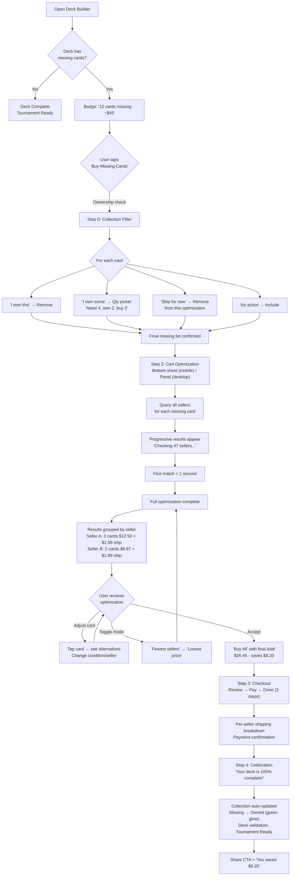
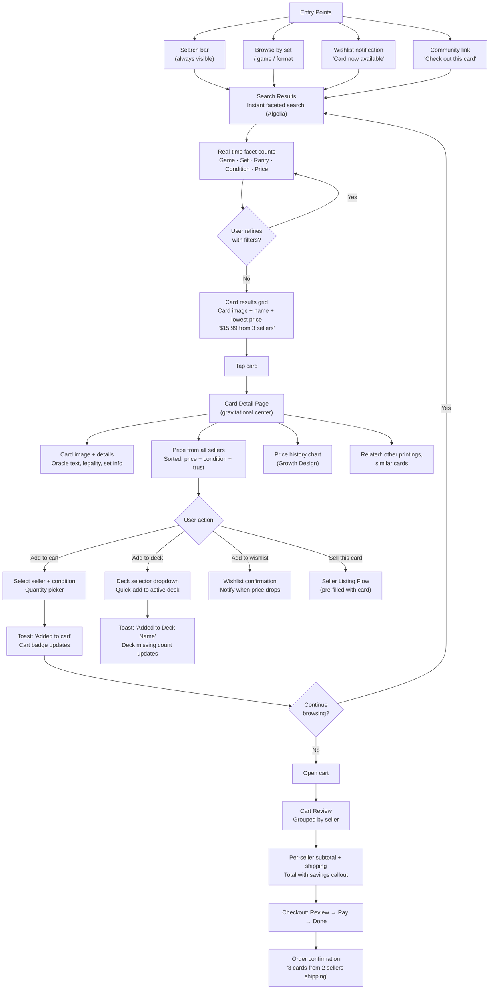
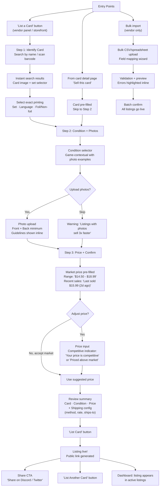
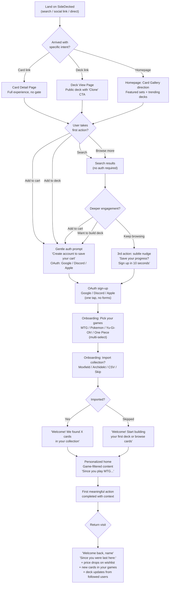

# UX Design Specification — SideDecked Storefront

**Author:** Tav
**Date:** 2026-02-21
**Focus Areas:** Deck Builder, TCG Catalog, Buy Flow, Sell Flow
**Scope:** Storefront only (Next.js 14)

---

## Executive Summary

### Project Vision

SideDecked is a multi-game TCG marketplace serving Magic: The Gathering, Pokemon, Yu-Gi-Oh!, and One Piece communities. Built on a split-brain architecture (commerce in MedusaJS/MercurJS, TCG features in custom Node.js), the storefront is a Next.js 14 application with 200+ components following atomic design patterns.

The platform aspires to be more than a buy/sell marketplace — it is the **community hub** where TCG players build decks, track prices, discuss strategy, discover events, and trade with trusted sellers. The deck builder, pricing intelligence, and community features differentiate SideDecked from pure commerce competitors like TCGPlayer or CardMarket.

**Storefront Focus Areas (this spec):** Deck Builder, TCG Catalog, Buy Flow, Sell Flow.

### Target Users

1. **TCG Collectors/Players** — The core audience. They search for specific cards by set, condition, rarity, and format legality. They build tournament-legal decks, track card values, and buy from trustworthy sellers. Deeply knowledgeable about card grading (NM, LP, MP, HP, DMG). Mobile-heavy — browsing at game shops, tournaments, and on the couch.

2. **Individual Sellers (C2C)** — Players selling their collections. Need frictionless listing, fair market pricing guidance, and reputation building. Not professional merchants — they need hand-holding through grading, pricing, and shipping.

3. **Professional Vendors (B2C)** — Established card shops selling at scale. Need bulk import, analytics dashboards, dynamic pricing tools, and order management. Compare SideDecked against TCGPlayer Direct, eBay, and their own storefronts.

4. **Community Members** — Players who discuss strategy, share decks, organize local events, and connect with other players. Currently using Discord, Reddit, and Twitter — SideDecked needs to pull them into an integrated experience.

### Key Design Challenges

1. **Four games, one experience** — MTG, Pokemon, Yu-Gi-Oh!, and One Piece have radically different card structures (mana costs vs. HP vs. ATK/DEF vs. power). The UI must adapt per game without feeling like four separate apps.

2. **Touch-first deck building** — The deck builder uses react-dnd with HTML5Backend (desktop) and TouchBackend (mobile), but hover-dependent controls (quantity +/-, delete) are invisible on touch devices. The core creative experience is broken on the most common device type.

3. **Trust in a peer-to-peer marketplace** — Buyers must trust seller grading. The reputation system exists but metrics are unactionable — sellers see scores without knowing how to improve them.

4. **Mock data everywhere** — Prices, availability counts, community activity, and market intelligence are hardcoded throughout. Users see fabricated numbers, destroying credibility.

5. **Checkout complexity** — Multi-vendor orders mean multiple shipments, varying shipping costs, and split payments. No progress indicator; shipping costs hidden until late in the flow.

### Design Opportunities

1. **Deck-to-cart integration** — No competitor lets you build a deck and one-click buy the missing cards from the cheapest sellers. SideDecked has both the deck builder and marketplace — connecting them is a killer feature.

2. **Condition confidence** — Inline grading education with photo examples, seller-specific grading history, and buyer verification badges could make SideDecked the most trusted place to buy graded singles.

3. **Modern design language** — The bento grid hero, glass-morphism, and gradient text show design ambition. Applying InterfaceCraft's "reduce until clear, refine until right" philosophy plus 2026 trends (functional minimalism, trust-centric UX, motion-driven micro-interactions) can elevate SideDecked above the "eBay clone" aesthetic of competitors.

4. **Community-powered pricing** — Combining real market data with community sentiment, deck popularity trends, and format rotation alerts creates a pricing intelligence engine no competitor offers.

## Core User Experience

### Defining Experience

The core user action is **card discovery leading to purchase**, served by two equally important entry points:

1. **Search-first loop:** Search → Evaluate (condition, price, seller trust) → Act (buy, add to deck, wishlist, or sell)
2. **Deck-first loop:** Build Deck → Identify missing cards → Find cheapest sellers → Buy (the "Cart Optimizer killer" — no competitor does this from inside a deck builder)

Both loops converge on the **card detail page** — the gravitational center where catalog browsing, deck builder, buy flow, and sell flow all meet.

### Platform Strategy

- **Primary:** Responsive web (Next.js 14), mobile-first
- **Input:** Touch primary, mouse/keyboard enhanced
- **Responsive approach:** CSS-first layouts (no JS for core responsive behavior); JS reserved for progressive enhancement only
- **Architecture:** Two backends (MedusaJS commerce + Node.js TCG) unified via BFF endpoints for critical pages (card detail page needs single aggregated API call)
- **Offline:** Not required — pricing and inventory freshness are core
- **Data freshness (MVP):** HTTP polling (30s interval) for inventory/price on active pages. Redis cache invalidation on listing changes. UX should feel responsive — show cached data immediately, update in background. Growth phase: SSE for watched cards/decks.
- **Device features:** Camera for card photos, touch gestures for deck builder
- **Performance:** Prefetch shipping estimates from saved address/geolocation before checkout begins

### Effortless Interactions

- Card discovery: search + filter must feel instant with real-time facet counts
- Price transparency: real prices with context at every touchpoint ("$15.99 — 3 sellers, lowest NM")
- Cart confidence: toast feedback, quantity control, shipping estimates pre-checkout
- Mobile deck building: always-visible touch controls, readable card grids
- Listing creation: 3-4 focused steps (not 8 sections), prominent market pricing with range and sales context
- Multi-seller checkout: visible step progress, per-seller shipping breakdown
- Trust evaluation: actionable reputation metrics with clear improvement paths
- Deck-to-cart: one-click "buy missing cards" from cheapest sellers

### Critical Success Moments

1. "This card exists and I can afford it" — real search results with contextual prices
2. "My deck is legal and complete" — validation panel green, stats tournament-ready
3. "Buy all missing cards" — deck builder auto-optimizes cart across sellers
4. "I know exactly what I'm paying" — all costs visible before payment
5. "My card sold!" — first sale notification with public listing link and share CTA
6. "This seller is legit" — verified badge, real reviews, grading history

### Experience Principles

1. **Real data with context** — every number includes its source and meaning; "$15.99 (3 sellers, lowest NM)" not just "$15.99"
2. **Touch-first, CSS-first** — every action works with a thumb; responsive layout via CSS, progressive enhancement via JS
3. **Two entry points, one hub** — search-first and deck-first loops both converge on the card detail page as the gravitational center
4. **Show the cost, show the path** — running totals and next steps always visible; prefetch shipping estimates before checkout
5. **Reduce until clear, refine until right** — strip noise, polish what remains
6. **Fewer steps, more confidence** — measurably fewer steps than competitors in every flow; listing in 3-4 steps, not 8

## Desired Emotional Response

### Primary Emotional Goals

1. **Confident discovery** — users feel empowered, informed, and in control at every step. They never question whether a price is real, a seller is trustworthy, or a feature actually works.
2. **Strategic superiority** — TCG players feel *smarter* using SideDecked. The deck optimizer found the cheapest sellers. The price context showed they got a deal. The format alerts kept them ahead of the meta. This is what makes them tell their playgroup.

### Emotional Journey Mapping

| Stage | Desired Emotion | Current Gap |
|---|---|---|
| **First visit** | "Finally — a place that gets TCG players" | Homepage impressive visually but community feels fake (placeholder avatars, mock data) |
| **Browsing/searching** | Thrill of the hunt + strategic edge — "I found it cheaper here" | Search works but filters confuse ('B2C' instead of 'From Shops'), mock availability undermines excitement |
| **Card detail page** | Confident mastery — "I know exactly what I'm getting, and it's a good deal" | Mock prices, alert() dialogs, no price history, no shipping estimates |
| **Deck building** | Creative pride + competitive edge — "this deck is going to win" | Broken mobile controls steal the joy; no "buy missing cards" integration |
| **Checkout** | Calm control — "no surprises, no regrets" | Hidden shipping costs, no step indicator, no price comparison confirmation |
| **Listing a card (seller)** | Anxiety → Guided confidence → Relief | 8-section form triggers anxiety; market price buried; no progress indicator |
| **First sale (seller)** | Pride + relief — "I'm a real seller and it was easy" | Routes to admin not public listing; can't share or verify |
| **Something goes wrong** | Supported — "they've got my back" | Generic errors, no inline help, alert() dialogs feel broken |
| **Returning** | Belonging — "they remember me" | No personalized greeting, no "since you were last here" updates |

### Micro-Emotions

**Critical positive micro-emotions to cultivate:**
- **Confidence over confusion** — every label self-explanatory; "From Shops" not "B2C"
- **Trust over skepticism** — verified badges, real reviews, transparent grading history
- **Strategic pride over passive browsing** — price comparisons, "you saved $X," best-deal indicators
- **Accomplishment over frustration** — deck completion, listing success, checkout all feel like wins
- **Belonging over isolation** — community features make solo collectors feel part of something
- **Relief over anxiety (sellers)** — guided flows that acknowledge complexity and hold their hand through it

**Critical negative micro-emotions to eliminate:**
- **"Is this real?"** — mock data, placeholder avatars, hardcoded market intelligence
- **"Where did my action go?"** — alert() dialogs instead of toast notifications
- **"I can't do this on my phone"** — hover-only controls, unreadable text, hidden interactions
- **"How much is shipping?"** — hidden costs revealed at final checkout step
- **"What does B2C mean?"** — database language exposed to users
- **"Did I get ripped off?"** — no price history, no "best price" indicator, no post-purchase reassurance

### Design Implications

| Emotion | UX Design Approach |
|---|---|
| **Confident discovery** | Real data with context; "$15.99 (3 sellers, lowest NM)" |
| **Strategic superiority** | Price history charts, "you saved $X" confirmations, "best price" badges, deck optimizer showing total savings |
| **Belonging** | Real user avatars, actual activity data, game-specific identity, personalized return-visit nudges |
| **Trust** | Verified badges prominent, seller grading history, escrow status, "Secured by Stripe" |
| **Creative pride** | Deck stats celebrate completion; "tournament ready" badge; share with pride |
| **Relief (sellers)** | Progress bar on listing form, market price prominent and pre-filled, "~5 min to complete" estimate |
| **Calm control (checkout)** | Step progress bar, running total, per-seller shipping, price-match confidence |
| **Supported (errors)** | Empathetic inline help, toast notifications, "here's what to do next" |
| **Remembered (returning)** | "3 new cards in your watchlist," "your deck format rotated," personalized recommendations |

### Emotional Design Principles

1. **Celebrate the wins** — green flash on valid deck, confetti on first sale, toast on add-to-cart, "you saved $X" on checkout. Every successful action gets acknowledged.
2. **Talk like a friend who happens to be an expert** — microcopy passes the "friend test." "Near Mint — looks like it just came out of the pack" not "NM: Card in excellent condition." "From Shops" not "B2C." Warm, knowledgeable, never clinical.
3. **Feel like your LGS (and they remember you)** — the digital equivalent of a local game shop owner who remembers your name, knows what you collect, and says "hey, that card you wanted just came in." Personalized nudges based on decks, watchlists, and browsing history.
4. **Guide through anxiety, don't skip to pride** — for seller flows, acknowledge the complexity first ("this takes about 5 minutes"), hold their hand (progress bars, inline help, pre-filled fields), then celebrate ("your listing is live!").
5. **Make them feel smarter** — every tool should make users feel like they have an unfair advantage. Price context, deck optimization, format alerts, and market intelligence aren't features — they're the reason users tell their friends.
6. **Fail gracefully with empathy** — when things break, sound human: "We couldn't load prices right now — try refreshing, or check back in a few minutes." Never raw errors, never blame the user.

## UX Pattern Analysis & Inspiration

### The "Alex at the LGS" Litmus Test

Every pattern decision is evaluated against this scenario: a player between tournament rounds, on mobile, needs to adjust their deck, find the cheapest cards, and buy them in under 2 minutes. If a pattern doesn't serve Alex, it doesn't belong.

**Formal E2E Acceptance Scenario:**
> Given Alex is on mobile at a tournament, when they open the deck builder and tap a card in search results, a bottom sheet appears with card image, price from N sellers, and "Add" button. When they tap "Buy Missing Cards," the system optimizes across sellers for lowest total including shipping, shows total cost with seller breakdown, and Alex can complete purchase in 3 or fewer taps.

### Inspiring Products Analysis

#### 1. TCGPlayer — Cart Optimizer & Marketplace Trust

TCGPlayer's Cart Optimizer is the single feature that keeps users on the platform despite knowing individual sellers may be cheaper elsewhere. It solves a real pain: when buying 15 singles for a deck, manually comparing shipping costs across sellers is impossible. The optimizer does it automatically, showing total cost including shipping across the fewest sellers.

**What they do well:** Cart optimization across sellers; condition-based filtering (NM, LP, MP, HP); seller reputation with transaction counts and specific numbers ("99.8% positive feedback (2,847 sales)") — specificity over badges; market price as reference anchor.

**What they don't do:** No deck builder integration — the optimizer lives in the cart, disconnected from deck building. No mobile-first design — the experience is desktop-conceived, responsive as afterthought. No price history or "you saved $X" feedback.

#### 2. Moxfield / Archidekt — Deck Building UX

Moxfield dominates MTG deck building with an interaction model that feels like handling real cards. On desktop, hover reveals card details with quantity overlay. On mobile, they switch to **tap → bottom sheet card preview → add button** — a fundamentally different interaction model, not just a responsive shrink of the desktop experience. Minimal text in the builder itself — lets the cards speak visually.

**What they do well:** Instant card search with autocomplete; tap-to-add mobile pattern with bottom sheet preview; real-time deck stats (mana curve, color distribution); format legality validation with conversational tone ("This deck is Standard legal ✓"); social sharing with visual deck thumbnails; comment sections that feel like Discord threads.

**What they don't do:** No marketplace integration — you build the deck, then leave to buy cards elsewhere. No price context during building. No "buy missing cards" flow.

#### 3. StockX / GOAT — Trust & Verification Flows

While the sneaker audience differs from TCG, StockX's **verification and trust visualization** patterns are directly transferable. Their three-step order flow (Payment Secured → Seller Ships → Authenticator Verifies → Delivered) makes the invisible visible. Buyers never wonder "where's my order?" — the visual pipeline shows exactly where they are.

**What they do well:** Escrow visualization that builds trust through transparency; verified seller badges with clear authentication flow (submit → check → badge) — directly maps to our card condition verification challenge; bid/ask spread showing real market depth; price history charts with trend indicators.

**What they don't do:** Luxury aesthetic and sneaker-specific photography standards don't translate to TCG. Bid/ask pricing model too complex for casual card buyers.

#### 4. Scryfall — Search & Data Mastery

Scryfall is the gold standard for card data presentation. Their advanced search syntax (`t:creature pow>3 f:standard`) serves power users, but their real UX win is progressive disclosure — a simple text box that works for everyone, with smart suggestions and advanced syntax available but never required.

**What they do well:** Progressive disclosure search — simple text works for everyone, autocomplete suggests sets/formats, advanced syntax available for power users; comprehensive card data with clean hierarchy; instant results with faceted filtering; high-resolution card images with multiple printings. Content is terse, precise — legality shown as colored pills ("Legal" green, "Banned" red) with zero ambiguity.

**What they don't do:** No commerce, no pricing, no community. Pure reference tool. Terse content tone works for reference but wrong for a marketplace seeking emotional connection.

#### 5. PlayKami — Game-Adaptive Card Presentation

PlayKami's approach to multi-game TCG support solves our Design Challenge #1 (four games, one experience). Rather than one card layout for all games, they use **game-contextual visual hierarchy**: Pokémon cards emphasize HP/weakness/retreat cost, MTG cards emphasize mana cost/type/format legality, Yu-Gi-Oh! cards emphasize ATK/DEF/level. Same component structure, different information priority.

**What they do well:** Game-adaptive card templates that re-prioritize information per game without feeling like separate apps; seller-focused onboarding with guided listing flows; mobile-native design from day one.

### Transferable UX Patterns

**Navigation Patterns:**
- **Progressive disclosure search** (Scryfall-adapted) — simple search bar → smart autocomplete suggestions → advanced syntax for power users. No forcing Scryfall syntax on casual "charizard" searchers.
- **Game-adaptive information hierarchy** (PlayKami) — single card detail component that re-prioritizes fields based on `card.game`. Serves all four TCG communities without four separate UIs.
- **Bottom sheet card preview** (Moxfield mobile) — tap a card anywhere (search results, deck list, collection) to get a bottom sheet with image, key stats, and contextual actions.

**Interaction Patterns:**
- **Tap → bottom sheet → add** (Moxfield mobile) — replaces hover-dependent drag-and-drop on touch devices. Bottom sheet shows card preview with quantity controls and "Add to Deck" button.
- **Cart optimization from deck context** (TCGPlayer + SideDecked innovation) — integrate seller optimization directly into the deck builder's "Buy Missing Cards" flow. Show total cost including shipping, optimized for fewest sellers.
- **Instant toast feedback** (modern standard, via sonner) — immediate migration target. Replace all `alert()` instances with contextual toast notifications. Sonner already in storefront dependencies.

**Trust Patterns:**
- **Three-step escrow visualization** (StockX — adopt directly) — Payment Secured → Seller Ships → Buyer Confirms. Visual pipeline on order detail and order list pages.
- **Verification badge flow** (StockX-adapted) — seller submits grading photos → community/system verification → verified badge. Addresses SideDecked's condition confidence challenge.
- **Specificity over badges** (TCGPlayer) — "99.2% positive · 412 sales · Ships from Toronto" not vague trust badges. Every trust signal is a specific, verifiable number.

**Visual & Modern 2026 Patterns:**
- **Functional minimalism** — reduce visual noise, increase information density where it matters (card stats, pricing), use whitespace as hierarchy tool.
- **Motion-driven micro-interactions** — subtle animations on add-to-cart, deck completion, format validation. Celebrate wins without slowing flows.
- **Sticky contextual bars** — price comparison bar on card detail, deck stats bar in builder, cart total bar in checkout. Requires BFF aggregation endpoint as prerequisite.

**Content Patterns:**
- **Price context format:** "$15.99 · 3 sellers · lowest NM · market avg $17.50" — dot-separated, scannable at a glance
- **Trust signal format:** "99.2% positive · 412 sales · Ships from Toronto" — specificity over badges, every number verifiable
- **Deck validation tone:** "Standard legal ✓" not "This deck meets Standard format requirements" — concise, visual, celebratory
- **Error tone:** "Couldn't load prices — try refreshing" not "Error: API_TIMEOUT" — empathetic, actionable, human
- **Empty state tone:** "No sellers yet — be the first to list this card" not "No results found" — inviting, opportunity-framing

### Anti-Patterns to Avoid

**Automatable Checks (lint rules + E2E tests):**

1. **Browser Alert Dialogs** — `alert()`, `confirm()`, `prompt()` are application credibility killers. Enforce via ESLint rule: no `alert/confirm/prompt` in storefront code. Sonner already in dependencies.

2. **Hover-Gated Functionality** — any interaction requiring hover state to discover or activate. Enforce via E2E tests running with touch-only simulation — every interactive element must be testable without hover events.

3. **Mock Data in Production** — hardcoded prices, fake availability counts, placeholder avatars. Enforce via grep/lint for known mock data patterns and hardcoded price values.

**Review-Gate Checks (content review before merge):**

4. **Database Jargon as UI Labels** — "B2C" instead of "From Shops," "C2C" instead of "From Players." Requires human review against the "friend test" — no automated rule can catch all jargon.

5. **The eBay Clone Trap** — multi-section, scroll-based listing forms that expose every field at once. Requires design review to ensure wizard-pattern progression.

6. **Hidden Cost Reveals** — shipping costs, platform fees, or taxes appearing only at the final checkout step. Requires flow review to verify running totals with all costs visible from cart onward.

7. **Flat Navigation for Deep Catalogs** — treating all four TCG games identically in navigation. Requires UX review to ensure game context persists and informs the experience.

### Design Inspiration Strategy

#### Strategic Priority (what unblocks the killer feature first)

| Priority | Pattern | Type | Tier | Rationale |
|---|---|---|---|---|
| **P0** | Tap → bottom sheet → add (mobile deck builder) | Adopt | 2 — Frontend | If deck builder doesn't work on mobile, the killer feature doesn't work for Alex |
| **P0** | BFF aggregation endpoint | Prerequisite | 3 — Backend | Required for Cart Optimizer AND sticky price bar |
| **P0** | Cart Optimizer in deck builder | Adopt | 3 — Full-stack | **The killer feature** — deck-to-cart optimization is what differentiates SideDecked |
| **P1** | Toast notifications via sonner | Adopt | 1 — Immediate | Hygiene fix, zero dependencies, ~12 replacements, ships this week |
| **P1** | Three-step escrow visualization | Adopt | 3 — Full-stack | Trust is conversion — needs order state machine updates in MedusaJS |
| **P1** | Progressive disclosure search | Adopt | 2 — Frontend | Search bar + Algolia exist; add suggestion UX and advanced toggle |
| **P2** | Price history charts | Adopt | 3 — Full-stack | Needs pricing history table with daily rollups + frontend charting |
| **P2** | Game-adaptive card templates | Adapt | 3 — Data + Frontend | Needs card schema normalization across four game APIs |
| **P2** | Verification badge flow for grading | Adapt | 3 — Full-stack | Adapted from StockX for card condition verification |
| **P2** | Social deck sharing | Adapt | 2 — Frontend | Visual thumbnails, community integration |
| **P2** | Sticky price comparison bar | Adapt | 3 — Full-stack | Depends on BFF aggregation endpoint (P0 prerequisite) |
| **P3** | Content pattern standardization | Implement | 2 — Frontend | Price format, trust signals, tone — content review gate |

**Implementation Tiers:**
- **Tier 1 (Ship This Week):** No design decisions, no backend work. Toast migration, lint rule additions.
- **Tier 2 (Ship This Sprint):** Frontend design + implementation. Bottom sheet pattern, progressive search, social sharing.
- **Tier 3 (Requires Backend + Frontend):** BFF endpoints, database migrations, order state machine changes. Cart Optimizer, price history, escrow visualization, game-adaptive templates.

**Avoid:**
- Scryfall's power-user-only search syntax as default (use progressive disclosure)
- StockX's luxury/sneaker aesthetic (our users want information density, not aspirational photography)
- Any pattern requiring hover state for core functionality
- Disconnected marketplace-to-deckbuilder experience (TCGPlayer's current weakness = our opportunity)

## Design System Foundation

### Design System Choice

**Hybrid: Tailwind CSS + shadcn/ui (Radix primitives) + Custom TCG Components**

A three-layer design system that preserves the existing 354-component codebase while adding accessible interactive primitives for the patterns identified in our inspiration analysis.

- **Layer 1 — Tailwind CSS + existing design tokens:** The foundation. Already in place with CSS variables (`colors.css`), `cn()` utility (`lib/utils.ts`), `next-themes` dark mode, and `@/` path alias. No changes needed.
- **Layer 2 — shadcn/ui (Radix primitives):** Accessible interactive components installed into `src/components/ui/`. Sheet (bottom sheets), Command (progressive search), Dialog, Alert Dialog, Tooltip, Popover, Dropdown Menu, Toast (sonner). Each component is copy-pasted source — fully customizable, no runtime dependency lock-in.
- **Layer 3 — Custom TCG components:** Game-adaptive card templates, deck builder, cart optimizer, escrow visualization, and other domain-specific components built on top of Layers 1 and 2.

### Rationale for Selection

1. **Near-zero adoption cost** — The codebase is 95% pre-configured. `cn()`, CSS variables matching shadcn/ui tokens, `next-themes` with class strategy, TypeScript strict mode, `@/` alias, and `src/components/ui/` directory all already exist. Only `tailwindcss-animate` needs adding.

2. **No mandatory migration** — Existing 354 components (atoms, molecules, organisms) coexist with shadcn/ui components. Custom Modal (28 files), ToastProvider (21 files), Accordion, Tabs, and Dropdown continue working. Migration happens gradually when files are touched for other reasons.

3. **Fills critical gaps without custom builds** — Sheet (mobile bottom sheets), Command (progressive search palette), Tooltip, Popover, and Dialog are components that don't exist today and would require 15-25 days to build with proper accessibility. shadcn/ui provides them in hours.

4. **Accessibility for free** — Radix primitives provide WCAG 2.1 AA compliance out of the box: focus trapping, keyboard navigation, screen reader announcements, scroll lock, portal rendering, and collision detection. Building this from scratch for each component is the highest-risk, lowest-value custom work.

5. **The "Alex" test** — The mobile deck builder bottom sheet (Sheet), progressive search (Command), and confirmation dialogs (Alert Dialog) are P0 features for the killer deck-to-cart flow. shadcn/ui makes these buildable immediately rather than after weeks of primitive development.

6. **TCG-specific components are custom regardless** — Game-adaptive card templates, deck builder interactions, cart optimizer, escrow visualization — none of these exist in any component library. The design system choice only affects the foundation primitives they're built on.

### Implementation Approach

**Setup (1-2 hours):**
1. Install `tailwindcss-animate` and add to `tailwind.config.ts` plugins
2. Run `npx shadcn@latest init` (auto-detects existing config, zero changes needed)
3. Remove unused `@headlessui/react` dependency

**Immediate installs (new components, zero migration):**
- `npx shadcn@latest add sheet` — for mobile bottom sheets (P0 deck builder)
- `npx shadcn@latest add command` — for progressive disclosure search (P1)
- `npx shadcn@latest add dialog` — for new features (existing Modal untouched)
- `npx shadcn@latest add alert-dialog` — for replacing `confirm()` calls
- `npx shadcn@latest add tooltip` — missing primitive
- `npx shadcn@latest add popover` — missing primitive
- `npx shadcn@latest add dropdown-menu` — enhanced dropdown for new features
- `npx shadcn@latest add sonner` — toast system for new features

**Gradual migration (when files are touched for other work):**

| Trigger | Migration |
|---|---|
| Fixing `alert()` in a file | Replace with Alert Dialog or sonner toast |
| Building new modal feature | Use Dialog instead of custom Modal |
| Building new form wizard | Use Dialog + custom stepper |
| Improving toast feedback | Switch from custom ToastProvider to sonner |

**Never required:**
- Existing custom Accordion, Tabs, Dropdown — replace only if desired
- Existing atoms (Button, Input, Badge, etc.) — keep as-is

### Customization Strategy

**Styling:** All shadcn/ui components use Tailwind classes and the existing CSS variables. They inherit SideDecked's visual identity automatically — `--primary` (indigo), `--destructive` (red), `--muted`, border radius, shadow system all apply without modification.

**TCG customization layer:** Game-specific variants built as wrappers around shadcn/ui primitives:
- `CardSheet` — Sheet customized with card image preview, price context, and game-adaptive stats
- `DeckCommand` — Command palette customized with card search, set filtering, and format-aware suggestions
- `GradingDialog` — Dialog customized with condition photo examples and seller grading history

**Component ownership:** shadcn/ui copies source into your codebase. You own every line. If Radix behavior doesn't fit a TCG use case, modify the source directly — no library fork needed.

## Defining Core Experience

### The Defining Interaction

**"Build your deck, buy the missing cards — cheapest across all sellers — in one tap."**

This is what users will describe to their playgroup. No competitor connects deck building to marketplace optimization. TCGPlayer has Cart Optimizer but no deck builder. Moxfield has a deck builder but no marketplace. SideDecked is the only platform where the creative act of deck building flows directly into the most efficient purchase possible.

**The elevator pitch:** "I built my deck and bought every card I was missing — cheapest prices, fewest shipments — without leaving the deck builder."

### User Mental Model

**Current workflow (3 tools, 20+ minutes):**
1. Build deck on Moxfield/Archidekt
2. Identify cards they don't own (manual memory or collection tracking)
3. Open TCGPlayer in another tab
4. Search each missing card individually (10-15 searches)
5. Compare sellers, conditions, and shipping for each
6. Add to cart, run Cart Optimizer
7. Hope the optimizer found a good combination
8. Checkout

**The mental model they bring:** TCG players already think in terms of "my deck needs these cards" — the concept of a missing-cards list is native to their workflow. They also understand that buying from fewer sellers means less shipping cost. What they don't expect is a single tool that does both — so the first time they experience it, the reaction is delight through exceeded expectations.

**Where they get confused today:**
- "Do I own this card?" — no collection integration means manual tracking
- "Is this the cheapest across all sellers?" — no cross-seller comparison during deck building
- "How much will shipping add?" — shipping unknowable until cart is assembled
- "Which condition should I buy?" — no guidance on when LP vs NM matters for playability vs. collecting

**What they love about existing tools:**
- Moxfield's instant search and visual deck layout
- TCGPlayer's Cart Optimizer showing "you saved $X"
- Scryfall's comprehensive data accuracy

**What they hate:**
- Context-switching between 3 tools
- Manually searching each card
- Shipping costs as a surprise
- No "best deal" confidence

### Success Criteria

**The core interaction succeeds when:**

1. **"This just works"** — Alex taps "Buy Missing Cards" and sees progressive optimization results within 1 second (best match first, total refining as the system completes). No configuration, no manual seller selection, no shipping calculator.

2. **"I feel smarter"** — The optimization result shows: "5 cards from 2 sellers · $23.47 total · saves $8.20 vs. buying from one shop · all Near Mint." Alex didn't do the math — SideDecked did — and the savings are real and specific.

3. **"I know I got the best deal"** — Price context at every step: market average, lowest available, condition breakdown. The system finds the near-optimal combination across sellers (a heuristic approximation, like TCGPlayer's — honest about algorithmic reality). The "you saved $X" confirmation is the emotional payoff.

4. **"It was fast enough for between rounds"** — The complete flow (open deck → tap "Buy Missing Cards" → review optimized cart → confirm purchase) takes under 2 minutes on mobile for returning users with saved payment. First-time buyers add 2-3 minutes for account/payment setup.

5. **"I want to tell someone"** — The experience is surprising enough that Alex shows their friend. "Look — I built my deck and it found all the cards from the cheapest sellers automatically." Word-of-mouth is the ultimate success metric.

**Measurable success indicators:**

| Metric | Launch Target | Growth Target (6 months) |
|---|---|---|
| Deck-to-cart conversion (users who build decks and purchase missing cards) | > 10% | > 15% |
| Deck-influenced purchase rate (any purchase within 7 days of deck building) | > 25% | > 35% |
| Time from "Buy Missing Cards" to checkout complete (returning users, saved payment) | < 120 seconds | < 90 seconds |
| Cart optimization shows savings (when 2+ sellers exist for > 50% of cards) | > 80% of eligible | > 90% of eligible |
| Repeat usage (users who use deck-to-cart once and use it again within 30 days) | > 40% | > 60% |

### Novel vs. Established Patterns

**This is a combination of familiar patterns in an innovative way.**

**Established patterns we adopt:**
- Deck builder interface (Moxfield-proven) — users already know how to add cards, organize zones, check legality
- Cart optimization algorithm (TCGPlayer-proven) — users already trust the concept of "system finds cheapest combination"
- Bottom sheet card preview (mobile standard) — users already know tap-to-preview from countless apps
- Step-based checkout (e-commerce standard) — cart → shipping → payment → confirm

**The novel combination:**
- **Deck builder + Cart Optimizer in one context** — no one does this. The innovation is connecting two proven patterns, not inventing new ones.
- **Collection-aware missing cards** — the deck builder knows what you own and only offers to buy what you're missing. This requires collection tracking integration (see Step 0 in mechanics below).
- **Shipping-aware optimization from deck context** — the optimizer factors in shipping costs before the user goes to cart, showing true total cost inside the deck builder.
- **Game-contextual condition defaults** — MTG optimization defaults to "any playable" (NM/LP) for tournament use, Pokémon defaults to NM for collector culture. The optimization algorithm accepts a `game` parameter that adjusts condition weighting.

**How we teach the new pattern:**
- No education needed for individual pieces (deck builder, cart, checkout — all familiar)
- The connection point ("Buy Missing Cards" button) needs clear affordance: prominent placement in the deck builder toolbar, with real-time price preview ("12 cards missing · ~$45 from 3 sellers")
- First-time tooltip: "We'll find the cheapest sellers for all your missing cards, including shipping"
- Post-optimization celebration: "You saved $X vs. buying each card separately"

### Experience Mechanics

#### Step 0: Collection Awareness (Prerequisite)

The defining experience depends on knowing which cards Alex already owns. Without reliable collection data, "Buy Missing Cards" shows the entire deck instead of truly missing cards — destroying the magic.

**MVP path (launch):** "Mark as owned" during deck building. As Alex adds cards to their deck, each card shows an "I own this" toggle. Over time, their collection builds organically through deck building. No separate collection-management feature needed at launch.

**Three ownership states per card:**
- **"I own this"** — removes from missing list entirely (all copies owned)
- **"I own some"** — quantity picker: "You need 4, you own ___, buy ___" (partial ownership)
- **"Skip for now"** — removes from this optimization but stays in missing list for future

**Growth paths (post-launch):**
- CSV import from TCGPlayer/Moxfield (one-time bulk import)
- Auto-update on purchase (buy a card on SideDecked → automatically added to collection)
- Camera scan (aspirational — high effort to build, high delight if executed)

#### Step 1: Initiation — "Buy Missing Cards"

**Trigger:** Prominent button in the deck builder header/toolbar. Always visible when the deck has missing cards (cards not in the user's collection).

**Pre-trigger context:** A persistent badge or summary shows "12 cards missing · ~$45" — giving price awareness before the user even taps. This price estimate updates as the deck changes.

**Entry points:**
- Primary: "Buy Missing Cards" button in deck builder
- Secondary: "Complete This Deck" CTA on deck list page
- Tertiary: "Cards you need" section on returning-user dashboard

#### Step 2: Interaction — Cart Optimization

**What happens when the user taps "Buy Missing Cards":**

1. **Bottom sheet slides up** (mobile) or **panel opens** (desktop) showing the optimization in progress
2. **System queries all sellers** for each missing card, factoring in:
   - User's preferred condition — game-contextual defaults (MTG: "any playable" NM/LP; Pokémon: NM; Yu-Gi-Oh!: "any playable")
   - User's saved shipping address (for shipping cost calculation)
   - Seller reputation threshold (configurable, default 95%+)
3. **Optimization results appear progressively** — best seller match appears first (target: < 1 second), total refines as the system completes optimization across all sellers. "Still optimizing..." indicator resolves to final total. The algorithm uses a greedy heuristic (sort by total-cost-per-seller, consolidate) — near-optimal, not guaranteed optimal.
4. **Final result displayed:**
   - Grouped by seller: "Seller A (3 cards, $12.50 + $2.99 shipping) · Seller B (2 cards, $8.97 + $1.99 shipping)"
   - Total: "$26.45 from 2 sellers"
   - Savings: "Saves $8.20 vs. single seller"
   - All conditions listed per card
5. **User can adjust:** Tap any card to see alternatives (different condition, different seller), tap a seller group to see details. Changes recalculate the total in real-time.

**Controls:**
- Condition preference toggle — game-contextual defaults, user-overridable (NM / LP / Any playable)
- "Fewest sellers" vs. "Lowest price" optimization mode
- Individual card override (swap to different seller/condition)
- Per-card ownership: "I own this" / "I own some (quantity)" / "Skip for now"

#### Step 3: Feedback — Confidence Building

**During optimization:**
- Progressive results: first seller match appears immediately, running total updates as more matches resolve
- Animated progress: "Checking 47 sellers..." with card icons appearing as matches are found
- No dead loading state — always showing actionable partial results

**After optimization:**
- Green total with savings callout: "$26.45 total · saves $8.20"
- Seller trust indicators: "99.2% positive · 412 sales" per seller (specificity over badges)
- Condition confidence: card condition with tooltip ("Near Mint — looks like it just came out of the pack")
- Shipping estimate: per-seller and total, calculated from saved address

**If something goes wrong:**
- Card unavailable: "Liliana of the Veil — no sellers in NM. Available in LP from $12.99" with one-tap fallback
- Price spike: "Ragavan — price increased 15% this week. Still the best available at $45.99"
- No sellers: "3 cards have no sellers right now. We'll notify you when they're listed." with auto-watchlist
- Few sellers (cold-start): honest about limited options — "Only 1 seller for this card" instead of fake "optimized" results

#### Step 4: Completion — Purchase & Celebration

**Checkout from deck builder:**
- "Buy All" button with final total — goes directly to payment confirmation (address and payment already saved from profile)
- Step indicator: "Review → Pay → Done" (3 steps, not 5)
- Per-seller shipping breakdown visible throughout

**Post-purchase:**
- Confirmation with deck context: "Your deck is now 100% complete! All 5 cards shipping from 2 sellers."
- Collection automatically updated — those cards now show as "owned" in the deck builder
- Share CTA: "Share your completed deck" with visual thumbnail
- "You saved $8.20 by buying through SideDecked" — the strategic superiority moment

**Returning to the deck builder:**
- Missing cards count updates to reflect purchases
- Visual celebration: cards that were "missing" now show as "owned" with a subtle green glow
- Deck validation panel updates: "Tournament ready ✓"

### Secondary Defining Experience: Seller Flow

**"List a card in under 60 seconds with market-accurate pricing."**

The seller equivalent of "buy missing cards" — turn the anxiety of "how do I price this?" into the confidence of "the market says $15.99 and I'm listing at $14.99 to sell fast."

**Mechanics:**
1. **Initiation:** Scan or search the card → instant market price with range and recent sales
2. **Interaction:** 3-step wizard (Card → Condition + Photos → Price + Confirm), market price pre-filled, condition guide inline with photo examples
3. **Feedback:** "Your price is competitive — similar cards sell within 3 days at this price"
4. **Completion:** "Your listing is live!" with shareable public link and "list another" CTA

## Visual Design Foundation

### Design Philosophy — "Midnight Forge"

**"Linear meets the Local Game Shop"** — The precision and restraint of Linear/Vercel-style design, infused with the warm metallics and card-centric energy of TCG culture. Dark-first. Card art as hero. Cool structure, warm value signals.

The name tells the story: the dark workshop where cards are forged, deals are struck, decks are crafted. This isn't a generic marketplace wearing a dark theme — it's a premium gaming surface built for TCG culture.

**Five guiding rules:**
1. **The card is the content.** Every layout decision serves card visibility. Card art should be large enough to appreciate the illustration and read the rules text. Minimum 240px height in grid, 2.5:3.5 aspect ratio, never stretched or cropped.
2. **Cool tones for structure, warm tones for value.** Backgrounds and chrome are cool blue-gray. Prices, rarity, CTAs, and premium elements use warm gold/amber. This separation creates instant visual parsing.
3. **Progressive depth, not decoration.** Elevation through surface lightness, not heavy shadows. Glass-morphism only for floating overlays. Every visual effect earns its place.
4. **Emotional temperature shifts.** Browse mode is cool and exploratory. Purchase mode warms subtly. Celebration mode pulses gold. The user doesn't notice the transition — they feel it.
5. **Gold is a punctuation mark, not a paragraph.** Gold appears on primary CTAs, price displays, rarity indicators, premium badges, and celebration moments. Never on surfaces, navigation, body text, or borders. Card art and white space dominate — gold is 5-10% of any screen's visual weight.

### Implementation Phasing

#### Launch Design (~2 days effort — ship with MVP)

| Item | Effort | Impact |
|---|---|---|
| `colors.css` rewrite with Midnight Forge palette | 2-4 hours | Entire storefront transforms |
| `tailwind.config.ts` token mapping + font families | 30 min | Tokens available to all components |
| `layout.tsx` font migration (Inter + Geist Sans) | 1 hour | All typography updates |
| `--primary` split to `--accent-primary` + `--interactive` in shadcn components | 2-3 hours | Gold CTAs, blue navigation |
| Rarity color tokens applied to card indicators in search/detail | 1-2 hours | "We speak your language" signal |
| Card-shaped skeleton loading placeholders (2.5:3.5 ratio) | 1-2 hours | TCG-native loading states |
| Dense list view for seller dashboard | 2-3 hours | Vendor-first experience |
| Visual QA pass — all pages correct with new palette | 4-6 hours | No regressions |

**Brand-critical for launch (do not defer):**
- Homepage hero must showcase card art at full quality on Midnight Forge background with gold CTA — communicates "TCG premium" within 3 seconds of first visit
- Rarity colors visible in search results (game-specific color next to card name) — signals fluency with TCG culture
- Card-shaped skeleton loaders — TCG-native even during loading

**Sprint-ready story: "Apply Midnight Forge Visual Foundation"**
- AC1: `colors.css` updated with Midnight Forge palette (all tokens from this spec)
- AC2: Fonts migrated to Inter (body) + Geist Sans (display)
- AC3: `--primary` split into `--accent-primary` (gold) and `--interactive` (blue) across all shadcn components
- AC4: Rarity color tokens defined and applied to card rarity indicators in search results and card detail
- AC5: Dark mode as default, light mode functional
- AC6: Card-shaped skeleton loading placeholders
- AC7: Dense list view available for seller dashboard
- AC8: Visual QA pass — all existing pages render correctly with new palette

**shadcn Post-Install Checklist:** After installing any new shadcn component (`npx shadcn@latest add [component]`), remap class references:
- `bg-primary` / `text-primary-foreground` on **buttons and CTAs** → `bg-accent-primary` / `text-on-accent`
- `text-primary` on **links, tabs, navigation** → `text-interactive`
- `ring-primary` on **focus rings** → `ring-interactive`
- `bg-primary/10` on **subtle highlights** → context-dependent (`accent-primary-subtle` or `interactive-subtle`)

#### Growth Design (~10-15 days — post-launch iterations)

| Item | Effort | Dependencies |
|---|---|---|
| Holographic card effects (CSS shaders, gyroscope on mobile) | 3-5 days | Card detail bottom sheet exists |
| Social preview card generation (OG images per game) | 2-3 days | Server-side rendering pipeline |
| Emotional temperature shifts (browse → purchase → celebrate) | 1-2 days | Route-based token overrides |
| MTG mana color tokens in UI context (filters, deck builder) | 1-2 days | Game-context detection |
| Profile accent customization | 2-3 days | User preference storage |
| Bento grid refinements with variable card spans | 1-2 days | Browse page redesign |

### Color System — "Midnight Forge" Palette

#### Core Surfaces

| Token | Light Mode | Dark Mode | Usage |
|---|---|---|---|
| `--bg-base` | `#F8F9FB` | `#0C0D12` | Page background |
| `--bg-surface-1` | `#FFFFFF` | `#13141A` | Sidebar, panels |
| `--bg-surface-2` | `#F1F3F7` | `#1A1C24` | Cards, containers |
| `--bg-surface-3` | `#E8EBF0` | `#22242E` | Elevated elements, modals |
| `--bg-surface-4` | `#DFE3EA` | `#2A2D38` | Dropdowns, popovers |
| `--bg-overlay` | `rgba(0,0,0,0.4)` | `rgba(0,0,0,0.6)` | Modal/sheet backdrop |

Dark mode elevation: each surface steps up ~6-8% in lightness. Higher = lighter. No heavy shadows — borders define edges.

#### Accent — Arcane Gold (CTAs, Value Signals, Premium)

| Token | Light Mode | Dark Mode | Usage |
|---|---|---|---|
| `--accent-primary` | `#96751A` | `#D4A843` | Primary CTA buttons, premium indicators, "value" signals |
| `--accent-primary-hover` | `#7D6116` | `#E0B94F` | Hover state |
| `--accent-primary-subtle` | `rgba(150,117,26,0.12)` | `rgba(212,168,67,0.15)` | Badge backgrounds, highlights |

Gold is the universal TCG "premium" color — rarity across MTG (rare symbol), Pokémon (illustration rare stars), Yu-Gi-Oh! (ultra rare name foil), and One Piece (super rare). Light mode uses deeper gold (`#96751A`) for sufficient contrast on white surfaces. shadcn/ui `--primary` maps to Arcane Gold.

#### Interactive — Mystic Blue (Links, Navigation, Secondary Actions)

| Token | Light Mode | Dark Mode | Usage |
|---|---|---|---|
| `--interactive` | `#4F6AE8` | `#7C8CFF` | Links, secondary buttons, focus rings, navigation |
| `--interactive-hover` | `#3D55D4` | `#9BA6FF` | Hover state |
| `--interactive-subtle` | `rgba(79,106,232,0.10)` | `rgba(124,140,255,0.12)` | Active tab bg, selected state |

Deliberate split from old `--primary`. Gold handles value/action; blue handles navigation/interactive. shadcn components using `text-primary` for links remap to `text-interactive`.

#### Semantic Colors

| Token | Light Mode | Dark Mode | Usage |
|---|---|---|---|
| `--positive` | `#1A8B3E` | `#4ADE80` | In stock, legal format, price drop, savings, deck complete |
| `--negative` | `#DC2626` | `#EF5350` | Out of stock, banned, price spike, errors |
| `--warning` | `#CA8A04` | `#FBBF24` | Low stock, restricted format, price volatile |
| `--info` | `#2563EB` | `#60A5FA` | Notifications, tips, system messages |

#### Text

| Token | Light Mode | Dark Mode | Usage |
|---|---|---|---|
| `--text-primary` | `#1A1D27` | `#E8ECF1` | Headings, body, card names |
| `--text-secondary` | `#5A6175` | `#8B93A6` | Metadata, timestamps, labels |
| `--text-tertiary` | `#8B93A6` | `#4F5568` | Placeholders, disabled text |
| `--text-on-accent` | `#FFFFFF` | `#0C0D12` | Text on gold buttons |
| `--text-price` | `#96751A` | `#D4A843` | Current/best price (gold, always) |

#### Borders

| Token | Light Mode | Dark Mode | Usage |
|---|---|---|---|
| `--border-subtle` | `rgba(0,0,0,0.06)` | `rgba(255,255,255,0.06)` | Card edges, dividers |
| `--border-default` | `rgba(0,0,0,0.10)` | `rgba(255,255,255,0.10)` | Input borders, panels |
| `--border-strong` | `rgba(0,0,0,0.16)` | `rgba(255,255,255,0.16)` | Focus rings, active states |

#### Emotional Temperature Shifts (Growth Design)

| Mode | Surface Shift | Accent Behavior | Emotional Intent |
|---|---|---|---|
| **Browse/Discovery** | Cool base surfaces | Blue interactive dominant, gold for value labels | Exploratory, low pressure |
| **Purchase** (cart, checkout) | Surfaces warm 2-3% (`#13141A` → `#141416`) | Gold becomes dominant on CTAs, green appears | Purposeful, confident |
| **Celebration** (purchase complete, listing live) | Brief return to base | Gold shimmer/pulse animation, green confirmation | Achievement, pride |

#### Game-Contextual Rarity Colors (CSS Variable Tokens)

**Magic: The Gathering — Rarity:**

| Token | Value | Rarity |
|---|---|---|
| `--rarity-mtg-common` | `#6B6B6B` | Common |
| `--rarity-mtg-uncommon` | `#A8B4C0` | Uncommon (silver) |
| `--rarity-mtg-rare` | `#D4A843` | Rare (gold) |
| `--rarity-mtg-mythic` | `#E85D26` | Mythic Rare (orange-red) |

**Magic: The Gathering — Mana Colors:**

| Token | Value | Color |
|---|---|---|
| `--mtg-white` | `#F9FAF4` | Plains (warm white) |
| `--mtg-blue` | `#0E68AB` | Island (deep blue) |
| `--mtg-black` | `#150B00` | Swamp (near-black brown) |
| `--mtg-red` | `#D3202A` | Mountain (fire red) |
| `--mtg-green` | `#00733E` | Forest (deep green) |
| `--mtg-colorless` | `#A8A8A8` | Wastes (gray) |
| `--mtg-gold` | `#D4A843` | Multicolor (gold) |

Mana colors are prominent in search filters, deck builder color distribution, mana curve visualizations, and card browsing context. They are how MTG players think about cards first, rarity second.

**Pokémon TCG:**

| Token | Value | Rarity |
|---|---|---|
| `--rarity-pokemon-common` | `#6B6B6B` | Common/Uncommon/Rare |
| `--rarity-pokemon-ultra` | `#C0C0C0` | Ultra Rare (silver stars) |
| `--rarity-pokemon-illustration` | `#D4AF37` | Illustration Rare (gold star) |
| `--rarity-pokemon-hyper` | `#FFD700` | Hyper Rare (bright gold) |

**Yu-Gi-Oh!:**

| Token | Value | Rarity |
|---|---|---|
| `--rarity-ygo-common` | `#8B8B8B` | Common |
| `--rarity-ygo-rare` | `#C0C0C0` | Rare (silver) |
| `--rarity-ygo-super` | `#4FC3F7` | Super Rare (holo blue) |
| `--rarity-ygo-ultra` | `#FFD700` | Ultra Rare (gold) |
| `--rarity-ygo-secret` | `#E0B0FF` | Secret Rare (prismatic) |
| `--rarity-ygo-starlight` | `#F8F8FF` | Starlight Rare (shimmer) |

**One Piece TCG:**

| Token | Value | Rarity |
|---|---|---|
| `--rarity-op-common` | `#B0B0B0` | Common |
| `--rarity-op-uncommon` | `#4A90D9` | Uncommon (blue) |
| `--rarity-op-rare` | `#4CAF50` | Rare (green) |
| `--rarity-op-super` | `#FFB300` | Super Rare (gold) |
| `--rarity-op-secret` | `#1A1A1A` | Secret Rare (black, premium border) |
| `--rarity-op-leader` | `#9C27B0` | Leader (purple) |

### Typography System

**Primary UI Font: Inter (Variable)** — High x-height for readability at small sizes, tabular figures for prices (`font-feature-settings: 'tnum'`), OpenType case-sensitive forms. The workhorse for all body text, data, and UI. Available via `@fontsource-variable/inter` or Google Fonts.

**Display Font: Geist Sans** — For page titles, hero text, and marketing headings. Sharper, more technical character. Signals "modern tool built for power users." Available via `geist` npm package.

**Monospace: Geist Mono** — For card IDs, set codes, collector numbers, and code blocks.

**Price Typography:** Inter with `font-feature-settings: 'tnum'` at 500 weight, gold color (`--text-price`). Explicit `font-family: Inter` ensures digit alignment in price columns regardless of primary `--font-sans` setting.

**Type Scale (Major Second — 1.125 ratio):**

| Role | Size | Weight (Light) | Weight (Dark) | Line Height | Font | Usage |
|---|---|---|---|---|---|---|
| Display | 32px | 700 | 700 | 1.2 | Geist Sans | Hero headings |
| Page Title | 24px | 600 | 650 | 1.25 | Geist Sans | Page headers |
| Section Title | 20px | 600 | 650 | 1.3 | Inter | Section dividers |
| Card Title | 16px | 500 | 550 | 1.4 | Inter | Card names, row headers |
| Body | 14px | 400 | 450 | 1.5 | Inter | Primary content |
| Label | 12px | 500 | 550 | 1.4 | Inter | Metadata, badges |
| Micro | 11px | 500 | 550 | 1.3 | Inter | Overlines, rarity badges |

Dark mode: +50 weight via variable font axis prevents thin fonts fading into dark backgrounds.

### Iconography

**Generic UI: Lucide React** (already installed) — Clean, geometric, outlined at consistent stroke weight.

**Game-specific symbols: Custom SVG icon set** — Mana symbols (MTG), energy types (Pokémon), attribute symbols (Yu-Gi-Oh!), color/cost indicators (One Piece).

**Icon style requirements:**
- 1.5px stroke weight matching Lucide
- 24x24px default, scalable
- Monochrome by default (inherit text color), colorized variants for game context
- Every icon paired with `aria-label` or visible text

**Categories needed:**
- MTG: 5 mana + colorless + generic + tap + set symbol frame
- Pokémon: 11 energy types + Pokéball rarity symbols
- Yu-Gi-Oh!: 7 attributes + star/level + link arrows
- One Piece: 5 colors + cost + power symbol
- Shared: condition grades (NM/LP/MP/HP/DMG), shipping status, verification badge

### Spacing & Layout Foundation

**Base unit: 8px**

| Token | Value | Usage |
|---|---|---|
| `--space-1` | 4px | Icon-to-label gap, tight grouping |
| `--space-2` | 8px | Between list items, inline elements |
| `--space-3` | 12px | Card internal padding (compact) |
| `--space-4` | 16px | Card internal padding (default), form gaps |
| `--space-5` | 24px | Between card groups, section padding |
| `--space-6` | 32px | Major section breaks |
| `--space-8` | 48px | Page-level margins |

**Border radius:**

| Token | Value | Usage |
|---|---|---|
| `--radius-sm` | 6px | Badges, chips, small buttons |
| `--radius-md` | 10px | Inputs, standard buttons |
| `--radius-lg` | 16px | Cards, panels, modals |
| `--radius-xl` | 24px | Hero cards, featured sections |
| `--radius-full` | 9999px | Avatars, pills |

**Layout patterns:**
- **Bento grid** for buyer browsing: 16px gutters, variable card spans (1x1, 2x1, 2x2), max 12-15 visible cards
- **Dense list view** as vendor/power-user primary: 40-48px row height, `--space-1` row gaps, 8+ columns, sticky sorted header, alternating row backgrounds (`--bg-surface-1` / `--bg-surface-2`), inline edit for price/quantity. Default for seller dashboard and inventory — not secondary.
- **Sticky contextual bar** at bottom on mobile: deck stats, cart total, price bar

**Card image treatment:**
- Minimum: 240px height in grid (art + rules text visible)
- Aspect ratio: 2.5:3.5 (standard TCG) — never stretch or crop
- Full-bleed in detail views
- Card-shaped skeleton loading (same aspect ratio, rounded corners)

### Visual Effects

**Elevation (dark mode):** Surface lightness progression via `--bg-surface-N` tokens. Borders at `--border-subtle` define edges. No heavy shadows.

**Elevation (light mode):** Soft, diffuse shadows:
- Level 1: `0 1px 3px rgba(0,0,0,0.04), 0 1px 2px rgba(0,0,0,0.06)`
- Level 2: `0 4px 12px rgba(0,0,0,0.06), 0 2px 4px rgba(0,0,0,0.04)`
- Level 3: `0 8px 24px rgba(0,0,0,0.08), 0 4px 8px rgba(0,0,0,0.04)`

**Glass-morphism (restricted — command palette, bottom sheet, floating toolbar only):**
- `backdrop-filter: blur(16px)` + `background: var(--bg-surface-2) / 0.75` + `border: 1px solid var(--border-subtle)`

**Holographic card effects (Growth Design — CSS, for foil/rare cards):**
- Gradient overlay responding to pointer position (desktop hover) or device gyroscope (mobile tilt)
- `mix-blend-mode` + `background-blend-mode` for prismatic shimmer
- Hover/tap activation only — disabled during scroll and in list view
- `will-change: transform` only when active, max 3-4 compositing layers in viewport
- Disabled under `prefers-reduced-motion`
- Mobile: tap card → bottom sheet with hero card → tilt phone for holo shift (gyroscope); fallback: slow ambient gradient loop

**Micro-animations:**
- Duration: 200-300ms interactions, 300-500ms transitions
- Easing: `ease-out` for user-initiated, spring-based for celebration
- GPU-only: `transform` and `opacity` exclusively
- Card hover: 1.02x scale + border glow
- Add-to-cart: card "flies" toward cart icon
- Deck completion: green pulse + gold shimmer
- Skeleton loading states replace all spinners

**Social Preview Cards (Growth Design — OG / Discord Embeds):**
- Background: `--bg-base` (dark), accent: `--accent-primary` (gold) for names
- Layout: up to 5 card thumbnails in row, deck name in gold above
- SideDecked wordmark: bottom-right, subtle, `--text-secondary`
- 1200x630px (OG standard)
- Per-game variant: MTG shows mana distribution, Pokémon shows energy types, Yu-Gi-Oh! shows attribute breakdown
- Auto-generated via server-side rendering

**Profile Accent Customization (Growth Design):**
- User-selectable accent color for profile and shared deck pages
- Presets: MTG mana colors, Pokémon energy types, Yu-Gi-Oh! attributes
- Custom hex for advanced users
- Replaces `--accent-primary` on user's pages only — marketplace retains gold

### Accessibility Considerations

**Contrast ratios:**
- Primary text on all surfaces: WCAG AAA (7:1) target
- Secondary text: WCAG AA (4.5:1) minimum
- Interactive elements: 3:1 minimum against adjacent colors
- Gold accent (`#D4A843` dark / `#96751A` light): passes AA on respective surfaces
- Blue interactive (`#7C8CFF`): passes AA on dark surfaces

**Color independence:**
- Rarity: color + text label or symbol (never color alone)
- Success/error: icon + color (checkmark + green, X + red)
- Price trends: icon + color + direction text ("$2.50 ↑ 15%")

**Touch targets:**
- Minimum 44x44px all interactive elements (WCAG 2.5.5)
- Deck builder controls: 48x48px (tournament use)

**Reduced motion:**
- `prefers-reduced-motion`: disable all animations except opacity fades
- Holographic effects disabled entirely
- Skeleton loading replaces animated transitions

**Dark/light mode:**
- Dark as default (TCG community overwhelming preference)
- System detection as option
- Manual toggle always accessible
- Both modes receive equal design attention

## Design Direction Decision

### Directions Explored

Six design directions were prototyped and evaluated (see `ux-design-directions.html` for interactive showcase):

| # | Direction | Core Concept | Strength |
|---|-----------|-------------|----------|
| 1 | Card Gallery | Card art as hero, editorial layouts, art-forward browsing | Emotional connection, visual delight |
| 2 | Command Center | Dense data tables, filters, price charts, batch operations | Power-user efficiency, vendor workflows |
| 3 | Split Panel Deck Builder | Side-by-side search + decklist, real-time stats, drag-and-drop | Core defining experience, competitive tool |
| 4 | Marketplace Grid | Price-first cards, seller ratings, shipping badges, comparison | Purchase confidence, marketplace trust |
| 5 | Social Feed | Activity streams, deck shares, community reactions, following | Community engagement, retention |
| 6 | Mobile Stack | Bottom sheets, swipe gestures, thumb-zone navigation, compact cards | Mobile-first TCG experience |

### Chosen Direction: Context-Adaptive Composition

Rather than selecting a single direction, SideDecked adopts a **context-adaptive composition** that surfaces the right direction based on user mode:

| User Mode | Primary Direction | Supporting Elements |
|-----------|------------------|-------------------|
| Browsing / Discovery | Card Gallery | Social Feed reactions, Marketplace Grid pricing |
| Building a Deck | Split Panel Deck Builder | Command Center stats, Card Gallery search results |
| Buying Cards | Marketplace Grid | Card Gallery visuals, Command Center filters |
| Selling / Vendor | Command Center | Marketplace Grid listings, Card Gallery previews |
| Community / Social | Social Feed | Card Gallery shared decks, Marketplace Grid linked cards |
| Mobile (any mode) | Mobile Stack | Adapts inner content from above modes |

### Design Rationale

1. **No single direction serves all users** — a competitive MTG player building a deck has completely different needs than a Pokémon collector browsing new sets or a vendor managing 5,000 listings
2. **The defining experience demands it** — "build your deck, buy the missing cards in one tap" requires the Split Panel Deck Builder seamlessly transitioning into the Marketplace Grid, which no single direction achieves
3. **TCG users expect density when working, beauty when browsing** — Card Gallery for emotional connection, Command Center for serious work, and the system adapts based on intent
4. **Mobile is a mode, not a direction** — Mobile Stack wraps whatever the user is doing in touch-optimized patterns (bottom sheets, swipe, thumb-zone nav) rather than being a separate experience

### Implementation Approach

**Route-to-Direction Mapping:**

| Route Pattern | Primary Direction | Layout |
|---------------|------------------|--------|
| `/` (home) | Card Gallery | Featured sets, trending decks, new arrivals |
| `/search`, `/cards` | Card Gallery → Marketplace Grid | Progressive: browse → buy intent |
| `/decks/[id]/edit` | Split Panel Deck Builder | Side-by-side with real-time stats |
| `/decks/[id]` | Card Gallery + Social Feed | Deck showcase with community reactions |
| `/marketplace` | Marketplace Grid | Price-first with filters |
| `/vendor/*` | Command Center | Dense tables, batch operations, analytics |
| `/community`, `/feed` | Social Feed | Activity streams, deck shares |
| `/wishlist` | Marketplace Grid | Price-tracked cards with notification status |
| `/decks` (browse) | Card Gallery + Social Feed | Public deck discovery, trending, format filter |
| `/orders/[id]/dispute` | Command Center | Photo evidence upload, dispute timeline |
| Mobile (any route) | Mobile Stack wrapper | Bottom sheets, swipe nav, compact cards |

**Shared Components Across Directions:**

- `<CardDisplay>` — renders in gallery, grid, list, or compact mode based on context
- `<PriceTag>` — consistent price display with trend indicators
- `<RarityBadge>` — game-contextual rarity with color + label
- `<SellerTrust>` — specificity-based trust signals (not generic badges)
- `<DeckStats>` — mana curve, card type distribution, price total
- `<ConditionSelector>` — game-contextual condition with visual guide
- Navigation shell with persistent cart, deck builder access, and search

## User Journey Flows

### Journey 1: Deck-to-Cart (The Defining Experience)

**"Build your deck, buy the missing cards — cheapest across all sellers — in one tap."**



**Key Decision Points:**
- **Ownership filter (Step 0):** Three states per card — "I own this" (full), "I own some" (partial with qty picker), "Skip for now" (defer). Reduces unnecessary purchases without forcing collection import.
- **Optimization mode toggle:** "Fewest sellers" minimizes shipping costs by consolidating. "Lowest price" finds absolute cheapest per card regardless of seller count. Default: lowest price.
- **Per-card override:** Any card in the optimization can be tapped to see alternatives — different conditions, sellers, or printings. Override persists through mode toggles.

**Error Recovery:**
- Card unavailable in preferred condition → Show next-best: "Liliana — no NM sellers. Available in LP from $12.99"
- Price spike detected → Transparent warning: "Ragavan — price increased 15% this week. Still best available at $45.99"
- No sellers for a card → "3 cards have no sellers. We'll notify you when listed." Cards removed from optimization, remainder proceeds.
- Cold-start (few sellers) → Honest messaging about limited options. No fake loading or hidden empty states.

---

### Journey 2: Card Discovery & Purchase

**The search-first entry point — users who know what card they want.**



**Key Decision Points:**
- **Card Detail Page is the gravitational center** — Every journey converges here. From search, from deck builder, from community links, from wishlists. All actions branch from this single page.
- **Four actions from card detail:** Add to cart (buy intent), add to deck (build intent), add to wishlist (watch intent), sell this card (supply intent). Each leads to a different flow but starts from the same context.
- **Seller selection on add-to-cart:** Users pick seller + condition before adding. Sorted by price with trust signals inline. No separate "compare sellers" step.

**Error Recovery:**
- Search returns no results → Suggest: "Did you mean [similar card]?" + "Set up alert for this card"
- Card out of stock → Show last known price + "Notify when available" button
- Seller out of stock during cart → Toast warning + auto-suggest replacement seller

---

### Journey 3: Seller Listing (Under 60 Seconds)

**"List a card in under 60 seconds with market-accurate pricing."**



**Key Decision Points:**
- **3-step wizard, not 8-section form** — Identify → Condition + Photos → Price + Confirm. Each step fits on one screen. Progress indicator shows where you are.
- **Market price pre-filled** — Removes the anxiety of "am I pricing this right?" Range and recent sales provide context. Competitive indicator gives confidence.
- **Photos optional but encouraged** — Skip is allowed with a gentle nudge ("sell 3x faster"). No blocking gate on photo upload.

**Error Recovery:**
- Card not found in search → "Can't find this card? Request it to be added" with game/set context form
- Photo upload fails → Retry inline, don't lose other entered data. Allow "save without photos" fallback.
- Price below market floor → Warning: "This price is significantly below market. Are you sure?" (prevents accidental underpricing)

---

### Journey 4: First-Time User Onboarding

**"Finally — a place that gets TCG players."**



**Key Decision Points:**
- **No auth gate on browse** — Card pages, deck views, search results all work without sign-up. Auth triggers only on write actions.
- **OAuth-only sign-up** — Google, Discord, Apple. No email/password forms. One tap. Discord is critical for TCG community overlap.
- **Game selection as first onboarding step** — Personalizes everything downstream. Multi-select because many players play multiple games.
- **Collection import optional** — Moxfield/Archidekt import for power users. Skip for casual browsers. Either path leads to personalized experience.

**Error Recovery:**
- OAuth fails → Retry with alternative provider. Show all 3 options.
- Collection import fails → "Import didn't work. You can try again later from Settings, or start fresh."
- Returning user, session expired → Re-auth with same provider, state fully restored.

---

### Journey Patterns

**Navigation Patterns:**
- **Progressive entry** — No auth gates on browse/search. Auth triggers only on write actions (add to cart, add to deck, list card).
- **Gravitational center** — Card Detail Page is the convergence point for all journeys. Every flow routes through it.
- **Context-preserving transitions** — Deck builder to cart optimization happens in an overlay (bottom sheet/panel), not a page navigation. Users never lose their place.

**Decision Patterns:**
- **Pre-decision context** — Always show the outcome before asking for commitment ("12 cards missing · ~$45" before "Buy Missing Cards").
- **Smart defaults with override** — Market price pre-filled but adjustable. Game-contextual condition defaults but changeable. Optimization mode defaulted but toggleable.
- **Progressive refinement** — Results appear progressively (first match < 1s), then refine. Users can act on partial results.

**Feedback Patterns:**
- **Toast confirmation** — Every add/remove action confirmed via sonner toast with undo option.
- **Badge state updates** — Cart count, deck missing count, listing count update in real-time.
- **Celebration moments** — Deck completion (green glow + "Tournament Ready"), first sale ("Your listing is live!"), savings callout ("You saved $8.20").

**Error Recovery Patterns:**
- **Inline alternatives** — Card unavailable? Show next-best condition. No sellers? Offer wishlist notification.
- **Honest cold-start** — Limited sellers? Say so honestly. Don't hide empty states behind loading.
- **Context-preserving retry** — Error in checkout doesn't lose cart. Failed listing retains all entered data.

### Supplementary UX Flows

The following flows address capabilities referenced in the PRD but not fully covered by Journeys 1-4. These are storefront-scoped; vendor panel bulk operations (FR40: bulk price update) are out of scope for this spec and require a separate vendor panel UX specification.

#### Wishlist Page (`/wishlist`) — FR12

**Entry:** Nav icon (heart badge with count) or card detail "Add to Wishlist" action.

**Layout:**
- Marketplace Grid direction. Cards displayed with: card image, current lowest price, price when wishlisted, price change indicator (green down arrow / red up arrow / grey dash), notification status toggle.
- Filter by: game, price direction (dropped / rose / stable), availability (in stock / out of stock).
- Sort by: date added, price change %, lowest price.

**Actions per card:**
- "Add to Cart" — opens seller selector (same as card detail page).
- "Remove" — swipe left (mobile) or hover X (desktop). Undo via 5s toast.
- "Notify" toggle — enable/disable price drop and back-in-stock notifications.

**Empty state (cold-start):** "Track prices on cards you're watching. Add cards from any card detail page." CTA: "Browse Cards."
**Empty state (cleared):** "Your wishlist is empty." CTA: "Continue Browsing."

**Return visit:** Banner at top: "2 cards dropped in price since your last visit" with highlighted cards.

---

#### Public Deck Discovery (`/decks`) — FR24

**Entry:** "Decks" in top nav (desktop) or bottom nav (mobile).

**Layout:**
- Card Gallery direction with Social Feed elements. Grid of deck cards showing: deck name, game badge, format badge, card count, creator avatar + name, "missing cards" count (if authenticated), estimated cost.
- Featured section at top: "Trending Decks This Week" (sorted by imports + views).
- Filter by: game, format, price range, card count, recency.
- Sort by: trending, newest, most imported, cheapest.

**Deck card interaction:**
- Tap → Deck view page (`/decks/[id]`).
- Long-press (mobile) → Bottom sheet: "Import to My Decks", "View Creator Profile", "Share".

**Search integration:** Deck results appear in universal search under "Decks" tab alongside Cards and Listings.

---

#### Dispute Opening (`/orders/[id]/dispute`) — FR49

**Entry:** Order detail page → "Report Issue" button (visible only after delivery confirmed or 14 days post-shipment).

**Flow:**
1. **Select issue type** — Condition mismatch (most common), item not received, wrong card, other. Radio group with descriptions.
2. **Provide evidence** — Photo upload (minimum 1, maximum 6). Camera or gallery. Guidelines shown inline: "Show the card front, back, and the specific area of concern."
3. **Describe issue** — Textarea with 500-char limit. Pre-filled prompt: "The listing described this card as [condition]. I received..."
4. **Side-by-side comparison** — System shows seller's original listing photos next to buyer's uploaded photos. Buyer confirms the comparison represents their concern.
5. **Submit** — Confirmation: "Dispute submitted. The seller has 48 hours to respond. You'll receive email updates."

**Dispute status page:** Timeline view showing: Submitted → Seller Response (48h window) → Admin Review → Resolution. Each step shows timestamp and content.

**Error recovery:** Photo upload fails → retry inline, don't lose text. Dispute already exists → show current status instead.

---

#### Seller Shipping Configuration — FR41

**Integration point:** Listing wizard Step 3 (Price + Confirm), expanded to include shipping.

**Shipping section in listing wizard:**
- **Shipping method:** Dropdown — Standard Mail, Tracked Package, Custom. Default: Standard Mail for cards < $25, Tracked for >= $25.
- **Shipping rate:** Pre-filled based on method. Seller can override. Range shown: "Most sellers charge $1.50-$3.50 for standard."
- **Ships from:** Auto-filled from seller profile address (city, state/country).
- **Ships to:** Checkboxes — Domestic, International (with separate rate), or custom regional selection.
- **Handling time:** Dropdown — 1 business day (default), 2-3 business days, 3-5 business days.

**For returning sellers:** Last-used shipping configuration pre-filled. "Use same shipping as last listing" toggle at top.

**Seller profile shipping defaults:** Settings page (`/settings/shipping`) where sellers configure default shipping preferences applied to all new listings.

---

#### Seller Order Fulfillment & Tracking — FR42

**Entry:** Seller dashboard → Orders tab → order card with "Ship Now" CTA.

**Flow:**
1. **Order card** shows: buyer name, card(s) purchased, condition, shipping method, earnings after commission. Status badge: "Awaiting Shipment."
2. **"Ship Now" tapped** → Inline expansion (not a new page):
   - Carrier selector: USPS, UPS, FedEx, Other (text input).
   - Tracking number: text input with format validation per carrier.
   - Optional: "Print Shipping Label" link (if integrated).
3. **Confirm shipment** → Toast: "Tracking added. Buyer notified." Status changes to "Shipped."
4. **Packing guidance** (first-time sellers): Collapsible section — "How to ship TCG cards safely" with game-specific tips (toploaders for holos, penny sleeves for commons, team bags for bulk). Shown once, then collapsed with "Show tips" link.

**Mobile:** Designed for sellers at the post office or LGS. Large tap targets, camera input for tracking number (scan barcode).

### Flow Optimization Principles

1. **Zero-to-value in minimum taps** — Search results show price immediately. Deck builder shows missing count in header. Listing wizard pre-fills market price.
2. **Defer authentication** — Browse, search, view cards, view decks — all unauthenticated. Auth gate only at write actions. OAuth one-tap (Google/Discord/Apple).
3. **Show outcomes, not process** — Users don't care about "optimizing across 47 sellers." They care about "$26.45 total, saves $8.20 from 2 sellers."
4. **Game-aware defaults** — MTG defaults to "any playable" (NM/LP). Pokemon defaults to NM. Condition guides use game-specific terminology and photo examples.
5. **Persistent context** — Cart state persists across sessions. Deck builder state survives navigation. Collection ownership remembered for future optimizations.

## Component Strategy

### Design System Components (shadcn/ui via Radix)

**Coverage from shadcn/ui (~40 components):**

| Category | Components | Journey Usage |
|----------|-----------|---------------|
| Layout | Card, Sheet, Dialog, Drawer, Tabs, Accordion, Scroll Area, Separator, Resizable | Card detail page, bottom sheets, deck builder panels |
| Forms | Input, Textarea, Select, Checkbox, Radio, Switch, Slider, Form (react-hook-form) | Listing wizard, search filters, condition selector |
| Feedback | Toast (sonner), Alert, Progress, Skeleton, Badge | Add-to-cart confirmation, optimization progress, loading |
| Navigation | Navigation Menu, Breadcrumb, Pagination, Command (cmdk) | Site nav, search palette, results pagination |
| Data | Table, Data Table (TanStack), Hover Card, Tooltip, Popover | Seller listings, price tables, vendor dashboard |
| Overlay | Dialog, Sheet, Drawer, Alert Dialog, Dropdown Menu, Context Menu | Modals, bottom sheets, card quick-view |
| Misc | Avatar, Button, Toggle, Toggle Group, Collapsible, Carousel | User profiles, view mode toggles, card carousels |

### Custom TCG Components

**1. `<CardDisplay>`**

- **Purpose:** Universal card renderer — the single most-used component in the app
- **Content:** Card image, name, set icon, rarity indicator, price (optional)
- **Variants:** `gallery` (large art, hover details), `grid` (medium, price visible), `list` (row, dense data), `compact` (thumbnail, deck builder)
- **States:** default, hover (1.02x scale + border glow), loading (skeleton), unavailable (grayscale + overlay), owned (green border glow)
- **Actions:** Click → card detail, long press → quick-add menu (mobile), drag (deck builder only)
- **Accessibility:** Card name as alt text, role="article", keyboard focusable, Enter to navigate

**2. `<PriceTag>`**

- **Purpose:** Consistent price display across all contexts
- **Content:** Price amount, seller count ("from 3 sellers"), trend arrow (up/down/stable)
- **Variants:** `inline` (search results), `detailed` (card detail, includes range), `compact` (deck builder, price only)
- **States:** loading (skeleton pulse), available, unavailable ("No sellers"), price-drop (green), price-spike (amber)
- **Accessibility:** `aria-label="$15.99, from 3 sellers, price trending down"`

**3. `<RarityBadge>`**

- **Purpose:** Game-contextual rarity with color + text (never color alone)
- **Content:** Rarity name + game-specific color token
- **Variants:** Per-game tokens — MTG (Common/Uncommon/Rare/Mythic), Pokemon (Common through Illustration Rare), Yu-Gi-Oh! (Common through Secret), One Piece (Common through Manga Rare)
- **States:** Default only — rarity is static per card
- **Accessibility:** Text label always visible (not color-dependent)

**4. `<ConditionSelector>`**

- **Purpose:** Game-aware condition picker with visual reference
- **Content:** Condition options, photo examples per condition, tooltip descriptions
- **Variants:** `buyer` (filter, multi-select), `seller` (single select with photo guide)
- **States:** default, selected, with-photo-examples-expanded
- **Game defaults:** MTG → "Any Playable" (NM+LP), Pokemon → NM, Yu-Gi-Oh! → "Any Playable"

**5. `<DeckBuilderShell>`**

- **Purpose:** Split-panel deck building environment — the core product surface
- **Content:** Left: card search + results. Right: decklist + stats. Header: deck name, missing count badge, "Buy Missing Cards" CTA
- **Variants:** `desktop` (side-by-side resizable), `mobile` (stacked with tab switching)
- **States:** editing, optimizing (cart optimizer overlay), complete (celebration state)
- **Actions:** Search cards, drag-to-add (desktop), tap-to-add (mobile), remove, adjust quantities, buy missing
- **Accessibility:** Keyboard drag-and-drop, screen reader announces deck changes, focus management between panels

**6. `<DeckStats>`**

- **Purpose:** Real-time deck analytics panel
- **Content:** Mana curve (MTG), energy distribution (Pokemon), attribute breakdown (Yu-Gi-Oh!), card type counts, total price, format legality
- **Variants:** `sidebar` (desktop, full), `compact` (mobile, collapsible), `header` (inline summary)
- **States:** valid (green), invalid (red with specific issues), calculating

**7. `<CartOptimizer>`**

- **Purpose:** The "magic" — cross-seller optimization results
- **Content:** Seller groups with card lists, per-seller subtotals + shipping, total with savings callout, optimization mode toggle
- **Variants:** `bottom-sheet` (mobile), `side-panel` (desktop)
- **States:** optimizing (progressive results), complete, adjusting (user overriding a card), error (card unavailable)
- **Actions:** Toggle optimization mode, override per-card, accept all, expand seller details

**8. `<SellerRow>`**

- **Purpose:** Single seller listing on card detail page
- **Content:** Seller name, rating ("99.2% · 412 sales"), condition, price, shipping estimate, "Add to Cart" button
- **States:** default, best-price (highlighted), out-of-stock (disabled)
- **Accessibility:** Row is focusable, Enter activates add-to-cart

**9. `<ListingWizard>`**

- **Purpose:** 3-step card listing flow for sellers
- **Content:** Step indicator + step content (Identify → Condition + Photos → Price + Confirm)
- **States:** Per-step: active, completed, upcoming. Overall: in-progress, review, submitted
- **Built on:** shadcn/ui Stepper pattern + Form components

**10. `<MarketPriceDisplay>`**

- **Purpose:** Market pricing context for sellers
- **Content:** Suggested price, price range (low-high), recent sales with dates, competitive indicator
- **States:** loading, loaded, no-data ("First listing for this card!")
- **Variants:** `seller-flow` (prominent, with adjustment input), `card-detail` (compact, info only)

### Component Implementation Strategy

**Three-Layer Architecture:**

```
Layer 3: TCG Domain Components (custom)
  CardDisplay, DeckBuilderShell, CartOptimizer, DeckStats,
  RarityBadge, ConditionSelector, PriceTag, SellerRow,
  ListingWizard, MarketPriceDisplay, GamePicker, etc.
     ↓ built with
Layer 2: shadcn/ui Primitives (installed via CLI)
  Button, Card, Sheet, Dialog, Form, Table, Toast,
  Select, Badge, Skeleton, Tabs, Command, etc.
     ↓ styled by
Layer 1: Midnight Forge Design Tokens (CSS variables)
  --bg-base, --accent-primary, --interactive,
  --rarity-mtg-mythic, spacing scale, type scale, etc.
```

**Migration from Existing Components:**

| Current Component | Migration Path | Priority |
|---|---|---|
| Custom Modal (28 files) | → shadcn/ui Dialog + Sheet | Launch (blocking) |
| Custom ToastProvider (21 files) | → sonner via shadcn/ui Toast | Launch (blocking) |
| 37 alert() calls (11 files) | → sonner toasts or Alert Dialog | Launch (blocking) |
| Custom Tabs | → shadcn/ui Tabs (already similar) | Low effort |
| @headlessui (unused) | Remove dependency | Cleanup |
| react-dnd (deck builder) | Keep — shadcn has no DnD equivalent | N/A |

### Implementation Roadmap

**Phase 1 — Launch (Week 1-2):**

| Component | Reason | Depends On |
|---|---|---|
| shadcn/ui install + Midnight Forge tokens | Foundation for everything | tailwindcss-animate plugin |
| Modal → Dialog/Sheet migration | Unblocks all overlay patterns | shadcn/ui installed |
| ToastProvider → sonner migration | Unblocks all feedback patterns | shadcn/ui installed |
| alert() → toast/AlertDialog | User-facing quality gate | sonner installed |
| `<CardDisplay>` (all 4 variants) | Used on every page | Design tokens |
| `<PriceTag>` | Used alongside every card | Design tokens |
| `<RarityBadge>` | Visual identity per game | CSS rarity tokens |

**Phase 2 — Core Experience (Week 3-4):**

| Component | Reason | Depends On |
|---|---|---|
| `<DeckBuilderShell>` | The defining experience | CardDisplay, Resizable |
| `<DeckStats>` | Deck builder analytics | Game-specific logic |
| `<ConditionSelector>` | Buy flow + sell flow | Game condition data |
| `<CartOptimizer>` | The "magic" differentiator | Seller API, PriceTag |
| `<SellerRow>` | Card detail purchase flow | PriceTag, ConditionSelector |
| `<FacetedSearch>` | Algolia-powered search UI | Algolia integration |

**Phase 3 — Marketplace & Sellers (Week 5-6):**

| Component | Reason | Depends On |
|---|---|---|
| `<ListingWizard>` | Seller listing flow | ConditionSelector, MarketPrice |
| `<MarketPriceDisplay>` | Seller pricing confidence | Pricing API |
| `<PhotoUpload>` | Listing quality | MinIO/S3 integration |
| `<GamePicker>` | Onboarding flow | Game data |
| `<CollectionImporter>` | Power user onboarding | Import API |

**Phase 4 — Growth (Week 7+):**

| Component | Reason | Depends On |
|---|---|---|
| `<HolographicCard>` | Visual delight (foils/rares) | CSS effects, gyroscope API |
| `<ActivityFeedItem>` | Community engagement | Social API |
| `<ProfileAccentPicker>` | Personalization | CSS variable override |
| `<SocialPreviewCard>` | Sharing/embeds | Server-side rendering |

## UX Consistency Patterns

### Button Hierarchy

| Level | When to Use | Don't Use When | shadcn/ui Component | Midnight Forge Token |
|-------|-------------|----------------|--------------------|--------------------|
| Primary | The single most important action on screen (Buy, List, Checkout) | Multiple competing CTAs on same view | `<Button variant="default">` | `bg-accent-primary` (gold) |
| Secondary | Supporting actions alongside a primary (Add to Deck, Save, Share) | It's the only action — promote to primary | `<Button variant="outline">` | `border-interactive` (blue) |
| Tertiary | Escape routes, navigation, low-priority actions (Cancel, Skip, View All) | The action has consequences — use secondary minimum | `<Button variant="ghost">` | `text-secondary` |
| Destructive | Irreversible removals (Delete Deck, Cancel Listing, Delete Account) | Reversible actions — use undo-via-toast instead | `<Button variant="destructive">` | `bg-semantic-error` |
| Icon | Compact repeated actions (quantity +/-, remove, toggle view) | The action needs text explanation — use labeled button | `<Button variant="ghost" size="icon">` | 44x44px min touch target |

**Rules:**
- One primary button per view. Full-width on mobile, auto-width on desktop. Min height 44px (48px in deck builder).
- Secondary: outline variant, fill on hover. Multiple allowed per view.
- Disabled: opacity 0.5, `cursor-not-allowed`. Tooltip explains why: "Sign in to add to cart."

### Feedback Patterns

**Toast Notifications (sonner):**

| Type | When to Use | Don't Use When | sonner API | Duration |
|------|-------------|---------------|-----------|----------|
| Success | Action completed | Form validation (use inline) | `toast.success()` | 3s auto-dismiss |
| Info | State change, background update | User needs to act (use warning) | `toast.info()` | 4s auto-dismiss |
| Warning | Needs attention but not blocking | Action failed (use error) | `toast.warning()` | 5s manual dismiss |
| Error | Action failed, needs recovery | Validation error on visible field (use inline) | `toast.error()` | Persistent until dismissed |

**Toast Positioning:**

| Context | Desktop | Mobile |
|---------|---------|--------|
| Default (all views) | Bottom-right | Bottom-center, above nav |
| Deck Builder (split-panel) | **Top-right** (avoids overlapping active decklist) | Bottom-center, above nav |

**Rules:**
- Max 3 toasts stacked. New replaces oldest if at limit.
- All toasts include dismiss button. Success/info include undo when applicable.
- No toast for navigation events or filter changes.

**Optimistic vs. Confirm-First Actions:**

| Optimistic-Safe (instant UI update, background sync) | Confirm-First (wait for server response) |
|------|------|
| Add/remove from cart | "Buy All" from Cart Optimizer |
| Add/remove card from deck | Checkout / payment |
| Wishlist toggle | Listing submission |
| Quantity change | Account deletion |
| Deck card reorder | Bulk operations (vendor) |

Optimistic actions show toast immediately and revert on failure. Confirm-first actions show progress indicator and confirm only after server success.

**Undo Window Rules:**
- Duration: **5 seconds** for all reversible actions (cart remove, deck card remove, wishlist toggle)
- Navigation: undo **commits immediately** if user navigates to a different flow
- Same-flow persistence: undo toast **persists across page transitions** within the same flow (e.g., stays visible while browsing within deck builder)
- Stacking: if user performs 3 rapid removes, each gets its own undo toast (up to max 3 stacked)

**Inline Validation (Forms):**
- Validate on blur, not on keystroke. Red border + error message below field.
- Success: green checkmark inline.
- Format: "[What's wrong]. [How to fix it]." — e.g., "Price must be at least $0.25. Enter a valid price."

**Progress Indicators:**
- **Determinate:** Step indicator for multi-step flows. Listing Wizard: `<Stepper>` (1/3, 2/3, 3/3). Checkout: Review → Pay → Done.
- **Indeterminate:** `<Skeleton>` loading matching expected content shape. Never spinners.
- **Progressive:** Cart Optimizer shows partial results as they arrive.

**Empty States vs. Cold-Start States:**

| Type | When | Message Pattern | Primary Action | Visual |
|------|------|----------------|---------------|--------|
| **Cold-start** | User has NEVER used this feature | Onboarding nudge: "Start browsing to add your first cards" | Discovery CTA ("Browse Cards", "Build Your First Deck") | Illustrated empty state with product value prop |
| **Cleared** | User has used feature but it's currently empty | Recovery action: "Your cart is empty" | Return to last activity ("Continue Browsing", "View Wishlist") | Simpler icon + action-focused copy |

Never show a blank page. Both types include: visual (illustration or icon), explanation, primary action button.

### Card Interaction Patterns

**Hover Behavior (Desktop):**
- Card scales to 1.02x with `--accent-primary` border glow (200ms ease-out)
- Price and action buttons fade in on overlay (if not already visible in current variant)
- Cursor changes to pointer

**Tap/Click Behavior:**
- **Primary action (click/tap):** Navigate to Card Detail Page. Always. No exceptions.
- **Secondary action (context-dependent):** Varies by location:

| Context | Secondary Action | Trigger |
|---------|-----------------|---------|
| Search results | Quick-add to cart | Hover → "Add to Cart" button overlay (desktop) |
| Deck builder search | Add to deck | Single tap/click on card (deck builder overrides default) |
| Deck builder decklist | Remove / adjust qty | Right-click → context menu (desktop) |
| Wishlist | Remove from wishlist | Swipe left (mobile) or hover → X button |

**Mobile Card Interactions:**
- **Tap:** Navigate to card detail (primary action)
- **Long-press (300ms):** Bottom sheet with actions: Add to Deck, Add to Cart, Add to Wishlist, View Details
- **Swipe** (in lists only): Left-swipe for remove/dismiss actions

**Action Priority Hierarchy:**
1. View details (always primary — tap/click)
2. Context action (add to deck in builder, add to cart in marketplace)
3. Secondary actions (wishlist, share — via long-press menu or card detail page)

**Drag Behavior (Deck Builder only):**
- Desktop: drag card from search results → drop on decklist. Ghost preview follows cursor.
- Mobile: no drag. Tap-to-add with quantity confirmation toast.
- Keyboard: focus card → Enter to add → toast confirms with undo

### Form Patterns

**Input Fields:**
- Label always visible above field (not placeholder-only). Placeholder shows example format.
- Required fields: no asterisk. Mark optional fields with "(optional)" — `<Label>` + `<Input>` from shadcn/ui.
- Character count for textareas (`<Textarea>`) — deck descriptions, listing notes.

**Search:**
- Always visible in nav. Opens `<Command>` palette (cmdk) on focus.
- Progressive disclosure: type 2+ chars → instant results dropdown. Enter → full results page.
- Faceted filters on results page via `<FacetedSearch>`: Game, Set, Rarity, Condition, Price Range, Seller Type. Real-time count per facet.
- Mobile: full-screen search overlay. Recent searches shown.

**Select / Dropdown:**
- Game selector: `<Select>` with icons + text. Condition selector: color-coded with photo example on hover via `<HoverCard>`.
- Multi-select: `<Checkbox>` group with "X selected" `<Badge>`. Single-select: `<RadioGroup>` with immediate apply.

**Stepper (Listing Wizard):**
- Horizontal on desktop, vertical on mobile. Built on shadcn/ui stepper pattern.
- Completed steps: green checkmark. Current: gold highlight. Future: muted.
- Back navigation always available. Data persists between steps. "Save Draft" from step 2+.

### Navigation Patterns

**Global Navigation:**
- Desktop: persistent top nav — Logo, `<Command>` search, Game selector, Decks, Marketplace, Cart (`<Badge>` count), Profile `<Avatar>`.
- Mobile: persistent bottom nav — Home, Search, Deck Builder, Cart (`<Badge>` count), Profile. 5 items max.
- Active state: `--interactive` underline (desktop), filled icon (mobile).

**Breadcrumbs (`<Breadcrumb>`):**
- Shown on: card detail, deck edit, listing wizard, vendor dashboard.
- Format: Home > MTG > Dominaria United > Liliana of the Veil. Clickable at each level.
- Mobile: collapsed to "< Back to [previous page]" — not full breadcrumb chain.

**Tabs (`<Tabs>`):**
- Card detail: Sellers | Details | Price History | Related
- Deck view: Decklist | Stats | Community
- Vendor dashboard: Listings | Orders | Analytics | Settings
- Active tab: `--interactive` bottom border. Content loads without page navigation.

**Context Menus:**
- Desktop right-click: `<DropdownMenu>` — Remove, Move to Sideboard, Set Quantity, View Details.
- Mobile long-press: `<Sheet>` (bottom) — Add to Deck, Add to Cart, Add to Wishlist, View Details.

### Modal & Overlay Patterns

| Pattern | Component | When to Use | Don't Use When |
|---------|-----------|-------------|----------------|
| Confirmation | `<AlertDialog>` | Irreversible actions (delete, cancel listing) | Reversible actions (use undo toast) |
| Focused task | `<Dialog>` | Single-input tasks (rename, edit price) | Multi-step flows (use page or wizard) |
| Side panel | `<Sheet side="right">` | Cart review, deck stats, filters | Content that needs full screen |
| Bottom sheet | `<Sheet side="bottom">` | Mobile card quick-view, optimizer results | Desktop views (use side panel) |
| Full overlay | `<Drawer>` | Mobile complex tasks (search, listing wizard) | Desktop (use dialog or sheet) |

**Rules:**
- Never stack more than 1 modal. Replace current or use inline expansion.
- Escape key closes. Focus trapped inside. Return focus to trigger on close.
- Max dialog width: 480px. Centered with backdrop blur.

### Loading & Skeleton Patterns

- Shell (nav + layout) renders immediately. Content areas show `<Skeleton>` matching expected layout.
- Card grids: skeleton card shapes (image rectangle + 2 text lines + price line).
- Stale data shown with subtle "updating..." indicator. New data fades in. Never flash to blank.
- Search results: debounced 150ms. If >500ms, skeleton results appear.

### Error Handling Patterns

| Pattern | Component | When to Use |
|---------|-----------|-------------|
| Inline error | Red border + error `<p>` below field | Form validation, field-level errors |
| Toast error | `toast.error()` | Action failures (network, server) |
| Full-page error | Custom error page | 404, 500, auth required |

- 404: Friendly message + search CTA. 500: Apology + retry + home link. Auth: OAuth buttons inline.
- Never `alert()`. Never generic "An error occurred." Never lose user data on error.

### Anti-Patterns (Explicitly Forbidden)

| Anti-Pattern | Instead | shadcn/ui Equivalent |
|---|---|---|
| `alert()` / `confirm()` / `prompt()` | sonner toast or AlertDialog | `toast()` / `<AlertDialog>` |
| Spinner-only loading | Skeleton matching content shape | `<Skeleton>` |
| Placeholder-only labels | Visible label above + example placeholder | `<Label>` + `<Input placeholder="">` |
| Color-only status indicators | Color + icon + text label | `<Badge>` with icon |
| Hover-gated controls (mobile-breaking) | Always visible or tap-to-reveal | Responsive variants |
| Generic "Error occurred" | Specific message + recovery action | `toast.error("message", { action })` |
| Modal stacking | Replace current or inline expansion | Single `<Dialog>` rule |
| Full-page reload on action | Optimistic update + background sync | Client-side state |
| Hidden shipping costs | Per-seller shipping visible throughout | Inline `<PriceTag>` |
| "Are you sure?" for reversible actions | Undo via toast (5s window) | `toast("Removed", { action: { label: "Undo" } })` |

## Responsive Design & Accessibility

### Responsive Strategy

**Mobile-First Design (< 768px):**

SideDecked is mobile-first. The "Alex at the LGS" scenario — adjusting a deck between tournament rounds on a phone — is the defining use case. 3G is a first-class network target, not an edge case.

| Feature | Mobile Adaptation |
|---------|------------------|
| Navigation | Bottom nav: Home, Search, Deck Builder, Cart, Profile (5 items) |
| Search | Full-screen overlay on tap. Recent searches. Voice input optional. |
| Card Display | 2-column grid (compact variant). Tap → card detail. Long-press → bottom sheet actions. |
| Deck Builder | Stacked tabs (Search / Decklist / Stats). Tap-to-add, no drag. **Persistent deck summary in search tab header** ("58/60 cards · 2 missing · ~$12"). |
| Cart Optimizer | Bottom sheet with progressive results. Swipe between seller groups. |
| Listing Wizard | Full-screen drawer, vertical stepper. Photo upload from camera or gallery. |
| Card Detail | Full-width card image hero. Sellers list below. Sticky "Add to Cart" footer. |
| Vendor (basic) | **Not full dashboard, but basic seller actions:** view active listings, confirm/reject sales, order notifications. Players who sell need mobile access at LGS. |

**Tablet Strategy (768px — 1023px):**

| Feature | Tablet Adaptation |
|---------|-------------------|
| Navigation | Top nav (desktop-style) with touch-optimized spacing |
| Card Display | 3-4 column grid. Touch interactions (no hover assumption). |
| Deck Builder | Side-by-side panels (like desktop) with touch interactions. 60/40 split. |
| Condition Selector | **Inline thumbnail strip** (NM/LP/MP photos side-by-side, always visible). Not hover-dependent. |
| Listing Wizard | Centered dialog (max 640px) instead of full-screen. |
| Vendor Dashboard | Full layout, touch-optimized controls and targets. |

**Desktop Strategy (1024px+):**

| Feature | Desktop Adaptation |
|---------|-------------------|
| Navigation | Persistent top nav with expanded labels. Command palette (Cmd+K). |
| Card Display | 4-6 column grid (gallery) or data table (list/command center). View mode toggle. |
| Deck Builder | Resizable split panel. Drag-and-drop from search → decklist. Persistent stats sidebar. |
| Cart Optimizer | Right side panel. Full seller comparison visible. |
| Card Detail | 2-column: card image left, sellers + details right. Hover cards for related. |
| Vendor Dashboard | Full Command Center. Dense tables, batch selectors, analytics charts. **Input-adaptive density:** `@media (pointer: fine)` enables 32px rows (vs. 44px for touch). **Keyboard shortcuts:** j/k row nav, e edit, s status, p price (Growth Design). |

### Breakpoint Strategy

**Tailwind CSS breakpoints (mobile-first, matches existing config):**

| Token | Min Width | Target | Rationale |
|-------|-----------|--------|-----------|
| `sm` | 640px | Large phones / small tablets | Card grid goes from 2 → 3 columns |
| `md` | 768px | Tablets | Switch from bottom nav to top nav. Deck builder gets split panel. |
| `lg` | 1024px | Small desktops / landscape tablets | Full desktop layout. Side panels appear. |
| `xl` | 1280px | Standard desktops | Max content width. Extra density available. |
| `2xl` | 1536px | Large monitors | Optional expanded sidebar. Wider card grids (6 columns). |

**Container strategy:**
- Max content width: 1280px (`max-w-screen-xl`), centered with `mx-auto`.
- Deck builder and vendor dashboard: full-width (no max-width) to maximize workspace.
- Card grid: `grid-cols-2 sm:grid-cols-3 lg:grid-cols-4 xl:grid-cols-5`.

**Critical breakpoint behaviors:**

| Breakpoint | Navigation | Deck Builder | Card Detail |
|------------|-----------|-------------|-------------|
| < 768px | Bottom nav (5 items) | Stacked tabs + persistent summary | Single column, sticky footer CTA |
| 768px+ | Top nav | Split panel (resizable) | Two column |
| 1024px+ | Top nav + expanded labels | Split panel + stats sidebar | Two column + related cards |

**Input-Adaptive Density:**
- `@media (pointer: fine)` (mouse users): 32px table rows, 8px component gaps, tighter padding in Command Center.
- `@media (pointer: coarse)` (touch users): 44px minimum touch targets, 12px gaps, generous padding.
- Default to `coarse` (mobile-first). Desktop with mouse gets fine-tuned density.

### Accessibility Strategy

**Target: WCAG 2.1 AA compliance** with select AAA enhancements.

AA is the industry standard and legal safe harbor. AAA for contrast ratios on primary text (7:1 target) because dark theme makes this achievable and improves readability for everyone.

**Color & Contrast:**

| Element | Target | Ratio |
|---------|--------|-------|
| Primary text on all surfaces | AAA | 7:1 |
| Secondary text | AA | 4.5:1 |
| Interactive elements vs. adjacent | AA | 3:1 |
| Gold accent (`#D4A843` dark / `#96751A` light) | AA | Passes on respective surfaces |
| Blue interactive (`#7C8CFF`) | AA | Passes on dark surfaces |

**Color Independence:**
- Rarity: color + text label (never color alone)
- Success/error: icon + color (checkmark + green, X + red)
- Price trends: icon + color + direction text ("$2.50 ↑ 15%")

**Text Scaling:**
- All font sizes in `rem` (never `px` for body text). Respects browser/OS text size settings.
- Layout must not break at 200% zoom (WCAG 1.4.4).
- Optional "Comfort" text size toggle: base 18px instead of 16px, for casual browsing and users who prefer larger text. Saved to user preferences.

**Keyboard Navigation:**

| Area | Behavior |
|------|----------|
| Global nav | Tab through items. Enter to activate. Escape closes dropdowns. |
| Card grid | Arrow keys to navigate between cards. Enter to open detail. |
| Deck builder | Tab between panels. Arrow keys within card lists. Enter to add/remove. |
| Modals/sheets | Focus trapped inside. Escape to close. Return focus to trigger on close. |
| Search (Command) | Type to filter. Arrow keys to navigate results. Enter to select. Escape to close. |
| Listing wizard | Tab between form fields. Enter to advance step. Shift+Tab to go back. |
| Vendor dashboard (Growth) | j/k to navigate rows, e to edit, s for status, p for price. Cmd+/ for shortcut overlay. |

**Skip Links:**
- "Skip to main content" — visible on first Tab press.
- "Skip to search" — second Tab, jumps to search input.
- "Skip to deck" — visible in deck builder context, jumps to decklist panel.

**Screen Reader Support:**

| Component | ARIA Implementation |
|-----------|-------------------|
| CardDisplay | `role="article"`, `aria-label="[Card Name], [Set], [Price]"` |
| PriceTag | `aria-label="$15.99, from 3 sellers, price trending down"` |
| RarityBadge | Text always visible (decorative color, informative text) |
| DeckStats | `aria-live="polite"` for real-time stat updates |
| CartOptimizer | `aria-live="polite"` for progressive results, `role="status"` for total |
| Toast (sonner) | `role="status"` (success/info), `role="alert"` (error/warning) |
| DeckBuilderShell | `aria-label` on each panel, `aria-describedby` for panel purpose |
| **Deck View (shared)** | **Semantic grouping by card type:** `<section aria-label="Creatures (24)">` with card list items inside. Mana curve as `<table>` not decorative chart. Structure: card types → individual cards with counts. |

**Focus Indicators:**
- Visible focus ring: 2px `--interactive` outline with 2px offset on all interactive elements.
- Never `outline: none` without replacement. Custom focus styles must meet 3:1 contrast.

**Touch Targets:**
- Minimum 44x44px all interactive elements (WCAG 2.5.5).
- Deck builder controls: 48x48px (tournament use, potential stress/fatigue).
- Spacing between touch targets: minimum 8px gap to prevent mis-taps.
- Vendor dashboard with `pointer: fine`: 32px rows allowed (mouse-only context).

**Reduced Motion:**
- `prefers-reduced-motion: reduce` → disable all animations except opacity fades.
- Holographic effects disabled entirely.
- Skeleton loading replaces animated transitions.
- Cart optimizer: progressive results still shown but without animation.

**Dark/Light Mode:**
- Dark as default (TCG community preference).
- `prefers-color-scheme` detection as option.
- Manual toggle always accessible in nav (desktop) and settings (mobile).
- Both modes receive equal design and testing attention.

**Condition Selector Accessibility (Touch Devices):**
- Hover-dependent photo examples replaced with **inline thumbnail strip** on touch devices.
- NM / LP / MP / HP condition photos shown side-by-side, always visible, no interaction required.
- Desktop retains hover-to-expand for larger photo comparison.

**Proportional Accessibility Investment:**
- Focus a11y effort where users actually are: storefront (all users), deck builder (all users), card detail (all users) get full WCAG AA treatment.
- Vendor data tables (desktop-only, mouse-expected): semantic HTML + keyboard nav, but don't force mobile-optimized ARIA on 500-row tables that never render on mobile.
- Every a11y exception must be documented with justification and tracked in issue backlog.

### Image & Performance Strategy

**Image Loading (3G as first-class target):**
- All card images: `next/image` with `placeholder="blur"` and LQIP (Low Quality Image Placeholder) — tiny base64 blur-up.
- Responsive `sizes` attribute: `(max-width: 640px) 50vw, (max-width: 1024px) 33vw, 20vw`.
- Format: WebP with AVIF fallback via `next/image` automatic format negotiation.
- Lazy loading for below-fold images. Eager loading for first 8 cards in viewport.
- Target: card thumbnail < 15KB on mobile, full card image < 80KB.

**Network-Aware Behavior:**
- Detect slow connections via `navigator.connection.effectiveType` (where available).
- On slow networks (2G/3G): reduce card grid to 1-2 columns, defer non-critical images, simplify animations.
- Cart optimizer on slow networks: show text-only progressive results before loading card thumbnails.

### Testing Strategy

**Responsive Testing:**

| Layer | Tools | Frequency |
|-------|-------|-----------|
| Component-level | Storybook viewport addon | Every component PR |
| Page-level | Chrome DevTools device mode | Every page change |
| Real devices | BrowserStack (iOS Safari, Android Chrome, Samsung Internet) | Per sprint |
| Performance | Lighthouse mobile audit (target > 90) | Per sprint |
| Slow network | Chrome DevTools network throttling (Slow 3G) | Per feature touching images/loading |

**Priority test devices:**
- iPhone 14/15 (Safari) — primary mobile target
- Samsung Galaxy S23 (Chrome) — Android baseline
- iPad Air (Safari) — tablet baseline (condition selector touch testing)
- 1920x1080 Chrome — desktop baseline

**Accessibility Testing:**

| Layer | Tools | Frequency |
|-------|-------|-----------|
| Automated | axe-core (via @axe-core/react or jest-axe) | Every PR (CI gate) |
| Linting | eslint-plugin-jsx-a11y | Every save (editor integration) |
| Manual keyboard | Developer keyboard-only walkthrough | Per feature |
| Screen reader | VoiceOver (macOS/iOS), NVDA (Windows) | Per sprint |
| Deck structure | VoiceOver deck view read-through | Per deck builder change |
| Color contrast | Colour Contrast Analyser | Per design token change |
| Color blindness | Chrome DevTools rendering emulation | Per design token change |

**CI/CD Accessibility Gate:**
- axe-core violations = build failure (Level A + AA).
- No suppressed violations without documented justification and issue ticket.

### Implementation Guidelines

**Responsive Development:**
- Mobile-first media queries: base styles = mobile, `md:` = tablet, `lg:` = desktop.
- Use Tailwind responsive prefixes (`sm:`, `md:`, `lg:`, `xl:`) — never custom `@media` unless unavoidable.
- Relative units: `rem` for spacing/font, `%` for fluid widths, `dvh` for viewport height (not `vh` — accounts for mobile browser chrome).
- Images: `next/image` with `placeholder="blur"`, responsive `sizes`, LQIP base64.
- Touch: CSS `@media (hover: hover)` for hover-only styles. `@media (pointer: fine)` for mouse-density. Never assume hover capability.
- Deck builder search tab: persistent `<DeckSummaryHeader>` showing card count + missing count + estimated cost.

**Accessibility Development:**
- Semantic HTML first: `<nav>`, `<main>`, `<article>`, `<section>`, `<aside>`, `<button>`, `<a>`. ARIA only when HTML semantics are insufficient.
- Heading hierarchy: one `<h1>` per page. Sequential `<h2>` → `<h3>`. Never skip levels.
- Form associations: every `<input>` has a `<label>` with `htmlFor`. Groups wrapped in `<fieldset>` + `<legend>`.
- Dynamic content: `aria-live="polite"` for non-urgent updates (cart count, deck stats). `aria-live="assertive"` only for errors.
- Focus management: programmatic focus after route changes (`router.push` → focus main content). Focus trap in modals (handled by Radix/shadcn).
- Deck views: semantic `<section>` grouping by card type with `aria-label` including count. Mana curve rendered as accessible `<table>`.

### Share & Screenshot Optimization (Growth Design)

- "Copy as Image" button on deck view: generates a pre-designed share card with slightly boosted background for Discord/social contrast.
- Deck share card: dark but not pitch-black, card thumbnails in row, deck name in gold, SideDecked watermark subtle.
- Keyboard shortcut overlay for vendor dashboard: Cmd+/ (macOS) or Ctrl+/ (Windows) shows shortcut reference.


---

## Homepage Redesign

> **Source:** Design Thinking Session — `_bmad-output/design-thinking-2026-02-28.md` (2026-02-28)
> **Prototype:** `_bmad-output/planning-artifacts/homepage-redesign-prototype-v1.html`
> **Test guide:** `_bmad-output/planning-artifacts/ux-a3-usability-test-guide.html`
> **Status:** Prototype built · User testing in progress (A3) · Production epic pending (A7)

---

### Design Challenge

The SideDecked homepage serves visitors who arrive without a specific card in mind. High-intent buyers bypass it via search. The redesign must deliver **three distinct experiences from one URL**, with a single organising principle: **eliminate the delay between arrival and meaningful action**.

**Time-to-first-value targets:**

| Mode | Target |
|---|---|
| Anonymous browser / evaluator | First meaningful signal ≤ 10 seconds |
| Returning authenticated user | Back to context (deck / alerts / watchlist) ≤ 3 taps |
| Seller evaluator | Seller success evidence visible above fold |
| TCG newcomer | Understands the site purpose ≤ 5 seconds |

---

### Four Homepage Modes (one URL)

**Mode 1 — Anonymous visitor**
Prove the marketplace is real, capable, and trustworthy inside 10 seconds. Credibility signals are mode-specific: casual collectors need visual trust (real photos, reviews); TCG-native players need real prices and availability numbers.

**Mode 2 — Authenticated returning user**
Return the user to their existing context in under 3 taps. A compact three-tile personalised strip (deck progress · price alert · watchlist hits) replaces or precedes the hero for logged-in users.

**Mode 3 — Seller evaluator**
Surface platform health and seller success evidence above the fold. Required signals: active seller count, average time to first sale, transparent fee structure, real seller testimonials.

**Mode 4 — Orientation-first newcomer**
TCG-newcomers who need a single orienting statement before any credibility proof: *"Buy and sell MTG, Pokémon, Yu-Gi-Oh! and One Piece singles from verified sellers."* Delivered via a dismissible first-visit banner (cookie-gated, never shown to returning visitors).

**Cross-mode path — Community-to-commerce loop**
Community browsers who discover a card while browsing non-commerce content. The homepage must enable accidental discovery, not only explicit purchase intent.

---

### Three Concepts

**Concept 1 — "The Bifurcated Alive Hero"**
A hero that speaks to buyers and sellers simultaneously. Search bar is the largest interactive element. A-static trust metrics at launch ("8,400 cards · 340 verified sellers"); graduates to A-live when daily transactions ≥ 10. Same design system, swappable data sources — no redesign required.

**Concept 2 — "The Context-Restoring Homepage"**
An authenticated server component layer. A three-tile compact strip replaces hero CTAs for returning users: deck progress · triggered price alerts · watchlist hits. Anonymous users see Concept 1 unchanged. Architecture: single BFF endpoint, Redis-cached per session, rendered as Next.js 15 server component inside a Suspense boundary — no flash of wrong content.

**Concept 3 — "The Serendipity Layer"**
Below-fold section for non-intent browsers. Shared by both states: Trending Now (3 community-surfaced cards with live prices) + Deck of the Day (community deck with build cost) + Format Alert (authenticated only, ban list changes affecting the user's decks).

---

### Composed Page Architecture

```
Anonymous:                    Authenticated:
──────────────────────        ─────────────────────────────────
Nav (sticky)                  Nav (sticky, notif bell + cart)
[Concept 1 Hero]              [Personalised Strip — Concept 2]
  H1 orientation sentence       Deck progress · Price alert
  Search bar (largest el)       Watchlist hits
  A-static trust strip        [Search bar]
  Seller signal (single line) [A-static trust strip (compact)]
[Game Selector Grid]            Format alert (conditional)
  4 card-back image tiles     [Game Selector Grid]
[Trending Now — Concept 3]    [Trending Now — Concept 3]
[Deck of the Day]             [Deck of the Day]
[Footer]                      [Footer — seller CTA removed]
```

Newcomer variant = Anonymous state + dismissible orientation banner above the hero (first visit only, `sd_first_visit` cookie).

---

### Key Component Specifications

**Game Selector Grid**
- 4 tiles: 2×2 grid (mobile), 4-column row (desktop)
- Each tile: card-back image from `/public/images/card-backs/` with game-colour overlay (MTG: purple · Pokémon: yellow · YGO: gold · One Piece: red)
- Aspect ratio 5:7 · overlay: game name (Rajdhani, uppercase) + listing count (DM Mono)
- On tap: filters search context to that game (cookie-persisted per user)
- Listing count: Redis-cached, 30s TTL

**A-static Trust Strip**
- Launch content: "📦 8,400 cards · 👥 340 verified sellers · ✅ Buyers protected"
- Graduation trigger (product decision, no redesign): when daily completed transactions ≥ 10, swap static config to Redis live endpoint

**Personalised Strip (Concept 2)**
- BFF endpoint: `GET /api/homepage/context` — aggregates deck + price alert + watchlist services
- Next.js 15 server component inside `<Suspense>` with anonymous hero as fallback
- Mobile fallback: highest-priority tile only + "···" overflow
- Response: `{ deck?, priceAlert?, watchlist? }` — all fields optional, renders gracefully with any subset

**Newcomer Orientation Banner**
- Cookie: `sd_first_visit` — set on first load, cleared on first search focus or explicit dismiss
- Never shown to authenticated users
- Copy: "👋 New to card singles? Buy individual cards — no booster packs needed. Start with a search →"

---

### Data Architecture

| Element | Launch Source | Production Source | Cache |
|---|---|---|---|
| A-static trust counts | Static config | Redis query | N/A → 30s TTL |
| Personalised strip | Customer-backend services | Same | Session |
| Trending cards | Manual curation (3 cards) | Algorithmic endpoint | 5min TTL |
| Game listing counts | Customer-backend count query | Same | 30s TTL |
| Format alert | Static ban list | Ban list API + deck analysis | 24h TTL |

---

### Test Hypotheses (Usability Testing — A3)

Five assumptions tested against the lo-fi prototype before any production code is written:

| ID | Assumption | Success Criterion | Risk if Failed |
|---|---|---|---|
| P1 | Returning users understand the personalised strip without explanation | ≥ 70% tap a tile within 10s unprompted | Concept 2 architecture rethink |
| P2 | Orientation sentence works for newcomers without alienating experts | ≥ 80% identify site purpose within 5s | Back to DEFINE |
| P3 | A-static trust strip feels credible | Majority don't question the numbers | Accelerate live data pipeline |
| P4 | Seller CTA visible to seller evaluators | Seller participants notice it unaided | Elevate to bifurcated hero |
| P5 | Serendipity layer engages non-intent browsers | Browsers tap a trending card without a goal | Remove or reposition Concept 3 |

**Decision gates:** P1 fail → pause Concept 2 build. P4 fail → bifurcated hero. P2 fail → redesign orientation layer before any production work.

---

### Prototype and Testing Artifacts

| Artifact | Path |
|---|---|
| Lo-fi HTML prototype (5 states) | `_bmad-output/planning-artifacts/homepage-redesign-prototype-v1.html` |
| Usability test guide | `_bmad-output/planning-artifacts/ux-a3-usability-test-guide.html` |
| Design thinking session | `_bmad-output/design-thinking-2026-02-28.md` |

---

### Launch Graduation Criteria

- **A-static → A-live:** When daily completed transactions ≥ 10, swap to Redis live endpoint. No design change required.
- **Trending cards → algorithmic:** When sufficient transaction + search volume exists, replace manual curation.
- **Seller signal → hero elevation:** Trigger if P4 fails in testing, or when seller acquisition becomes primary growth lever.
