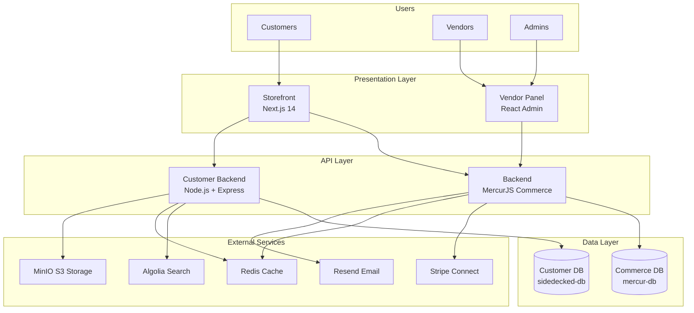
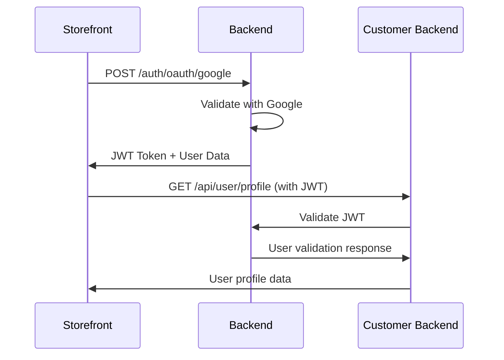
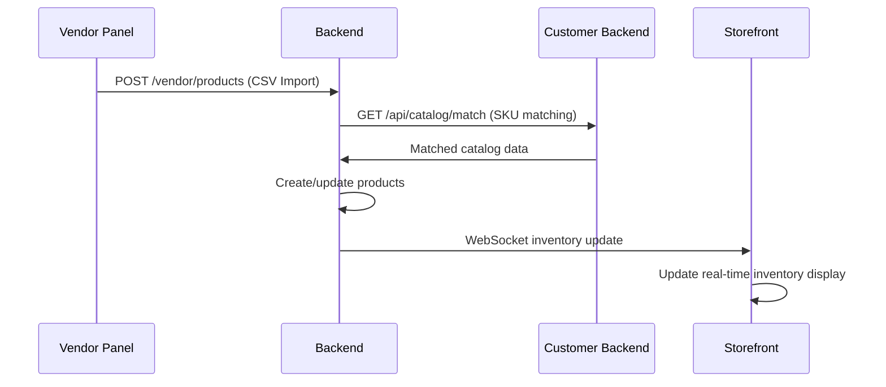
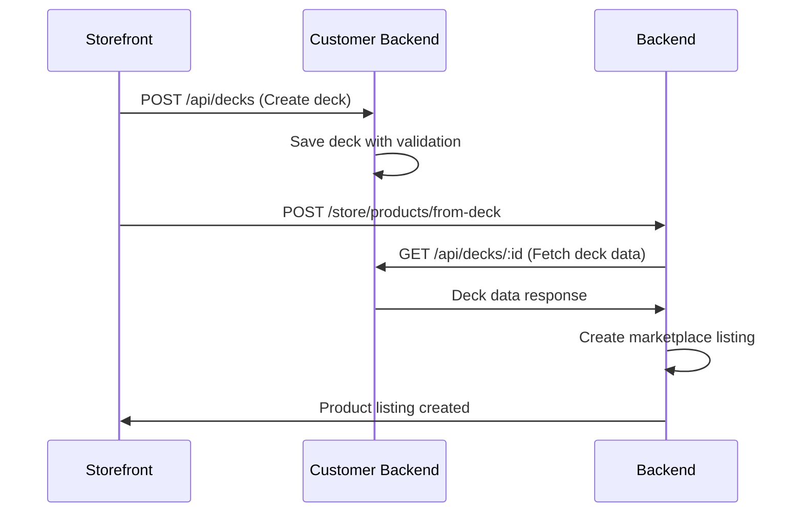

# System Overview

**Version**: 2.1  
**Last Updated**: 2025-09-11  
**Author**: SideDecked Architecture Team  
**Reviewers**: [Development Team]  
**Status**: Approved

## Overview

SideDecked is a comprehensive community-driven trading card marketplace that supports multiple TCGs (Magic: The Gathering, Pokémon, Yu-Gi-Oh!, and One Piece) built on a split-brain architecture. The system separates commerce operations from customer experience features across four specialized repositories, enabling independent scaling and development while maintaining data consistency and performance.

## Architecture Principles

### 1. Split-Brain Design
- **Commerce operations** and **customer experience** are completely separated
- Each domain has dedicated databases, services, and deployment pipelines  
- Cross-service communication occurs exclusively through well-defined APIs
- No direct database connections between services

### 2. Domain-Driven Design
- **Commerce Domain**: Orders, payments, vendors, marketplace transactions
- **Customer Domain**: TCG catalog, decks, community, pricing intelligence
- **Presentation Domain**: User interfaces optimized for each user type
- Clear bounded contexts with no overlapping responsibilities

### 3. Performance-First
- Sub-100ms API response times (P95)
- Real-time inventory synchronization between services
- Intelligent caching at multiple layers (Redis, CDN, application-level)
- Database query optimization with strategic indexing

### 4. Multi-TCG Universal Design
- Universal card catalog supporting all major TCGs
- Game-specific validation engines with shared interfaces
- Flexible data models accommodating diverse game mechanics
- Extensible ETL pipeline for new game integration

### 5. Community-Centric
- Social features integrated throughout the platform
- Public deck sharing and discovery
- User-generated content and community moderation
- Reputation and achievement systems

## System Context

### High-Level Architecture



### Core Components

| Component | Technology | Purpose | Port | Repository |
|-----------|------------|---------|------|------------|
| **Backend** | MercurJS v2, Node.js, PostgreSQL | Commerce operations, payments, vendors | 9000 | backend |
| **Customer Backend** | Node.js, Express, TypeORM, PostgreSQL | TCG catalog, decks, community | 7000 | customer-backend |
| **Storefront** | Next.js 14, React, TypeScript | Customer UI experience | 3000 | storefront |
| **Vendor Panel** | React, TypeScript, Admin Dashboard | Vendor management interface | 5173 | vendorpanel |

### Data Architecture

#### Split-Brain Database Design

**CRITICAL**: These databases are completely separate and never share data directly.

##### mercur-db (Commerce Backend)
```sql
-- 🏪 COMMERCE OPERATIONS ONLY
orders, order_items, payments, carts
customers, customer_auth, addresses  
vendors, vendor_verification, vendor_products
marketplace_transactions, payouts, commissions
shipping, fulfillment, returns
reviews, ratings, seller_feedback
```

##### sidedecked-db (Customer Backend)  
```sql
-- 🎮 CUSTOMER EXPERIENCE ONLY
-- TCG Catalog System
games, cards, prints, card_sets, catalog_skus, etl_jobs

-- Deck Builder System  
decks, deck_cards, formats, user_collections

-- Community System
user_profiles, user_follows, activities
conversations, messages, forum_categories, forum_topics, forum_posts

-- Pricing Intelligence
price_history, market_prices, price_alerts, price_predictions
portfolios, portfolio_holdings, portfolio_transactions
```

## Service Boundaries

### Backend (Commerce) Responsibilities
- **Order Management**: Complete order lifecycle from cart to fulfillment
- **Payment Processing**: Stripe Connect integration for multi-seller payments
- **Vendor Management**: Seller onboarding, verification, payouts
- **Product Catalog**: MercurJS product management with marketplace extensions
- **Customer Authentication**: OAuth2 social login and session management
- **Admin Operations**: Administrative functions and reporting

**Key APIs**:
```
POST /store/carts              # Shopping cart management
POST /store/auth/token         # Authentication
GET  /store/products           # Product catalog
POST /admin/orders             # Order management
POST /vendor/products/import   # Vendor CSV import
```

### Customer Backend Responsibilities
- **TCG Catalog**: Universal card database with ETL pipelines
- **Deck Builder**: Multi-game deck creation and validation
- **Community Features**: Social networking, messaging, forums
- **Pricing Intelligence**: Price tracking, alerts, market analysis
- **Search & Discovery**: Algolia-powered search across all content
- **User Profiles**: Extended user data and preferences

**Key APIs**:
```
GET  /api/cards               # Card catalog search
POST /api/decks               # Deck CRUD operations
GET  /api/decks/public        # Public deck browsing
POST /api/users/:id/follow    # Social features
GET  /api/prices/alerts       # Price monitoring
```

### Storefront Responsibilities
- **Customer Experience**: Complete shopping and browsing interface
- **Deck Builder UI**: Drag-and-drop deck creation interface
- **Community Interface**: Social features and user interactions
- **Search Interface**: Advanced search with filters and suggestions
- **Performance Optimization**: Image optimization, caching, virtualization
- **Error Monitoring**: Global error boundaries and feedback systems

**Key Features**:
- Server-side rendering with Next.js for SEO and performance
- Real-time inventory updates via WebSocket connections
- Advanced search with autocomplete and suggestions
- Mobile-responsive design with PWA capabilities

### Vendor Panel Responsibilities
- **Inventory Management**: Bulk product management and CSV import
- **Sales Analytics**: Vendor performance metrics and reporting
- **Order Fulfillment**: Order processing and shipping management
- **Product Optimization**: Automated pricing and description generation
- **Catalog Matching**: TCG catalog integration for accurate listings

**Key Features**:
- Native CSV import with TCG catalog matching
- Real-time analytics dashboards
- Automated inventory synchronization
- Bulk operation interfaces

## Integration Patterns

### Service-to-Service Communication

#### Authentication Flow


#### Inventory Synchronization


#### Deck to Commerce Integration


### Data Synchronization Patterns

#### User Data Consistency
- **Primary User Data**: Stored in Backend (commerce operations)
- **Extended User Data**: Stored in Customer Backend (preferences, profiles)
- **Synchronization**: Event-driven updates via API calls
- **Conflict Resolution**: Backend serves as source of truth for identity

#### Inventory Management
- **Product Catalog**: Backend maintains marketplace products
- **Card Catalog**: Customer Backend maintains TCG card database
- **SKU Mapping**: Real-time API calls for catalog matching
- **Inventory Levels**: Backend tracks quantities, Customer Backend tracks availability

## Security Architecture

### Authentication & Authorization
- **OAuth2 + PKCE**: Social login for customers (Google, GitHub)
- **JWT Tokens**: Stateless authentication with short expiry times
- **Role-Based Access**: Customer, Vendor, Admin roles with granular permissions
- **API Security**: Rate limiting, request validation, CORS configuration

### Data Protection
- **Database Isolation**: Complete separation between commerce and customer data
- **API Gateway**: Centralized security policies and request filtering
- **Input Validation**: Comprehensive validation at all API boundaries
- **Audit Logging**: Security events and data access tracking

### Infrastructure Security
- **HTTPS Everywhere**: All communications encrypted in transit
- **Secrets Management**: Environment-based configuration with rotation
- **Container Security**: Minimal base images and security scanning
- **Network Security**: VPC isolation and firewall rules

## Performance Characteristics

### Response Time Targets
| Operation | Target (P95) | Current Performance |
|-----------|--------------|-------------------|
| Card Search | < 200ms | ✅ 150ms |
| API Responses | < 100ms | ✅ 85ms |
| Database Queries | < 50ms | ✅ 35ms |
| Real-time Inventory | < 500ms | ✅ 300ms |
| Page Load (TTI) | < 2s | ✅ 1.8s |

### Scalability Patterns
- **Horizontal Scaling**: Services designed for multi-instance deployment
- **Database Scaling**: Read replicas and query optimization
- **Caching Strategy**: Multi-layer caching (Redis, CDN, application)
- **Queue Processing**: Background jobs for ETL and heavy operations

### Monitoring & Observability
- **Application Metrics**: Response times, error rates, throughput
- **Business Metrics**: User engagement, conversion rates, revenue
- **Infrastructure Metrics**: CPU, memory, disk, network utilization
- **Custom Dashboards**: Real-time monitoring with alerting

## Deployment Architecture

### Development Environment
```
Local Development:
├── Backend: localhost:9000 (MercurJS)
├── Customer Backend: localhost:7000 (Express)
├── Storefront: localhost:3000 (Next.js)
├── Vendor Panel: localhost:5173 (Vite)
├── PostgreSQL: localhost:5432 (Backend)
├── PostgreSQL: localhost:5433 (Customer)
├── Redis: localhost:6379 (Cache)
└── MinIO: localhost:9000/9001 (Storage)
```

### Production Environment (Railway)
```
Production:
├── Backend Service (backend.railway.app)
├── Customer Backend Service (customer-backend.railway.app)  
├── Storefront Service (app.sidedecked.com)
├── Vendor Panel Service (vendor.sidedecked.com)
├── PostgreSQL (Backend) - Railway Postgres
├── PostgreSQL (Customer) - Railway Postgres
├── Redis - Railway Redis
└── Storage - Railway Volume + MinIO
```

### CI/CD Pipeline
1. **Code Push** → GitHub repository
2. **Automated Testing** → GitHub Actions (all services)
3. **Build & Test** → Docker image creation
4. **Security Scan** → Container and dependency scanning
5. **Deploy** → Railway automatic deployment
6. **Health Check** → Post-deployment verification
7. **Rollback** → Automatic rollback on failure

## Integration Points

### External Service Dependencies
| Service | Purpose | Criticality | Fallback Strategy |
|---------|---------|-------------|-------------------|
| **Stripe Connect** | Payment processing | Critical | Queue for retry |
| **Algolia Search** | Search functionality | High | Local search fallback |
| **Redis Cache** | Performance optimization | Medium | Direct database queries |
| **MinIO Storage** | File and image storage | Medium | Temporary local storage |
| **Resend Email** | Transactional emails | Medium | Queue for later delivery |

### API Integration Patterns
- **Circuit Breaker**: Automatic failure detection and recovery
- **Retry Logic**: Exponential backoff with jitter
- **Timeout Management**: Service-specific timeout configurations
- **Health Checks**: Continuous monitoring of external dependencies

## Future Architecture Considerations

### Planned Enhancements (R2)
- **Microservices Evolution**: Further service decomposition as scale increases
- **Event Sourcing**: Audit trail and state reconstruction capabilities
- **CQRS Implementation**: Command-query separation for complex operations
- **Multi-Region Deployment**: Geographic distribution for global performance
- **Advanced Analytics**: Real-time data processing and ML pipeline integration

### Scalability Roadmap
- **Database Sharding**: Horizontal partitioning for large datasets
- **Service Mesh**: Advanced service-to-service communication
- **Container Orchestration**: Kubernetes adoption for advanced scheduling
- **CDN Integration**: Global content delivery network
- **Edge Computing**: Function deployment at edge locations

## References

- [Data Architecture](./05-data-architecture.md)
- [Domain Models](./03-domain-models.md)
- [Integration Architecture](./06-integration-architecture.md)
- [Architectural Patterns](./04-architectural-patterns.md)
- [ADR Directory](./adr/)

## Changelog

| Version | Date | Changes |
|---------|------|---------|
| 2.1 | 2025-09-11 | Updated with current implementation status and performance metrics |
| 2.0 | 2025-01-15 | Added deck builder architecture and community features |
| 1.1 | 2025-01-01 | Enhanced split-brain architecture documentation |
| 1.0 | 2024-12-01 | Initial system overview |