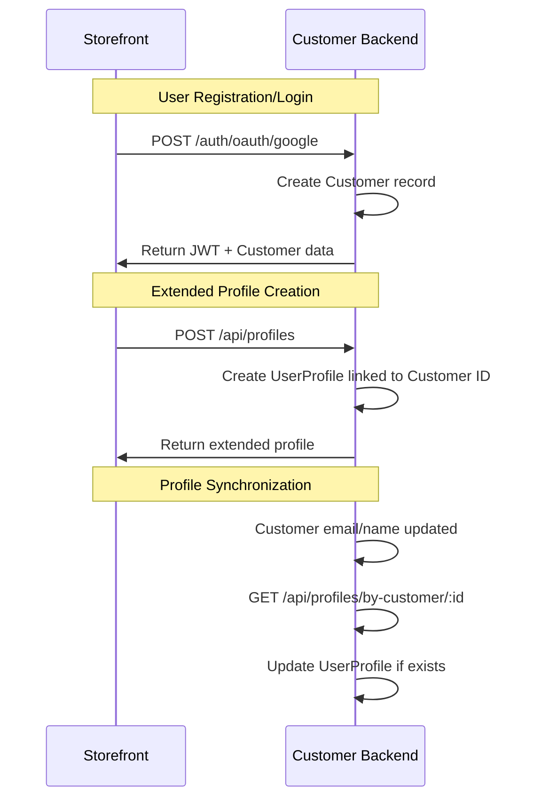
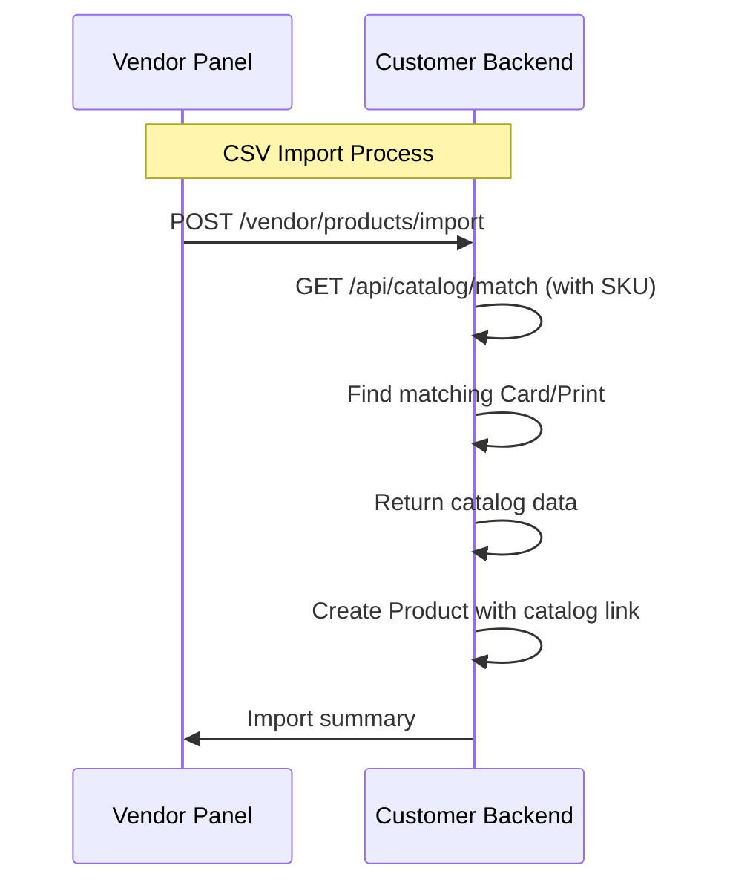
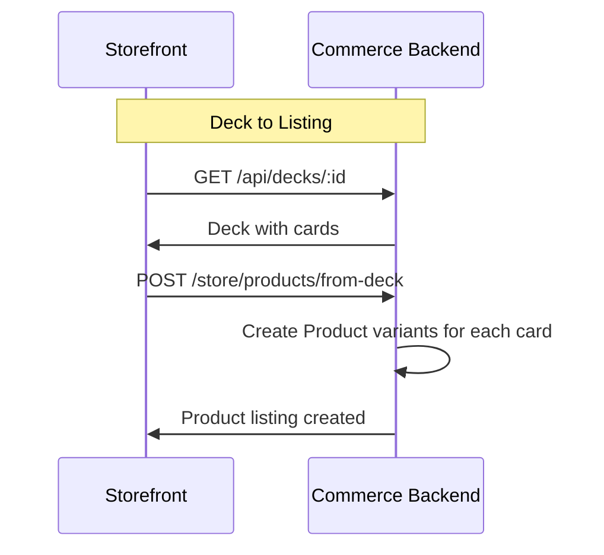

# Domain Models

**Version**: 2.2  
**Last Updated**: 2025-09-11  
**Author**: SideDecked Architecture Team  
**Reviewers**: [Development Team]  
**Status**: Approved

## Overview

This document defines the domain models and bounded contexts for the SideDecked platform. The system follows Domain-Driven Design principles with clear separation between commerce operations and customer experience domains.

## Bounded Contexts

### 1. Commerce Domain (mercur-db)

**Purpose**: Handles all marketplace transactions, vendor management, and order processing.

**Core Responsibilities**:
- Order lifecycle management
- Payment processing and financial transactions
- Vendor onboarding and management
- Product catalog for marketplace listings
- Customer authentication and basic profile data
- Shipping and fulfillment operations

#### Core Aggregates

##### Customer Aggregate
```typescript
// Root: Customer
interface Customer {
  id: string
  email: string
  firstName?: string
  lastName?: string
  addresses: Address[]
  
  // Authentication data
  authProviders: AuthProvider[]
  isEmailVerified: boolean
  
  // Commerce metadata
  stripeCustomerId?: string
  preferredCurrency: string
  
  created_at: Date
  updated_at: Date
}

interface Address {
  id: string
  customerId: string
  type: 'billing' | 'shipping'
  firstName: string
  lastName: string
  company?: string
  address1: string
  address2?: string
  city: string
  province: string
  postalCode: string
  countryCode: string
  phone?: string
  isDefault: boolean
}

interface AuthProvider {
  id: string
  provider: 'google' | 'github' | 'email'
  providerId: string
  email: string
}
```

**Business Rules**:
- Customer must have verified email before placing orders
- At least one address required for checkout
- Unique email per customer across all auth providers

##### Order Aggregate
```typescript
// Root: Order
interface Order {
  id: string
  customerId: string
  
  // Order details
  displayId: number
  status: OrderStatus
  currency: string
  subtotal: number
  taxTotal: number
  shippingTotal: number
  total: number
  
  // Relationships
  items: OrderItem[]
  payments: Payment[]
  fulfillments: Fulfillment[]
  returns?: Return[]
  
  // Shipping
  shippingAddress: Address
  billingAddress: Address
  
  // Metadata
  metadata: Record<string, any>
  
  created_at: Date
  updated_at: Date
}

interface OrderItem {
  id: string
  orderId: string
  variantId: string
  productId: string
  title: string
  description?: string
  thumbnail?: string
  quantity: number
  unitPrice: number
  total: number
  
  // Vendor information
  vendorId: string
  vendorName: string
}

enum OrderStatus {
  PENDING = 'pending',
  CONFIRMED = 'confirmed',
  FULFILLED = 'fulfilled',
  CANCELLED = 'cancelled',
  RETURNED = 'returned'
}
```

**Business Rules**:
- Order total must equal sum of items + tax + shipping
- Orders can only be modified in 'pending' status
- Each order item maps to a specific vendor for multi-seller support

##### Vendor Aggregate
```typescript
// Root: Vendor
interface Vendor {
  id: string
  
  // Identity
  businessName: string
  email: string
  contactName: string
  
  // Verification
  verificationStatus: VendorVerificationStatus
  verificationDocuments: VerificationDocument[]
  
  // Financial
  stripeAccountId: string
  payoutSchedule: PayoutSchedule
  commissionRate: number
  
  // Settings
  settings: VendorSettings
  
  created_at: Date
  updated_at: Date
}

interface VendorSettings {
  autoAcceptOrders: boolean
  shippingProfiles: ShippingProfile[]
  returnPolicy: string
  processingTime: number // days
}

enum VendorVerificationStatus {
  PENDING = 'pending',
  UNDER_REVIEW = 'under_review',
  VERIFIED = 'verified',
  REJECTED = 'rejected',
  SUSPENDED = 'suspended'
}
```

##### Product Aggregate
```typescript
// Root: Product (Marketplace Listing)
interface Product {
  id: string
  vendorId: string
  
  // Basic information
  title: string
  description?: string
  handle: string
  status: ProductStatus
  
  // Media
  images: ProductImage[]
  thumbnail?: string
  
  // Variants (different conditions, languages, etc.)
  variants: ProductVariant[]
  
  // TCG Integration
  catalogSku?: string // Links to customer-backend card catalog
  gameType?: 'MTG' | 'POKEMON' | 'YUGIOH' | 'OPTCG'
  
  // SEO and discovery
  tags: string[]
  metaTitle?: string
  metaDescription?: string
  
  created_at: Date
  updated_at: Date
}

interface ProductVariant {
  id: string
  productId: string
  title: string
  sku: string
  
  // Pricing
  price: number
  compareAtPrice?: number
  
  // Inventory
  inventoryQuantity: number
  allowBackorder: boolean
  trackQuantity: boolean
  
  // TCG specific
  condition?: 'NM' | 'LP' | 'MP' | 'HP' | 'DMG'
  language?: string
  foil?: boolean
  signed?: boolean
  
  // Physical properties
  weight?: number
  length?: number
  width?: number
  height?: number
  
  created_at: Date
  updated_at: Date
}
```

---

### 2. Customer Experience Domain (sidedecked-db)

**Purpose**: Manages all customer-facing features including TCG catalog, deck building, community, and pricing intelligence.

#### Core Aggregates

##### Game Aggregate
```typescript
// Root: Game
interface Game {
  id: string
  code: 'MTG' | 'POKEMON' | 'YUGIOH' | 'OPTCG'
  name: string
  displayName: string
  
  // Game mechanics
  hasColors: boolean
  hasEnergyTypes: boolean
  hasPowerToughness: boolean
  hasLevels: boolean
  
  // ETL configuration
  etlEnabled: boolean
  etlSource: string
  lastEtlRun?: Date
  
  // Display configuration
  cardBackImage: string
  primaryColor: string
  logoUrl: string
  
  // Relationships
  cards: Card[]
  sets: CardSet[]
  formats: Format[]
  
  created_at: Date
  updated_at: Date
}
```

##### Card Aggregate (Universal TCG Catalog)
```typescript
// Root: Card (Universal Oracle)
interface Card {
  id: string
  gameId: string
  
  // Universal identity
  oracleId: string // Unique across all printings
  name: string
  normalizedName: string
  
  // Universal attributes
  primaryType: string
  subtypes: string[]
  supertypes: string[]
  
  // Rules text
  oracleText?: string
  flavorText?: string
  keywords: string[]
  
  // Universal power system
  powerValue?: number  // Attack/Power/ATK
  defenseValue?: number // Toughness/HP/DEF
  
  // Game-specific data (stored as JSONB)
  gameData: GameSpecificData
  
  // Search optimization
  popularityScore: number
  totalViews: number
  totalSearches: number
  
  // Relationships
  game: Game
  prints: Print[]
  
  created_at: Date
  updated_at: Date
}

// Game-specific data stored as flexible JSONB
interface GameSpecificData {
  // MTG specific
  manaCost?: string
  manaValue?: number
  colors?: string[]
  colorIdentity?: string[]
  
  // Pokemon specific
  hp?: number
  retreatCost?: number
  energyTypes?: string[]
  
  // Yu-Gi-Oh! specific
  attribute?: string
  level?: number
  rank?: number
  attackValue?: number
  defenseValueYugioh?: number
  
  // One Piece specific
  cost?: number
  power?: number
  counter?: number
  life?: number
}

interface Print {
  id: string
  cardId: string
  setId: string
  
  // Print identification
  number: string
  rarity: string
  artist: string
  language: string
  
  // Images
  imageSmall?: string
  imageNormal?: string
  imageLarge?: string
  imageArtCrop?: string
  blurhash?: string
  
  // Pricing data
  currentMarketPrice?: number
  priceHistory: PriceHistoryEntry[]
  
  created_at: Date
  updated_at: Date
}
```

**Business Rules**:
- Each card has exactly one oracle identity across all printings
- Game-specific data must validate against game mechanics
- Images are processed and stored with multiple resolutions
- Price data is tracked per print, not per oracle card

##### Deck Aggregate
```typescript
// Root: Deck
interface Deck {
  id: string
  userId: string // References commerce customer ID
  
  // Deck identity
  name: string
  description?: string
  format: string
  game: 'MTG' | 'POKEMON' | 'YUGIOH' | 'OPTCG'
  
  // Visibility and sharing
  isPublic: boolean
  isArchived: boolean
  
  // Deck composition
  cards: DeckCard[]
  
  // Social features
  likes: number
  views: number
  copies: number
  tags: string[]
  
  // Visual representation
  coverImage?: string
  
  // Validation status
  isValid: boolean
  validationErrors: ValidationError[]
  lastValidated?: Date
  
  // Statistics
  totalCards: number
  estimatedValue: number
  completionPercentage: number // Based on user's collection
  
  created_at: Date
  updated_at: Date
}

interface DeckCard {
  id: string
  deckId: string
  cardId: string // References Card oracle ID
  printId?: string // Specific print preference
  
  quantity: number
  zone: DeckZone // main, sideboard, commander, extra
  
  // User customization
  notes?: string
  tags?: string[]
  
  // Relationships
  card: Card
  print?: Print
}

enum DeckZone {
  MAIN = 'main',
  SIDEBOARD = 'sideboard', 
  COMMANDER = 'commander', // MTG Commander
  EXTRA = 'extra', // Yu-Gi-Oh Extra Deck
  ENERGY = 'energy' // Pokemon energy cards
}

interface ValidationError {
  type: 'format_violation' | 'banned_card' | 'quantity_limit' | 'deck_size'
  message: string
  cardId?: string
  details?: Record<string, any>
}
```

**Business Rules**:
- Deck format must be valid for the selected game
- Card quantities must respect format restrictions
- Public decks are discoverable by all users
- Deck statistics are calculated in real-time

##### UserProfile Aggregate
```typescript
// Root: UserProfile (Extended customer data)
interface UserProfile {
  id: string
  customerId: string // References commerce customer ID
  
  // Public profile
  username: string
  displayName?: string
  bio?: string
  avatar?: string
  location?: string
  
  // Gaming preferences
  favoriteGames: string[]
  favoriteFormats: string[]
  playStyle: string[]
  
  // Social features
  followers: UserFollow[]
  following: UserFollow[]
  
  // Reputation system
  reputationScore: number
  badges: Badge[]
  achievements: Achievement[]
  
  // Privacy settings
  isProfilePublic: boolean
  showCollection: boolean
  showDecks: boolean
  
  // Activity tracking
  lastActiveAt: Date
  totalDecksCreated: number
  totalCardsViewed: number
  
  created_at: Date
  updated_at: Date
}

interface UserFollow {
  id: string
  followerId: string
  followeeId: string
  created_at: Date
}

interface Badge {
  id: string
  name: string
  description: string
  iconUrl: string
  rarity: 'common' | 'uncommon' | 'rare' | 'legendary'
  earnedAt: Date
}
```

##### Collection Aggregate
```typescript
// Root: Collection
interface Collection {
  id: string
  userId: string
  
  // Collection metadata
  name: string
  description?: string
  isPublic: boolean
  
  // Collection items
  items: CollectionItem[]
  
  // Statistics
  totalCards: number
  totalValue: number
  uniqueCards: number
  completionBySet: SetCompletion[]
  
  created_at: Date
  updated_at: Date
}

interface CollectionItem {
  id: string
  collectionId: string
  printId: string
  
  quantity: number
  condition: 'NM' | 'LP' | 'MP' | 'HP' | 'DMG'
  language: string
  foil: boolean
  signed: boolean
  
  // Acquisition info
  acquiredDate?: Date
  acquiredPrice?: number
  currentValue?: number
  
  // Personal notes
  notes?: string
  tags?: string[]
  
  // Location tracking
  location?: string
  binderPage?: number
  
  // Relationships
  print: Print
}

interface SetCompletion {
  setId: string
  totalCards: number
  ownedCards: number
  completionPercentage: number
  missingCards: string[] // Card IDs
}
```

##### Pricing Aggregate
```typescript
// Root: PriceHistory
interface PriceHistory {
  id: string
  printId: string
  
  // Price data
  prices: PriceEntry[]
  currentPrice: number
  averagePrice30d: number
  averagePrice90d: number
  
  // Market analysis
  priceDirection: 'up' | 'down' | 'stable'
  volatility: number
  marketCap: number
  
  // Data sources
  sources: PriceSource[]
  lastUpdated: Date
  
  created_at: Date
  updated_at: Date
}

interface PriceEntry {
  price: number
  condition: string
  source: string
  timestamp: Date
  volume?: number
}

interface PriceAlert {
  id: string
  userId: string
  printId: string
  
  // Alert conditions
  triggerPrice: number
  condition: 'above' | 'below'
  isActive: boolean
  
  // Notification preferences
  emailNotification: boolean
  pushNotification: boolean
  
  // Alert history
  triggeredAt?: Date
  lastChecked: Date
  
  created_at: Date
  updated_at: Date
}
```

---

## Cross-Domain Data Flow

### User Identity Management



### Product to Catalog Mapping



### Deck to Marketplace Flow



## Data Consistency Patterns

### Eventually Consistent Data
- **User profile information** (name, avatar) synced periodically
- **Collection statistics** updated via background jobs
- **Price data** refreshed on scheduled intervals
- **Search indexes** updated asynchronously

### Strongly Consistent Data
- **Order and payment information** - ACID transactions
- **Inventory quantities** - Real-time updates
- **User authentication data** - Immediate consistency
- **Financial calculations** - Transaction-based consistency

### Event-Driven Synchronization
```typescript
// Example: Customer profile update event
interface CustomerProfileUpdatedEvent {
  customerId: string
  email: string
  firstName?: string
  lastName?: string
  timestamp: Date
}

// Customer Backend handles this event
async handleCustomerProfileUpdated(event: CustomerProfileUpdatedEvent) {
  const profile = await this.userProfileRepo.findByCustomerId(event.customerId)
  if (profile) {
    await this.userProfileRepo.update(profile.id, {
      email: event.email,
      displayName: `${event.firstName} ${event.lastName}`.trim()
    })
  }
}
```

## Domain Services

### Commerce Domain Services
- **OrderService**: Order lifecycle management
- **PaymentService**: Stripe Connect integration
- **VendorService**: Seller onboarding and management
- **ProductService**: Marketplace listings
- **AuthService**: Customer authentication

### Customer Domain Services
- **CardCatalogService**: TCG data management and ETL
- **DeckService**: Deck CRUD and validation
- **DeckValidationService**: Format-specific validation
- **CollectionService**: Personal collection management
- **PriceTrackingService**: Market data and alerts
- **CommunityService**: Social features

### Cross-Domain Integration Services
- **CatalogMappingService**: Product-to-card matching
- **InventoryService**: Real-time stock synchronization
- **UserSyncService**: Profile data consistency
- **EventDispatcher**: Cross-service event distribution

## References

- [System Overview](./01-system-overview.md)
- [Architectural Principles](./02-architectural-principles.md)
- [Data Architecture](./05-data-architecture.md)
- [Integration Architecture](./06-integration-architecture.md)

## Changelog

| Version | Date | Changes |
|---------|------|---------|
| 2.2 | 2025-09-11 | Added comprehensive domain aggregates and cross-domain patterns |
| 2.1 | 2025-01-15 | Enhanced with community and pricing domains |
| 2.0 | 2025-01-01 | Major revision with DDD principles |
| 1.0 | 2024-12-01 | Initial domain model definition |