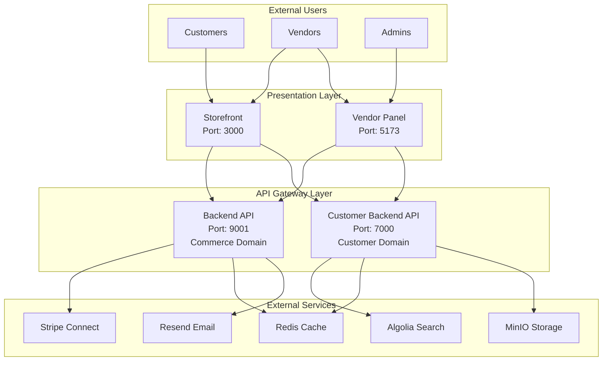
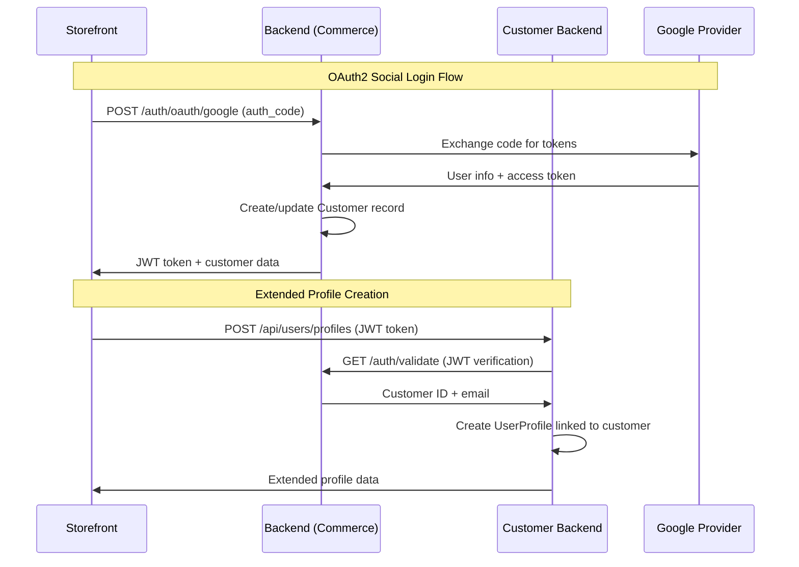
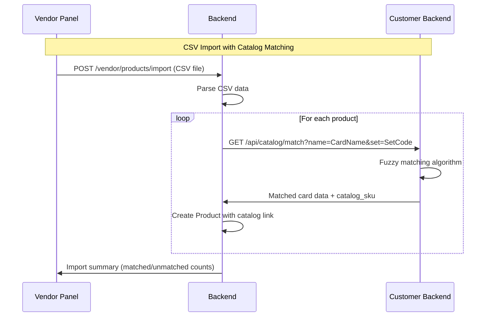
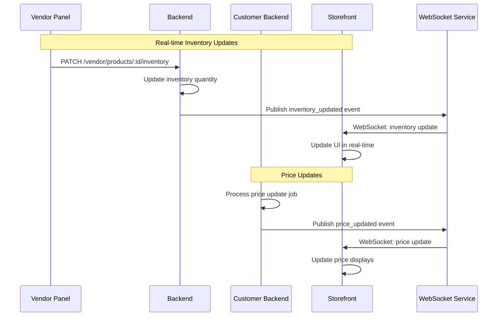
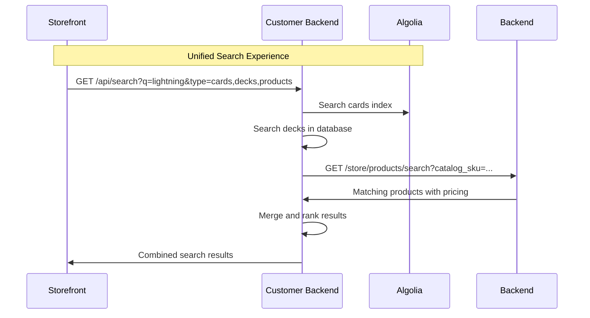

# Integration Architecture

**Version**: 2.0  
**Last Updated**: 2025-09-11  
**Author**: SideDecked Architecture Team  
**Reviewers**: [Development Team, API Team]  
**Status**: Approved

## Overview

This document defines the integration patterns, API contracts, and communication protocols between all services in the SideDecked platform. The split-brain architecture requires sophisticated integration patterns to maintain data consistency while preserving service independence.

## Integration Principles

### 1. API-First Communication

**Principle**: All service-to-service communication must occur through well-defined APIs, never through direct database access.

**Implementation Rules**:
- ✅ **REQUIRED**: RESTful APIs for synchronous operations
- ✅ **REQUIRED**: Event-driven messaging for asynchronous operations  
- ✅ **REQUIRED**: Circuit breakers for external service calls
- ❌ **FORBIDDEN**: Direct database connections between services
- ❌ **FORBIDDEN**: Shared database schemas or tables

### 2. Service Boundaries



## API Integration Patterns

### 3. Commerce to Customer Domain Integration

#### Authentication Flow


**Implementation**:
```typescript
// Backend: OAuth handler
export async function handleGoogleOAuth(
  req: MedusaRequest,
  res: MedusaResponse
): Promise<void> {
  const { authCode } = req.body
  
  try {
    // Exchange authorization code for tokens
    const tokens = await this.googleAuth.exchangeCodeForTokens(authCode)
    const userInfo = await this.googleAuth.getUserInfo(tokens.accessToken)
    
    // Find or create customer
    let customer = await this.customerService.findByEmail(userInfo.email)
    if (!customer) {
      customer = await this.customerService.create({
        email: userInfo.email,
        firstName: userInfo.given_name,
        lastName: userInfo.family_name,
        authProviders: [{
          provider: 'google',
          providerId: userInfo.sub,
          email: userInfo.email
        }]
      })
    }
    
    // Generate JWT
    const jwtToken = this.jwtService.sign({
      customerId: customer.id,
      email: customer.email,
      type: 'customer'
    })
    
    res.json({
      success: true,
      token: jwtToken,
      customer: {
        id: customer.id,
        email: customer.email,
        firstName: customer.firstName,
        lastName: customer.lastName
      }
    })
    
  } catch (error) {
    res.status(400).json({
      success: false,
      error: 'OAuth authentication failed',
      message: error.message
    })
  }
}

// Customer Backend: Profile creation
export async function createUserProfile(
  req: Request,
  res: Response
): Promise<void> {
  const jwtToken = req.headers.authorization?.replace('Bearer ', '')
  
  try {
    // Validate JWT with commerce backend
    const validation = await this.commerceAPI.validateJWT(jwtToken)
    if (!validation.valid) {
      return res.status(401).json({ error: 'Invalid token' })
    }
    
    // Create extended profile
    const profile = await this.userProfileService.create({
      customerId: validation.customerId,
      email: validation.email,
      displayName: req.body.displayName,
      favoriteGames: req.body.favoriteGames || []
    })
    
    res.status(201).json({
      success: true,
      profile
    })
    
  } catch (error) {
    res.status(500).json({
      success: false,
      error: 'Profile creation failed'
    })
  }
}
```

#### Product to Catalog Mapping


**Implementation**:
```typescript
// Backend: CSV import with catalog matching
export class VendorProductService extends TransactionBaseService {
  constructor(
    container: any,
    private readonly customerAPI: CustomerAPIClient
  ) {
    super(container)
  }
  
  async importFromCSV(
    vendorId: string, 
    csvFile: Buffer
  ): Promise<ImportResult> {
    return await this.atomicPhase_(async (manager) => {
      const products = await this.parseCSV(csvFile)
      let matched = 0
      let unmatched = 0
      
      for (const productData of products) {
        try {
          // Attempt catalog matching
          const catalogMatch = await this.customerAPI.matchCard({
            name: productData.name,
            set: productData.set,
            game: productData.game
          })
          
          if (catalogMatch) {
            // Create product with catalog link
            const product = await manager.create(Product, {
              ...productData,
              vendorId,
              catalogSku: catalogMatch.sku,
              gameType: catalogMatch.game,
              title: catalogMatch.name, // Use canonical name
              tags: [...(productData.tags || []), catalogMatch.type]
            })
            
            await manager.save(product)
            matched++
          } else {
            // Create product without catalog link
            const product = await manager.create(Product, {
              ...productData,
              vendorId,
              catalogSku: null
            })
            
            await manager.save(product)
            unmatched++
          }
          
        } catch (error) {
          this.logger.warn('Product import failed', {
            product: productData.name,
            error: error.message
          })
          unmatched++
        }
      }
      
      return { matched, unmatched, total: products.length }
    })
  }
}

// Customer Backend: Card matching service
export class CardMatchingService {
  async matchCard(query: CardMatchQuery): Promise<CardMatch | null> {
    // 1. Exact name match
    let card = await this.cardRepository.findOne({
      where: {
        name: query.name,
        game: { code: query.game }
      },
      relations: ['game', 'prints', 'prints.set']
    })
    
    if (card) {
      return this.buildCardMatch(card, query.set)
    }
    
    // 2. Fuzzy name matching
    const fuzzyResults = await this.cardRepository
      .createQueryBuilder('card')
      .leftJoinAndSelect('card.game', 'game')
      .leftJoinAndSelect('card.prints', 'prints')
      .leftJoinAndSelect('prints.set', 'set')
      .where('game.code = :game', { game: query.game })
      .andWhere('similarity(card.name, :name) > 0.7', { name: query.name })
      .orderBy('similarity(card.name, :name)', 'DESC')
      .limit(5)
      .getMany()
    
    if (fuzzyResults.length > 0) {
      const bestMatch = fuzzyResults[0]
      
      // Prefer exact set matches
      if (query.set) {
        const setMatch = fuzzyResults.find(card => 
          card.prints.some(print => 
            print.set.code.toLowerCase() === query.set.toLowerCase()
          )
        )
        if (setMatch) {
          return this.buildCardMatch(setMatch, query.set)
        }
      }
      
      return this.buildCardMatch(bestMatch)
    }
    
    return null
  }
  
  private buildCardMatch(card: Card, preferredSet?: string): CardMatch {
    // Select best print for the product
    let selectedPrint = card.prints[0]
    
    if (preferredSet) {
      const setPrint = card.prints.find(print => 
        print.set.code.toLowerCase() === preferredSet.toLowerCase()
      )
      if (setPrint) {
        selectedPrint = setPrint
      }
    }
    
    return {
      sku: `${card.game.code}-${card.oracle_id}`,
      cardId: card.id,
      printId: selectedPrint.id,
      name: card.name,
      game: card.game.code,
      type: card.primary_type,
      set: selectedPrint.set.name,
      setCode: selectedPrint.set.code,
      rarity: selectedPrint.rarity,
      imageUrl: selectedPrint.image_normal,
      confidence: 1.0 // Exact match
    }
  }
}
```

### 4. Real-Time Inventory Synchronization



**Implementation**:
```typescript
// Backend: Inventory update with event publishing
export class InventoryService extends TransactionBaseService {
  constructor(
    container: any,
    private readonly eventBus: EventBusService,
    private readonly websocketService: WebSocketService
  ) {
    super(container)
  }
  
  async updateInventory(
    variantId: string,
    quantity: number,
    vendorId: string
  ): Promise<void> {
    return await this.atomicPhase_(async (manager) => {
      // Update inventory
      const variant = await manager.findOne(ProductVariant, variantId)
      if (!variant || variant.product.vendorId !== vendorId) {
        throw new Error('Variant not found or access denied')
      }
      
      const previousQuantity = variant.inventoryQuantity
      variant.inventoryQuantity = quantity
      variant.updated_at = new Date()
      
      await manager.save(variant)
      
      // Publish real-time event
      const event = {
        type: 'inventory_updated',
        data: {
          variantId,
          productId: variant.productId,
          previousQuantity,
          newQuantity: quantity,
          inStock: quantity > 0,
          timestamp: new Date().toISOString()
        }
      }
      
      // Emit to WebSocket service for real-time updates
      await this.websocketService.broadcast(`product:${variant.productId}`, event)
      
      // Emit to event bus for other services
      await this.eventBus.emit('inventory.updated', event.data)
    })
  }
}

// Storefront: WebSocket client for real-time updates
export class RealTimeInventoryService {
  private socket: WebSocket | null = null
  private subscriptions = new Map<string, Set<(data: any) => void>>()
  
  connect(): void {
    this.socket = new WebSocket(process.env.WEBSOCKET_URL)
    
    this.socket.onmessage = (event) => {
      const message = JSON.parse(event.data)
      this.handleMessage(message)
    }
    
    this.socket.onopen = () => {
      console.log('WebSocket connected')
      this.resubscribe()
    }
    
    this.socket.onclose = () => {
      console.log('WebSocket disconnected, reconnecting...')
      setTimeout(() => this.connect(), 1000)
    }
  }
  
  subscribe(channel: string, callback: (data: any) => void): void {
    if (!this.subscriptions.has(channel)) {
      this.subscriptions.set(channel, new Set())
    }
    
    this.subscriptions.get(channel)!.add(callback)
    
    // Send subscription message if connected
    if (this.socket?.readyState === WebSocket.OPEN) {
      this.socket.send(JSON.stringify({
        type: 'subscribe',
        channel
      }))
    }
  }
  
  private handleMessage(message: any): void {
    const { channel, data } = message
    const callbacks = this.subscriptions.get(channel)
    
    if (callbacks) {
      callbacks.forEach(callback => callback(data))
    }
  }
}

// React component using real-time inventory
export function ProductCard({ product }: { product: Product }) {
  const [inventory, setInventory] = useState(product.variants[0].inventoryQuantity)
  const realTimeService = useRealTimeInventory()
  
  useEffect(() => {
    const unsubscribe = realTimeService.subscribe(
      `product:${product.id}`,
      (data) => {
        if (data.type === 'inventory_updated') {
          setInventory(data.newQuantity)
        }
      }
    )
    
    return unsubscribe
  }, [product.id])
  
  return (
    <div className="product-card">
      <h3>{product.title}</h3>
      <div className={`stock-status ${inventory > 0 ? 'in-stock' : 'out-of-stock'}`}>
        {inventory > 0 ? `${inventory} in stock` : 'Out of stock'}
      </div>
    </div>
  )
}
```

### 5. Search Integration



**Implementation**:
```typescript
// Customer Backend: Unified search service
export class UnifiedSearchService {
  constructor(
    private readonly algoliaClient: AlgoliaClient,
    private readonly deckRepository: DeckRepository,
    private readonly commerceAPI: CommerceAPIClient
  ) {}
  
  async search(query: SearchQuery): Promise<UnifiedSearchResult> {
    const results = await Promise.allSettled([
      this.searchCards(query),
      this.searchDecks(query),
      this.searchProducts(query)
    ])
    
    return {
      cards: results[0].status === 'fulfilled' ? results[0].value : [],
      decks: results[1].status === 'fulfilled' ? results[1].value : [],
      products: results[2].status === 'fulfilled' ? results[2].value : [],
      query: query.q,
      total: results.reduce((sum, result) => 
        sum + (result.status === 'fulfilled' ? result.value.length : 0), 0
      )
    }
  }
  
  private async searchCards(query: SearchQuery): Promise<CardSearchResult[]> {
    if (!query.types?.includes('cards')) return []
    
    const algoliaQuery = {
      query: query.q,
      filters: [
        query.game && `game:${query.game}`,
        query.format && `formats:${query.format}`,
        query.rarity && `rarity:${query.rarity}`
      ].filter(Boolean).join(' AND '),
      hitsPerPage: query.limit || 20
    }
    
    const response = await this.algoliaClient.search('cards', algoliaQuery)
    
    return response.hits.map(hit => ({
      type: 'card',
      id: hit.objectID,
      name: hit.name,
      game: hit.game,
      imageUrl: hit.image_normal,
      rarity: hit.rarity,
      relevanceScore: hit._highlightResult?.name?.matchLevel === 'full' ? 1.0 : 0.8
    }))
  }
  
  private async searchDecks(query: SearchQuery): Promise<DeckSearchResult[]> {
    if (!query.types?.includes('decks')) return []
    
    const decks = await this.deckRepository
      .createQueryBuilder('deck')
      .where('deck.is_public = true')
      .andWhere(`
        deck.name ILIKE :query 
        OR deck.description ILIKE :query 
        OR :query = ANY(deck.tags)
      `, { query: `%${query.q}%` })
      .andWhere(query.game ? 'deck.game = :game' : '1=1', { game: query.game })
      .andWhere(query.format ? 'deck.format = :format' : '1=1', { format: query.format })
      .orderBy('deck.total_views', 'DESC')
      .limit(query.limit || 10)
      .getMany()
    
    return decks.map(deck => ({
      type: 'deck',
      id: deck.id,
      name: deck.name,
      format: deck.format,
      game: deck.game,
      cardCount: deck.totalCards,
      likes: deck.likes,
      views: deck.views
    }))
  }
  
  private async searchProducts(query: SearchQuery): Promise<ProductSearchResult[]> {
    if (!query.types?.includes('products')) return []
    
    try {
      // Get catalog matches first to find relevant products
      const cardResults = await this.searchCards({ ...query, types: ['cards'] })
      if (cardResults.length === 0) return []
      
      const catalogSkus = cardResults.map(card => `${card.game}-${card.id}`)
      
      // Search commerce backend for products matching these catalog SKUs
      const products = await this.commerceAPI.searchProducts({
        catalogSkus,
        limit: query.limit || 10
      })
      
      return products.map(product => ({
        type: 'product',
        id: product.id,
        title: product.title,
        price: product.variants[0]?.price || 0,
        condition: product.variants[0]?.metadata?.condition,
        vendorName: product.vendor?.businessName,
        imageUrl: product.thumbnail,
        inStock: product.variants.some(v => v.inventoryQuantity > 0)
      }))
      
    } catch (error) {
      this.logger.error('Product search failed', { error: error.message })
      return []
    }
  }
}
```

## Event-Driven Integration Patterns

### 6. Asynchronous Event Processing

```typescript
// Event bus implementation
export class EventBusService {
  constructor(
    private readonly redis: Redis,
    private readonly logger: Logger
  ) {}
  
  async emit(eventType: string, data: any): Promise<void> {
    const event = {
      id: uuidv4(),
      type: eventType,
      data,
      timestamp: new Date().toISOString(),
      source: process.env.SERVICE_NAME
    }
    
    // Publish to Redis pub/sub
    await this.redis.publish(`events:${eventType}`, JSON.stringify(event))
    
    // Store in event log for replay/debugging
    await this.redis.lpush('event_log', JSON.stringify(event))
    await this.redis.ltrim('event_log', 0, 10000) // Keep last 10k events
    
    this.logger.info('Event emitted', { eventType, eventId: event.id })
  }
  
  async subscribe(
    eventType: string, 
    handler: (event: any) => Promise<void>
  ): Promise<void> {
    const subscriber = this.redis.duplicate()
    
    subscriber.subscribe(`events:${eventType}`, (err, count) => {
      if (err) {
        this.logger.error('Subscription failed', { eventType, error: err.message })
        return
      }
      
      this.logger.info('Subscribed to event', { eventType })
    })
    
    subscriber.on('message', async (channel, message) => {
      try {
        const event = JSON.parse(message)
        await handler(event)
        
        // Acknowledge successful processing
        await this.redis.set(
          `event:${event.id}:processed`,
          new Date().toISOString(),
          'EX',
          86400 // 24 hour expiry
        )
        
      } catch (error) {
        this.logger.error('Event processing failed', {
          eventType,
          error: error.message,
          message
        })
        
        // Dead letter queue
        await this.redis.lpush('dead_letter_queue', message)
      }
    })
  }
}

// Example event handlers
export class DeckEventHandlers {
  constructor(
    private readonly statisticsService: DeckStatisticsService,
    private readonly algoliaService: AlgoliaService,
    private readonly eventBus: EventBusService
  ) {
    this.setupEventHandlers()
  }
  
  private setupEventHandlers(): void {
    // Update deck statistics when cards are added/removed
    this.eventBus.subscribe('deck.card_added', async (event) => {
      await this.statisticsService.updateDeckStatistics(event.data.deckId)
    })
    
    this.eventBus.subscribe('deck.card_removed', async (event) => {
      await this.statisticsService.updateDeckStatistics(event.data.deckId)
    })
    
    // Update search index when deck becomes public
    this.eventBus.subscribe('deck.published', async (event) => {
      const deck = await this.deckRepository.findOne(event.data.deckId)
      if (deck) {
        await this.algoliaService.indexDeck(deck)
      }
    })
    
    // Remove from search index when deck is unpublished
    this.eventBus.subscribe('deck.unpublished', async (event) => {
      await this.algoliaService.removeDeck(event.data.deckId)
    })
  }
}
```

## Circuit Breaker Pattern

### 7. Fault Tolerance for External Services

```typescript
export class CircuitBreaker {
  private failures = 0
  private lastFailTime = 0
  private state: 'closed' | 'open' | 'half-open' = 'closed'
  
  constructor(
    private readonly threshold: number = 5,
    private readonly timeout: number = 60000, // 1 minute
    private readonly logger: Logger
  ) {}
  
  async execute<T>(operation: () => Promise<T>): Promise<T> {
    if (this.state === 'open') {
      if (Date.now() - this.lastFailTime >= this.timeout) {
        this.state = 'half-open'
        this.logger.info('Circuit breaker half-open, attempting operation')
      } else {
        throw new Error('Circuit breaker is open')
      }
    }
    
    try {
      const result = await operation()
      
      if (this.state === 'half-open') {
        this.state = 'closed'
        this.failures = 0
        this.logger.info('Circuit breaker closed, operation successful')
      }
      
      return result
      
    } catch (error) {
      this.failures++
      this.lastFailTime = Date.now()
      
      if (this.failures >= this.threshold) {
        this.state = 'open'
        this.logger.warn('Circuit breaker opened', { 
          failures: this.failures,
          threshold: this.threshold 
        })
      }
      
      throw error
    }
  }
}

// Usage with external service
export class CommerceAPIClient {
  private readonly circuitBreaker = new CircuitBreaker(5, 60000, this.logger)
  
  async validateJWT(token: string): Promise<JWTValidation> {
    return this.circuitBreaker.execute(async () => {
      const response = await fetch(`${this.baseURL}/auth/validate`, {
        method: 'POST',
        headers: {
          'Content-Type': 'application/json',
          'Authorization': `Bearer ${token}`
        },
        timeout: 5000 // 5 second timeout
      })
      
      if (!response.ok) {
        throw new Error(`JWT validation failed: ${response.statusText}`)
      }
      
      return response.json()
    })
  }
}
```

## API Versioning Strategy

### 8. API Evolution and Backward Compatibility

```typescript
// Version-aware API routing
export class APIRouter {
  constructor(private readonly app: Express) {
    this.setupVersionedRoutes()
  }
  
  private setupVersionedRoutes(): void {
    // v1 routes (deprecated but supported)
    this.app.use('/api/v1', this.createV1Router())
    
    // v2 routes (current)
    this.app.use('/api/v2', this.createV2Router())
    
    // Default to latest version
    this.app.use('/api', this.createV2Router())
  }
  
  private createV1Router(): Router {
    const router = Router()
    
    // Legacy deck format - convert to new format
    router.get('/decks/:id', async (req, res) => {
      const deck = await this.deckService.findById(req.params.id)
      
      // Convert v2 format to v1 format
      const v1Deck = {
        id: deck.id,
        name: deck.name,
        format: deck.format,
        cards: deck.cards.map(card => ({
          card_id: card.cardId, // snake_case for v1
          quantity: card.quantity,
          sideboard: card.zone === 'sideboard' // v1 boolean instead of zone
        }))
      }
      
      res.json(v1Deck)
    })
    
    return router
  }
  
  private createV2Router(): Router {
    const router = Router()
    
    // Current deck format with zones
    router.get('/decks/:id', async (req, res) => {
      const deck = await this.deckService.findById(req.params.id)
      
      // Native v2 format
      res.json({
        id: deck.id,
        name: deck.name,
        format: deck.format,
        game: deck.game,
        isPublic: deck.isPublic,
        cards: deck.cards.map(card => ({
          cardId: card.cardId, // camelCase for v2
          quantity: card.quantity,
          zone: card.zone // v2 zone system
        }))
      })
    })
    
    return router
  }
}
```

## Monitoring and Observability

### 9. Integration Monitoring

```typescript
export class IntegrationMonitoringService {
  constructor(
    private readonly metrics: MetricsCollector,
    private readonly logger: Logger
  ) {}
  
  // Middleware to track API calls
  trackAPICall(serviceName: string) {
    return (req: Request, res: Response, next: NextFunction) => {
      const start = Date.now()
      const correlationId = req.headers['x-correlation-id'] || uuidv4()
      
      req.headers['x-correlation-id'] = correlationId
      
      res.on('finish', () => {
        const duration = Date.now() - start
        
        this.metrics.recordAPICall({
          service: serviceName,
          endpoint: req.path,
          method: req.method,
          statusCode: res.statusCode,
          duration,
          correlationId
        })
        
        this.logger.info('API call completed', {
          service: serviceName,
          endpoint: req.path,
          method: req.method,
          statusCode: res.statusCode,
          duration,
          correlationId
        })
      })
      
      next()
    }
  }
  
  // Track cross-service calls
  async trackServiceCall<T>(
    targetService: string,
    operation: string,
    fn: () => Promise<T>
  ): Promise<T> {
    const start = Date.now()
    const correlationId = uuidv4()
    
    try {
      const result = await fn()
      const duration = Date.now() - start
      
      this.metrics.recordServiceCall({
        targetService,
        operation,
        success: true,
        duration,
        correlationId
      })
      
      return result
      
    } catch (error) {
      const duration = Date.now() - start
      
      this.metrics.recordServiceCall({
        targetService,
        operation,
        success: false,
        duration,
        error: error.message,
        correlationId
      })
      
      throw error
    }
  }
}
```

## Security Integration

### 10. Cross-Service Security

```typescript
// JWT validation middleware for cross-service calls
export class JWTValidationMiddleware {
  constructor(
    private readonly jwtService: JWTService,
    private readonly commerceAPI: CommerceAPIClient
  ) {}
  
  async validateJWT(req: Request, res: Response, next: NextFunction) {
    const token = req.headers.authorization?.replace('Bearer ', '')
    
    if (!token) {
      return res.status(401).json({
        success: false,
        error: 'Authentication required'
      })
    }
    
    try {
      // Validate with commerce backend (source of truth)
      const validation = await this.commerceAPI.validateJWT(token)
      
      if (!validation.valid) {
        return res.status(401).json({
          success: false,
          error: 'Invalid token'
        })
      }
      
      // Add user info to request
      req.user = {
        id: validation.customerId,
        email: validation.email,
        type: validation.type
      }
      
      next()
      
    } catch (error) {
      this.logger.error('JWT validation failed', {
        error: error.message,
        token: token.substring(0, 20) + '...' // Log only first 20 chars
      })
      
      return res.status(500).json({
        success: false,
        error: 'Authentication service unavailable'
      })
    }
  }
}
```

## References

- [System Overview](./01-system-overview.md)
- [Domain Models](./03-domain-models.md)
- [Architectural Patterns](./04-architectural-patterns.md)
- [API Reference](../API-REFERENCE.md)

## Changelog

| Version | Date | Changes |
|---------|------|---------|
| 2.0 | 2025-09-11 | Complete rewrite with comprehensive integration patterns |
| 1.1 | 2025-01-15 | Added event-driven patterns and circuit breakers |
| 1.0 | 2024-12-01 | Initial integration architecture |