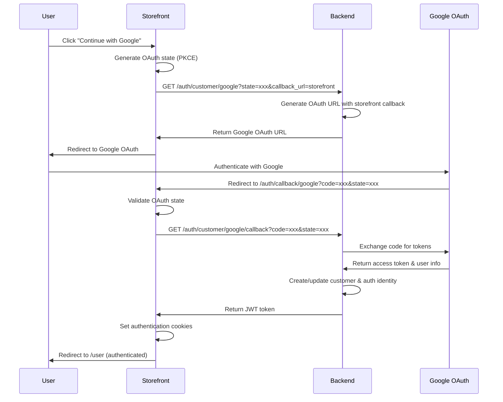

# Authentication Architecture

**Version**: 1.2
**Last Updated**: 2026-02-20
**Author**: SideDecked Architecture Team  
**Reviewers**: [Development Team, Security Team]  
**Status**: Approved

## Overview

The SideDecked authentication system implements a hybrid architecture that supports customer authentication with seamless seller upgrades:

1. **Customer Authentication**: Multiple flexible options for maximum user experience
   - **Email/Password**: Traditional account creation and login
   - **Social OAuth**: Google, GitHub, Microsoft, Facebook, and Apple OAuth
   - **Account Linking**: Customers can link multiple authentication methods to one profile

2. **Seller Authentication**: Tiered approach supporting both business and individual sellers
   - **Business Vendors**: Email/password authentication with enhanced verification
   - **Consumer Sellers**: Streamlined upgrade from customer accounts using existing authentication
   - **Identity Verification**: Automated verification for consumer sellers, manual for business vendors

## Hybrid Authentication Architecture

```
┌───────────────────────────────────────────────────────────────────────────┐
│                        SideDecked Authentication                          │
├─────────────────────────────────────┬─────────────────────────────────────┤
│           Customer Authentication   │         Seller Authentication       │
│           (Flexible Options)        │         (Tiered Approach)          │
├─────────────────────────────────────┼─────────────────────────────────────┤
│ • Email/Password Login              │ Business Vendors:                   │
│ • Google OAuth2                     │ • Email/Password Only               │
│ • GitHub OAuth2                     │ • Enhanced KYC Verification         │
│ • Microsoft OAuth2 (future)         │ • Team Management                   │
│ • Facebook OAuth2 (future)          │ • Role-Based Access                 │
│ • Apple Sign-In (future)            │                                     │
│ • Account Linking                   │ Consumer Sellers:                   │
│ • Social Profile Management         │ • Customer Account Upgrade          │
│                                     │ • Existing Auth Method              │
│                                     │ • Streamlined Verification         │
│                                     │ • Mobile-First Interface           │
└─────────────────────────────────────┴─────────────────────────────────────┘
```

## Authentication Flows

### 🔐 Customer Authentication Options

#### 1. Email/Password Authentication (Traditional)

```
1. Customer navigates to login page
2. Enters email and password
3. MedusaJS validates credentials against customer table
4. JWT token issued for customer session
5. Access to customer-specific routes and functionality
```

```typescript
// Registration Flow
POST /auth/customer/emailpass/register
{
  "email": "customer@example.com",
  "password": "secure-password"
}

// Login Flow  
POST /auth/customer/emailpass
{
  "email": "customer@example.com",
  "password": "secure-password"
}
```

#### 2. Social OAuth Authentication (Modern)

```
1. Customer initiates OAuth flow (/auth/customer/google or /auth/customer/github)
2. MedusaJS redirects to OAuth provider
3. User authorizes application with provider
4. OAuth callback processed (/auth/customer/{provider}/callback)
5. Social account linked to customer profile
6. JWT token issued for customer session
7. Access to customer-specific routes and functionality
```

```typescript
// Google OAuth Flow
1. GET /auth/customer/google → Redirect to Google
2. User authenticates with Google
3. Google → Storefront callback with auth code
4. Storefront → Backend to complete authentication
5. JWT token issued, user authenticated

// Supported Providers:
// ✅ Google (Active)
// ✅ GitHub (Active)  
// 🚧 Microsoft (Implemented, awaiting packaging)
// 🚧 Facebook (Implemented, awaiting packaging)
// 🚧 Apple (Implemented, awaiting packaging)
```

#### 3. Account Linking (Flexible)

```
1. Existing customer (email/password) adds social account
2. Social OAuth flow initiated while authenticated
3. Social account linked to existing customer profile
4. Customer can now login with either method
```

```typescript
// Link social account to existing email/password account
POST /store/auth/social/link
{
  "provider": "google",
  "provider_user_id": "123456789", 
  "email": "customer@gmail.com",
  "display_name": "John Doe",
  "avatar_url": "https://lh3.googleusercontent.com/..."
}

// Manage linked accounts
GET /store/auth/social/accounts     // View all linked accounts
DELETE /store/auth/social/{id}      // Disconnect account
PATCH /store/auth/social/{id}/primary // Set primary auth method
```

#### 4. Email Verification (Security)

```
1. Customer registers with email/password
2. Verification email sent immediately with unique token
3. Customer clicks link in email (/user/verify-email/{token})
4. Backend validates token (single-use, 24-hour expiry)
5. Email marked as verified in customer profile
6. Full platform access unlocked
```

**Key Features**:
- **Single-Use Tokens**: SHA-256 hashed, 24-hour expiry, prior tokens invalidated on resend
- **Rate Limiting**: Maximum 3 resend requests per hour per customer (Redis-based)
- **OAuth Auto-Verification**: Social login users automatically verified
- **Email Change Flow**: Triggers new verification, sends security notification to old email
- **Limited Functionality**: Unverified users can browse and use cart, but cannot purchase, sell, or send direct messages

```typescript
// Send verification email
POST /store/auth/email-verification/send
// No body required (authenticated endpoint)

// Verify token
POST /store/auth/email-verification/verify
{
  "token": "64-character-hex-string"
}

// Change email address
PATCH /store/auth/email/change
{
  "new_email": "newemail@example.com"
}

// Response from verify endpoint
{
  "success": true,          // or false with error code
  "customerId": "cus_123",  // only on success
  "error": "token_expired"  // 'invalid_token' | 'token_used' | 'token_expired'
}
```

**Storefront Components**:
- `EmailVerificationBanner`: Sticky amber banner with resend and change email actions
- `VerificationStatus`: Success/error pages with resend CTA
- `withEmailVerification` HOC: Blocked action modal for unverified users

**Implementation Details**:
- Dedicated `email-verification` module (MedusaJS v2 single-service-per-module pattern)
- Token generation: `crypto.randomBytes(32).toString('hex')` (64-char hex)
- Token storage: SHA-256 hash only (never stores raw token)
- Email templates: Resend SDK with verification link and security notifications
- Cross-device support: Token in URL, login prompt if not authenticated

### 🏢 Seller Authentication (Tiered)

#### Business Vendors (Enhanced)
```
1. Seller navigates to vendor panel (/vendor)
2. MercurJS seller middleware: authenticate('seller', ['bearer', 'session'])
3. Email/password login via MedusaJS auth
4. JWT token issued for seller session
5. Access to vendor-specific routes and functionality
```

```typescript
// Business vendor authentication (unchanged)
POST /vendor/auth/login
{
  "email": "seller@company.com", 
  "password": "secure-password"
}

// Features:
// • Team member invitations
// • Role-based access control
// • Enhanced KYC workflow
// • Audit logging
// • Business verification documents
```

#### Consumer Sellers (Streamlined)
```
1. Customer clicks "Sell This Card" button
2. System checks existing authentication status
3. If authenticated: initiate seller upgrade flow
4. If not: complete customer auth first, then upgrade
5. Streamlined identity verification (automated)
6. Seller account auto-created using existing customer auth
7. Access to simplified mobile seller interface
```

```typescript
// Consumer seller upgrade flow
POST /vendor/consumer-seller/upgrade
{
  "customer_id": "cus_123",           // From existing session
  "identity_document": File,          // Photo ID for verification
  "terms_accepted": true,
  "tax_info": {
    "ssn_last_4": "1234",            // For tax reporting
    "tax_classification": "individual"
  }
}

// Response includes seller onboarding
Response: {
  "seller_id": "sel_456",
  "seller_tier": "consumer",
  "verification_status": "pending",   // Usually auto-approved in minutes
  "onboarding_url": "/vendor/mobile/setup",
  "dashboard_url": "/vendor/mobile/dashboard"
}

// Features:
// • Uses existing customer authentication
// • Mobile-optimized interface
// • Automated identity verification
// • Simplified tax handling
// • No team management needed
```

**Design Decision:** 
- **Business Vendors**: Require rigorous verification and audit trails, making email/password authentication appropriate
- **Consumer Sellers**: Leverage existing customer authentication for minimal friction while maintaining security through automated verification

### 🔍 Consumer Seller Identity Verification

#### Automated Verification Flow
```typescript
interface ConsumerSellerVerification {
  // Identity verification providers
  providers: {
    primary: 'jumio' | 'onfido'
    fallback: 'manual_review'
  }
  
  // Verification steps
  steps: [
    'document_scan',      // Government-issued photo ID
    'liveness_check',     // Selfie verification  
    'document_validation', // Document authenticity
    'identity_match',     // Photo-to-document match
    'background_check'    // Basic fraud screening
  ]
  
  // Auto-approval criteria
  auto_approval: {
    document_quality: 'high'
    liveness_confidence: '>90%'
    identity_match_score: '>85%'
    fraud_risk_score: '<20%'
    processing_time: '<5_minutes'
  }
}
```

#### Verification API Integration
```typescript
// Identity verification service
export class ConsumerSellerVerificationService {
  async initiateVerification(customerId: string, documentFile: File): Promise<VerificationResult> {
    // 1. Upload document to verification provider
    const documentUpload = await this.jumio.uploadDocument(documentFile)
    
    // 2. Initiate verification workflow
    const verification = await this.jumio.startVerification({
      user_reference: customerId,
      callback_url: `${API_URL}/webhook/verification/complete`,
      document_types: ['PASSPORT', 'DRIVING_LICENSE', 'ID_CARD'],
      verification_levels: ['IDENTITY', 'SIMILARITY']
    })
    
    // 3. Store verification session
    await this.storeVerificationSession({
      customer_id: customerId,
      verification_id: verification.id,
      status: 'pending',
      initiated_at: new Date()
    })
    
    return {
      verification_id: verification.id,
      status: 'pending',
      redirect_url: verification.redirect_url,
      estimated_completion: '5 minutes'
    }
  }
  
  async handleVerificationComplete(webhookData: VerificationWebhook): Promise<void> {
    const { verification_id, status, confidence_scores } = webhookData
    
    if (status === 'APPROVED' && this.meetsAutoApprovalCriteria(confidence_scores)) {
      // Auto-approve consumer seller
      await this.approveConsumerSeller(verification_id)
      await this.createSellerAccount(verification_id)
      await this.notifySellerApproval(verification_id)
    } else {
      // Manual review required
      await this.flagForManualReview(verification_id, status, confidence_scores)
    }
  }
}
```

#### Seller Tier Management
```sql
-- Enhanced seller table with tier support
ALTER TABLE sellers ADD COLUMN seller_tier VARCHAR(20) DEFAULT 'business';
ALTER TABLE sellers ADD COLUMN verification_method VARCHAR(50);
ALTER TABLE sellers ADD COLUMN auto_approved BOOLEAN DEFAULT false;
ALTER TABLE sellers ADD COLUMN verification_completed_at TIMESTAMP;

-- Consumer seller verification tracking
CREATE TABLE consumer_seller_verifications (
    id UUID PRIMARY KEY DEFAULT gen_random_uuid(),
    customer_id UUID REFERENCES customers(id),
    seller_id UUID REFERENCES sellers(id),
    
    -- Verification details
    verification_provider VARCHAR(50),
    verification_id VARCHAR(100),
    document_type VARCHAR(50),
    
    -- Verification results
    status VARCHAR(20), -- pending, approved, rejected, manual_review
    confidence_scores JSONB,
    fraud_risk_score DECIMAL(3,2),
    
    -- Timing
    initiated_at TIMESTAMP DEFAULT NOW(),
    completed_at TIMESTAMP,
    
    INDEX(customer_id),
    INDEX(verification_id),
    INDEX(status)
);
```

## Technical Implementation

### 🛡️ Security Architecture

#### OAuth Security (PKCE Implementation)
```typescript
// State parameter generation with security measures
interface OAuthState {
  provider: OAuthProvider
  returnUrl?: string
  timestamp: number
  nonce: string  // 32-character random string
}

// Security features:
// ✅ PKCE (Proof Key for Code Exchange)
// ✅ State parameter validation with timestamp expiry
// ✅ CSRF protection
// ✅ Secure cookie storage (httpOnly, sameSite, secure)
// ✅ Token encryption
```

#### Session Management

**Token Architecture**: Short-lived access tokens (JWT) paired with long-lived refresh tokens (UUID v4) provide a balance of security and UX. Access tokens are stateless; refresh tokens are stored server-side for revocation support.

```typescript
// Customer JWT Access Token (15-minute TTL)
{
  "actor_id": "cus_01H...",
  "actor_type": "customer",
  "auth_identity_id": "authid_01H...",
  "app_metadata": {
    "seller_id": "sel_01H...",      // If customer is also a seller
    "seller_tier": "consumer",      // 'business' | 'consumer'
    "seller_verified": true
  },
  "iat": 1755070885,
  "exp": 1755071785               // 15 min from iat
}

// Seller JWT Access Token (for business vendors)
{
  "actor_id": "sel_01H...",
  "actor_type": "seller",
  "auth_identity_id": "authid_01H...",
  "app_metadata": {
    "seller_tier": "business",
    "team_role": "admin",
    "permissions": ["inventory", "orders", "analytics"]
  },
  "iat": 1755070885,
  "exp": 1755071785
}
```

**Refresh Token Rotation**: Each refresh token is single-use. When a token is exchanged for a new access token, the old refresh token is revoked and a new one is issued. This limits the window for token theft.

```
Login/OAuth → access token (15m) + refresh token (30d, SHA-256 hashed in DB)
                ↓
Token expires → POST /auth/refresh with refresh cookie
                ↓
Old refresh token revoked → new access token + new refresh token issued
                ↓
Security event (password change, 2FA toggle) → all refresh tokens revoked
```

**Cookie Configuration**:
```typescript
// Access token cookie
{ name: '_medusa_jwt', maxAge: 900, httpOnly: true, sameSite: 'strict', secure: true, path: '/' }

// Refresh token cookie
{ name: '_medusa_refresh', maxAge: 2592000, httpOnly: true, sameSite: 'strict', secure: true, path: '/' }
```

**Session Revocation**: Two mechanisms work together:
1. **Refresh token revocation** — `revoked_at` timestamp set on all tokens for a customer; prevents new access tokens from being issued
2. **Immediate invalidation** — `sessionInvalidatedAt` timestamp on `user_profiles` (customer-backend); the auth middleware rejects JWTs with `iat` before this timestamp, providing sub-second invalidation without waiting for token expiry

**Idle Session Detection**: Client-side localStorage tracks last user activity. On tab focus or visibility change, if >30 days have elapsed since last activity, the client automatically logs out.

```typescript
// Session Features:
// ✅ JWT integration with MedusaJS auth framework
// ✅ Session isolation (customer vs seller)
// ✅ Seller tier context in tokens
// ✅ Single-use refresh token rotation (30-day TTL)
// ✅ Server-side token revocation (immediate via sessionInvalidatedAt)
// ✅ Automatic session revocation on security events
// ✅ Cross-service auth event logging (fire-and-forget)
// ✅ Client-side idle session detection (30-day threshold)
// ✅ Secure logout clears both access and refresh cookies
```

### 🗄️ Database Schema

#### Core Tables
```sql
-- MedusaJS Native Tables
customer                    -- Core customer data
auth_identity              -- OAuth identity linkage  
auth_token                 -- Token storage

-- Custom Enhancement Tables
customer_profile           -- Extended customer profiles
social_account_metadata    -- Social account management
refresh_token              -- Refresh token storage (single-use, hashed)
```

#### customer_profile Table
```sql
CREATE TABLE customer_profile (
  id                    TEXT PRIMARY KEY,           -- cprof_xxx
  customer_id          TEXT REFERENCES customer(id),
  username             TEXT UNIQUE,
  display_name         TEXT,
  avatar_url           TEXT,
  timezone             TEXT DEFAULT 'UTC',
  language             TEXT DEFAULT 'en',
  profile_visibility   profile_visibility_enum DEFAULT 'public',
  primary_auth_provider TEXT,
  social_accounts_count INTEGER DEFAULT 0,
  email_verified       BOOLEAN DEFAULT false,
  last_login_at        TIMESTAMPTZ,
  login_count          INTEGER DEFAULT 0,
  created_at           TIMESTAMPTZ DEFAULT NOW(),
  updated_at           TIMESTAMPTZ DEFAULT NOW()
);
```

#### refresh_token Table (mercur-db)
```sql
CREATE TABLE refresh_token (
  id                   TEXT PRIMARY KEY,           -- rtok_xxx
  customer_id         TEXT NOT NULL,
  token_hash          TEXT NOT NULL UNIQUE,        -- SHA-256 hash of UUID v4 token
  expires_at          TIMESTAMPTZ NOT NULL,        -- 30 days from creation
  revoked_at          TIMESTAMPTZ,                 -- NULL = active
  device_info         TEXT,
  ip_address          TEXT,
  user_agent          TEXT,
  created_at          TIMESTAMPTZ DEFAULT NOW(),
  updated_at          TIMESTAMPTZ DEFAULT NOW()
);
-- Indexes: (customer_id), (token_hash UNIQUE), (customer_id, revoked_at), (expires_at WHERE revoked_at IS NULL)
```

#### social_account_metadata Table
```sql
CREATE TABLE social_account_metadata (
  id                   TEXT PRIMARY KEY,           -- sam_xxx
  customer_id         TEXT REFERENCES customer(id),
  provider_identity_id TEXT,                       -- Links to auth_identity
  provider            social_provider_enum,        -- google, github, etc.
  provider_user_id    TEXT,
  email               TEXT,
  display_name        TEXT, 
  avatar_url          TEXT,
  is_primary          BOOLEAN DEFAULT false,
  connected_at        TIMESTAMPTZ DEFAULT NOW(),
  last_used_at        TIMESTAMPTZ,
  is_active           BOOLEAN DEFAULT true,
  is_verified         BOOLEAN DEFAULT false
);
```

### 🔌 API Integration Points

#### Storefront API Routes
```typescript
// Customer Authentication
POST /auth/customer/emailpass/register  // Email/password registration
POST /auth/customer/emailpass          // Email/password login
GET  /auth/customer/{provider}         // OAuth initiation (Google, GitHub)

// Social Account Management  
POST /store/auth/social/link           // Link social account
GET  /store/auth/social/accounts       // Get linked accounts
DELETE /store/auth/social/{id}         // Disconnect account
GET  /store/auth/profile              // Get customer profile
PATCH /store/auth/profile             // Update profile preferences

// OAuth Callback (Storefront)
GET /auth/callback/{provider}         // Handle OAuth return
```

#### Backend Service Integration
```typescript
// Custom Authentication Services
SocialAuthService {
  processOAuthCallback()      // Process OAuth authentication
  createCustomerProfile()     // Create enhanced customer profile
  linkSocialAccount()         // Link social account to customer
  updateAuthPreferences()     // Update authentication preferences
}

SocialAccountManagementService {
  getCustomerSocialProfile()  // Get customer's social profile
  linkAccount()              // Link new social account
  unlinkAccount()            // Remove social account
  setPrimaryProvider()       // Set primary auth method

  // Session Management (refresh tokens)
  generateRefreshToken()                // Create hashed token, store in DB
  validateAndRotateRefreshToken()       // Validate, revoke old, issue new
  revokeRefreshToken()                  // Revoke a single token
  revokeAllRefreshTokensForCustomer()   // Revoke all (with optional exclusion)
}
```

### 🔧 Configuration

#### MedusaJS Configuration
```typescript
// medusa-config.ts
modules: [
  {
    resolve: '@medusajs/medusa/auth',
    options: {
      providers: [
        {
          resolve: '@medusajs/medusa/auth-emailpass',
          id: 'emailpass'
        },
        {
          resolve: '@medusajs/medusa/auth-google',
          id: 'google',
          options: {
            clientId: process.env.GOOGLE_CLIENT_ID,
            clientSecret: process.env.GOOGLE_CLIENT_SECRET,
            callbackUrl: process.env.GOOGLE_CALLBACK_URL
          }
        },
        {
          resolve: '@medusajs/medusa/auth-github',
          id: 'github', 
          options: {
            clientId: process.env.GITHUB_CLIENT_ID,
            clientSecret: process.env.GITHUB_CLIENT_SECRET,
            callbackUrl: process.env.GITHUB_CALLBACK_URL
          }
        }
      ]
    }
  },
  { resolve: './src/modules/authentication' }
]
```

#### Environment Configuration
```bash
# Active OAuth Providers
GOOGLE_CLIENT_ID="your-google-client-id-here"
GOOGLE_CLIENT_SECRET="your-google-client-secret-here"
GOOGLE_CALLBACK_URL="https://your-domain.com/auth/callback/google"

GITHUB_CLIENT_ID="your-github-client-id-here"
GITHUB_CLIENT_SECRET="your-github-client-secret-here"  
GITHUB_CALLBACK_URL="https://your-domain.com/auth/callback/github"

# Application URLs
STOREFRONT_URL=https://sidedecked-storefront-production.up.railway.app
VENDOR_PANEL_URL=https://sidedecked-vendorpanel-production.up.railway.app
BACKEND_URL=https://sidedecked-backend-production.up.railway.app

# CORS Configuration
STORE_CORS=https://sidedecked-storefront-production.up.railway.app
VENDOR_CORS=https://sidedecked-vendorpanel-production.up.railway.app
AUTH_CORS=https://sidedecked-backend-production.up.railway.app,https://sidedecked-vendorpanel-production.up.railway.app,https://sidedecked-storefront-production.up.railway.app

# Service-to-Service Authentication (must match customer-backend SERVICE_API_KEY)
SERVICE_API_KEY="shared-secret-key"
CUSTOMER_BACKEND_URL="http://localhost:7000"
```

## OAuth Flow Details

### 🔄 Complete OAuth Authentication Flow



### 🛡️ Security Measures

#### PKCE Implementation
```typescript
// OAuth state generation
function generateNonce(): string {
  const chars = 'ABCDEFGHIJKLMNOPQRSTUVWXYZabcdefghijklmnopqrstuvwxyz0123456789'
  let result = ''
  for (let i = 0; i < 32; i++) {
    result += chars.charAt(Math.floor(Math.random() * chars.length))
  }
  return result
}

// State parameter with expiry
const state: OAuthState = {
  provider,
  returnUrl,
  timestamp: Date.now(),
  nonce: generateNonce(),
}

// Secure cookie storage
cookieStore.set(`oauth_state_${provider}`, encodedState, {
  httpOnly: true,
  secure: process.env.NODE_ENV === 'production',
  sameSite: 'lax',
  maxAge: 600, // 10 minutes
  path: '/',
})
```

#### State Validation
```typescript
// OAuth callback validation
export async function validateOAuthState(
  provider: OAuthProvider,
  stateParam: string
): Promise<OAuthState | null> {
  const cookieStore = await cookies()
  const storedState = cookieStore.get(`oauth_state_${provider}`)?.value

  if (!storedState || storedState !== stateParam) {
    return null // State mismatch - possible CSRF attack
  }

  const state: OAuthState = JSON.parse(Buffer.from(stateParam, 'base64url').toString())
  
  // Validate expiry (10 minutes)
  if (Date.now() - state.timestamp > 600000) {
    return null // Expired state
  }

  return state
}
```

## OAuth Implementation Patterns for Claude Code

### Custom OAuth Callback Handler Pattern

When implementing OAuth providers, always create custom callback handlers in the backend:

```typescript
// File: backend/src/api/auth/customer/[auth_provider]/callback/route.ts
export const GET = async (req: MedusaRequest, res: MedusaResponse) => {
  const { auth_provider } = req.params
  const authService = req.scope.resolve(Modules.AUTH)
  const customerService = req.scope.resolve(Modules.CUSTOMER)
  
  try {
    // Validate OAuth callback
    const result = await authService.validateCallback(auth_provider, authData)
    const authIdentity = result.authIdentity
    
    // Extract email from provider_identities[0].user_metadata
    const providerIdentity = authIdentity.provider_identities?.[0]
    const email = providerIdentity?.user_metadata?.email
    
    // Create or find customer
    let customer = await findOrCreateCustomer(email)
    
    // Link auth identity to customer
    await authService.updateAuthIdentities({
      id: authIdentity.id,
      app_metadata: {
        ...authIdentity.app_metadata,
        customer_id: customer.id
      }
    })
    
    // Generate JWT with proper customer_id
    const token = generateJwtToken({
      actor_id: customer.id,
      actor_type: 'customer',
      auth_identity_id: authIdentity.id
    })
    
    // Redirect to storefront callback
    const callbackUrl = `${process.env.STOREFRONT_URL}/auth/callback?token=${token}`
    return res.redirect(callbackUrl)
    
  } catch (error) {
    const errorUrl = `${process.env.STOREFRONT_URL}/auth/error?message=${error.message}`
    return res.redirect(errorUrl)
  }
}
```

### Storefront OAuth Callback Handler Pattern

Always use dynamic route handlers for processing OAuth tokens:

```typescript
// File: storefront/src/app/auth/callback/route.ts
export async function GET(request: NextRequest) {
  const searchParams = request.nextUrl.searchParams
  const token = searchParams.get('token')
  const error = searchParams.get('message')
  
  const baseUrl = process.env.NODE_ENV === 'production' 
    ? 'https://your-production-domain.com'
    : `${request.nextUrl.protocol}//${request.nextUrl.host}`
  
  if (error) {
    return NextResponse.redirect(new URL(`/user?error=${encodeURIComponent(error)}`, baseUrl))
  }
  
  if (token) {
    const cookieStore = await cookies()
    
    cookieStore.set('_medusa_jwt', token, {
      maxAge: 60 * 60 * 24, // 24 hours
      httpOnly: true,
      sameSite: 'lax',
      secure: process.env.NODE_ENV === 'production',
      path: '/'
    })
    
    return NextResponse.redirect(new URL('/user', baseUrl))
  }
  
  return NextResponse.redirect(new URL('/user?error=No%20authentication%20token%20received', baseUrl))
}
```

### Middleware Configuration Pattern

Exclude OAuth routes from regional middleware:

```typescript
// File: storefront/src/middleware.ts
export const config = {
  matcher: [
    "/((?!api|auth|_next/static|_next/image|favicon.ico|images|assets|png|svg|jpg|jpeg|gif|webp).*)",
  ]
}
```

## Troubleshooting Guide for Common OAuth Issues

### Issue 1: Empty actor_id in JWT Token
**Symptoms**: User gets 401 Unauthorized after OAuth login, JWT token has empty `actor_id` field

**Root Cause**: Auth identity not properly linked to customer record

**Solution**:
1. Create custom OAuth callback handler (see pattern above)
2. Extract email from `provider_identities[0].user_metadata.email`
3. Create or find customer by email
4. Update auth identity's `app_metadata` with `customer_id`
5. Generate JWT with proper `actor_id` set to customer ID

**Code Pattern**:
```typescript
// In OAuth callback handler
await authService.updateAuthIdentities({
  id: authIdentity.id,
  app_metadata: {
    ...authIdentity.app_metadata,
    customer_id: customer.id
  }
})

const token = generateJwtToken({
  actor_id: customer.id, // This is critical
  actor_type: 'customer',
  auth_identity_id: authIdentity.id
})
```

### Issue 2: Email Extraction Failure
**Symptoms**: "Email not provided by OAuth provider" error

**Root Cause**: Different OAuth providers store user data in different structures

**Solution**:
```typescript
// Try multiple extraction paths
const providerIdentity = authIdentity.provider_identities?.[0]
const userMetadata = providerIdentity?.user_metadata || {}
const email = userMetadata.email || 
              authIdentity.metadata?.email || 
              authIdentity.app_metadata?.email ||
              (authIdentity as any).user_metadata?.email

if (!email) {
  console.error('Failed to extract email from auth identity:', {
    id: authIdentity.id,
    allFields: JSON.stringify(authIdentity, null, 2)
  })
  throw new MedusaError(MedusaError.Types.INVALID_DATA, 'Email not provided by OAuth provider')
}
```

### Issue 3: Middleware Route Interference
**Symptoms**: OAuth callback returns 404 or redirect loops

**Root Cause**: Next.js middleware intercepting `/auth` routes

**Solution**:
1. Update middleware matcher to exclude `/auth` routes
2. Use dynamic route handlers instead of static pages
3. Ensure callback URLs are accessible without middleware interference

**Code Pattern**:
```typescript
// storefront/src/middleware.ts
export const config = {
  matcher: [
    "/((?!api|auth|_next/static|_next/image|favicon.ico).*)",
  ]
}
```

### Issue 4: Static vs Dynamic Route Issues
**Symptoms**: Server-side cookie setting fails, callback processing doesn't work

**Root Cause**: Using static pages instead of dynamic route handlers

**Solution**:
1. Always use `route.ts` files for OAuth callbacks
2. Never use page components for OAuth processing
3. Use server-side cookie setting with `cookies()` function

### Issue 5: Incorrect Redirect URLs
**Symptoms**: OAuth redirects to wrong domain (e.g., localhost in production)

**Root Cause**: Hardcoded URLs or incorrect environment detection

**Solution**:
```typescript
const baseUrl = process.env.NODE_ENV === 'production' 
  ? 'https://your-production-domain.com'
  : `${request.nextUrl.protocol}//${request.nextUrl.host}`
```

### Issue 6: OAuth Provider Configuration
**Symptoms**: OAuth flow fails at provider level

**Root Cause**: Incorrect OAuth app configuration

**Solution**:
1. Verify OAuth app redirect URIs match your backend URLs exactly
2. Ensure client IDs and secrets are correct
3. Check that OAuth app is enabled and approved
4. Verify required scopes are configured

**Required OAuth App Settings**:
```
Google OAuth:
- Redirect URI: https://your-backend.com/auth/customer/google/callback
- Scopes: openid, email, profile

GitHub OAuth:
- Authorization callback URL: https://your-backend.com/auth/customer/github/callback
- Scopes: read:user, user:email
```

### Issue 7: CORS and Cookie Issues
**Symptoms**: Cookies not set, CORS errors during OAuth flow

**Root Cause**: Incorrect CORS configuration or cookie settings

**Solution**:
1. Ensure CORS allows your storefront domain
2. Use proper cookie settings for production vs development
3. Set `sameSite: 'lax'` for cross-site OAuth flows

```typescript
// Access token (15-minute TTL)
cookieStore.set('_medusa_jwt', token, {
  maxAge: 60 * 15,
  httpOnly: true,
  sameSite: 'strict',
  secure: process.env.NODE_ENV === 'production',
  path: '/'
})

// Refresh token (30-day TTL)
cookieStore.set('_medusa_refresh', refreshToken, {
  maxAge: 60 * 60 * 24 * 30,
  httpOnly: true,
  sameSite: 'strict',
  secure: process.env.NODE_ENV === 'production',
  path: '/'
})
```

### Debugging OAuth Flows

1. **Enable comprehensive logging**:
```typescript
console.log('OAuth callback for provider:', auth_provider)
console.log('Auth identity validated:', authIdentity)
console.log('Extracted email:', email)
console.log('Generated JWT token with customer_id:', customer.id)
```

2. **Check JWT token structure**:
```bash
# Decode JWT to verify actor_id is set
echo "your-jwt-token" | cut -d'.' -f2 | base64 -d | jq
```

3. **Verify database state**:
```sql
-- Check auth identity linking
SELECT id, app_metadata FROM auth_identity WHERE id = 'your-auth-identity-id';

-- Check customer creation
SELECT id, email FROM customer WHERE email = 'user-email';
```

## Database Schema Details

### customer_profile Table

| Column | Type | Description |
|--------|------|-------------|
| id | text | Primary key with 'cprof_' prefix |
| customer_id | text | Reference to MedusaJS customer |
| username | text | Unique username (nullable) |
| display_name | text | Display name |
| avatar_url | text | Profile avatar URL |
| timezone | text | User timezone (default: UTC) |
| language | text | User language (default: en) |
| currency | text | User currency (default: USD) |
| profile_visibility | enum | public, friends, private |
| show_collection_value | boolean | Show collection value in profile |
| allow_trade_requests | boolean | Allow trade requests |
| primary_auth_provider | text | Primary OAuth provider |
| social_accounts_count | integer | Number of linked social accounts |
| email_verified | boolean | Email verification status |
| phone_verified | boolean | Phone verification status |
| last_login_at | timestamptz | Last login timestamp |
| login_count | integer | Total login count |

### social_account_metadata Table

| Column | Type | Description |
|--------|------|-------------|
| id | text | Primary key with 'sam_' prefix |
| customer_id | text | Reference to customer |
| provider_identity_id | text | Reference to MedusaJS auth identity |
| provider | enum | google, microsoft, facebook, apple |
| provider_user_id | text | Provider's user ID |
| email | text | Email from provider |
| display_name | text | Display name from provider |
| avatar_url | text | Avatar URL from provider |
| is_primary | boolean | Primary authentication method |
| connected_at | timestamptz | When account was connected |
| last_used_at | timestamptz | Last used for authentication |
| token_expires_at | timestamptz | OAuth token expiry |
| is_active | boolean | Account active status |
| is_verified | boolean | Provider verification status |

### auth_events Table (sidedecked-db)

| Column | Type | Description |
|--------|------|-------------|
| id | uuid | Primary key (auto-generated) |
| customerId | text | Customer who triggered the event |
| eventType | enum | LOGIN, LOGOUT, TOKEN_REFRESH, SESSION_TERMINATED, PASSWORD_CHANGED, TWO_FA_TOGGLED, EMAIL_CHANGED |
| ipAddress | text | Client IP (nullable) |
| userAgent | text | Client user-agent (nullable) |
| metadata | jsonb | Event-specific data (nullable) |
| createdAt | timestamptz | Event timestamp |

Composite index: `(customerId, createdAt DESC)` for efficient per-customer audit queries.

### user_profiles Session Fields (sidedecked-db)

| Column | Type | Description |
|--------|------|-------------|
| sessionInvalidatedAt | timestamptz | When set, JWTs with `iat` before this timestamp are rejected by auth middleware |

## API Routes Reference

### Core Authentication Routes
- `POST /auth/customer/emailpass/register` - Email/password registration
- `POST /auth/customer/emailpass` - Email/password login
- `GET /auth/customer/{provider}` - OAuth initiation (Google, GitHub)
- `GET /auth/customer/{provider}/callback` - OAuth callback processing

### Social Account Management Routes
- `POST /store/auth/social/link` - Link social account to customer
- `GET /store/auth/social/accounts` - Get customer's social accounts
- `DELETE /store/auth/social/{id}` - Disconnect social account
- `PATCH /store/auth/social/{id}/primary` - Set primary social account
- `GET /store/auth/profile` - Get customer social profile
- `PATCH /store/auth/profile` - Update customer social preferences

### Session Management Routes (Backend)
- `POST /auth/refresh` - Exchange refresh token for new access + refresh tokens (single-use rotation)
- `POST /auth/revoke-sessions` - Revoke all refresh tokens for the authenticated customer (supports `except_current: true`)

### Auth Event Logging Routes (Customer-Backend)
- `POST /api/auth-events` - Record auth event (service-to-service, requires `X-Service-Key` header)

Auth events tracked: `LOGIN`, `LOGOUT`, `TOKEN_REFRESH`, `SESSION_TERMINATED`, `PASSWORD_CHANGED`, `TWO_FA_TOGGLED`, `EMAIL_CHANGED`

## Two-Factor Authentication (2FA)

SideDecked supports opt-in TOTP-based two-factor authentication for customer accounts.

### Architecture

- **Module**: `backend/apps/backend/src/modules/two-factor-auth/` (dedicated MedusaJS v2 module)
- **Models**: `TotpSecret` and `TrustedDevice` in `modules/authentication/models/`
- **Database**: mercur-db only (no customer-backend involvement)
- **Library**: `otpauth` (RFC 6238 compliant, zero dependencies)

### TOTP Secret Storage

- Secrets encrypted at rest with AES-256-GCM using `TOTP_ENCRYPTION_KEY` env var
- Random IV per secret, auth tag appended to ciphertext
- Backup codes: 10 per user, 8 alphanumeric chars each, individually SHA-256 hashed, single-use

### Trusted Devices

- 64-byte random token stored as SHA-256 hash in DB
- Raw token returned to client (stored in httpOnly cookie `_sd_trusted_device`)
- 30-day expiry, auto-cleaned on validation

### Sensitive Action Gating

When 2FA is enabled, re-authentication is required for:
- Purchases exceeding $500
- Email address changes
- Password changes
- 2FA disable
- Payment method changes

### Rate Limiting

- Redis key: `2fa_verify_rate:{customerId}`
- Max 5 attempts per 5 minutes (300s TTL)
- Returns HTTP 429 with `Retry-After: 300` header

### API Endpoints

| Method | Endpoint | Description |
|--------|----------|-------------|
| POST | `/store/auth/2fa/setup` | Generate TOTP secret and QR URI |
| POST | `/store/auth/2fa/verify` | Verify code and enable 2FA |
| POST | `/store/auth/2fa/disable` | Disable 2FA (requires valid code) |
| POST | `/store/auth/2fa/challenge` | Verify code for sensitive actions |
| POST | `/store/auth/2fa/backup-codes` | Regenerate backup codes |
| GET | `/store/auth/2fa/trusted-devices` | List trusted devices |
| DELETE | `/store/auth/2fa/trusted-devices/:id` | Revoke a trusted device |

### Environment Variables

- `TOTP_ENCRYPTION_KEY`: 32-byte hex string for AES-256 encryption (required)

## Security Considerations

- **Never log OAuth tokens or sensitive authentication data**
- **Always validate OAuth state parameters to prevent CSRF**
- **Use HTTPS in production for all OAuth flows**
- **Implement proper session timeout and cleanup**
- **Regularly rotate OAuth client secrets**
- **Monitor for suspicious authentication patterns**
- **TOTP secrets encrypted at rest with AES-256-GCM**
- **Backup codes are single-use and SHA-256 hashed**
- **2FA verification is rate-limited to prevent brute force**
- **Refresh tokens are SHA-256 hashed before storage — raw tokens never persisted**
- **Single-use token rotation limits the window for stolen refresh tokens**
- **Security events (password change, 2FA toggle, email change) immediately revoke all sessions**
- **Service-to-service auth uses shared `SERVICE_API_KEY` via `X-Service-Key` header**
- **Auth events logged to sidedecked-db for audit trail (fire-and-forget, non-blocking)**

## Compliance

The authentication system supports:
- **GDPR**: User data export and deletion capabilities
- **CCPA**: California privacy compliance features
- **SOC 2**: Security controls and audit logging
- **PCI DSS**: Secure handling of payment-related authentication (when integrated with payment flows)

## References

- [System Overview](./01-system-overview.md)
- [Architectural Patterns](./04-architectural-patterns.md)
- [Integration Architecture](./06-integration-architecture.md)

## Changelog

| Version | Date | Changes |
|---------|------|---------|
| 1.2 | 2026-02-20 | Added Session Management: refresh token rotation, immediate session revocation, auth event logging, idle session detection, service-to-service auth |
| 1.1 | 2026-02-17 | Added Two-Factor Authentication (2FA) section: TOTP, trusted devices, sensitive action gating, rate limiting |
| 1.0 | 2025-09-12 | Initial authentication architecture documentation with OAuth patterns and troubleshooting guide |