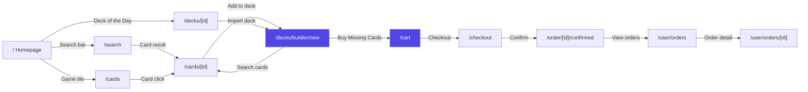
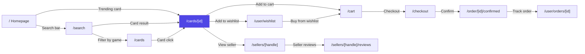
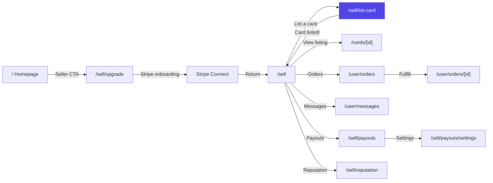
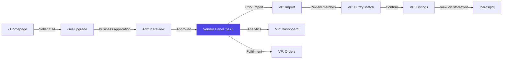
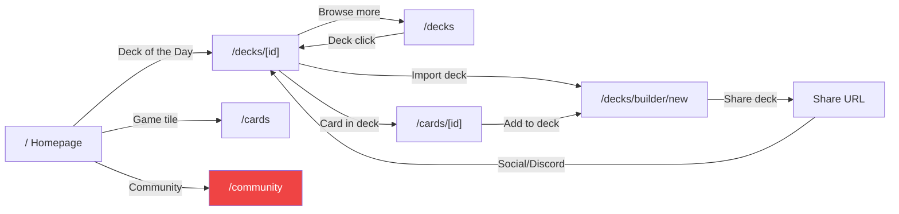
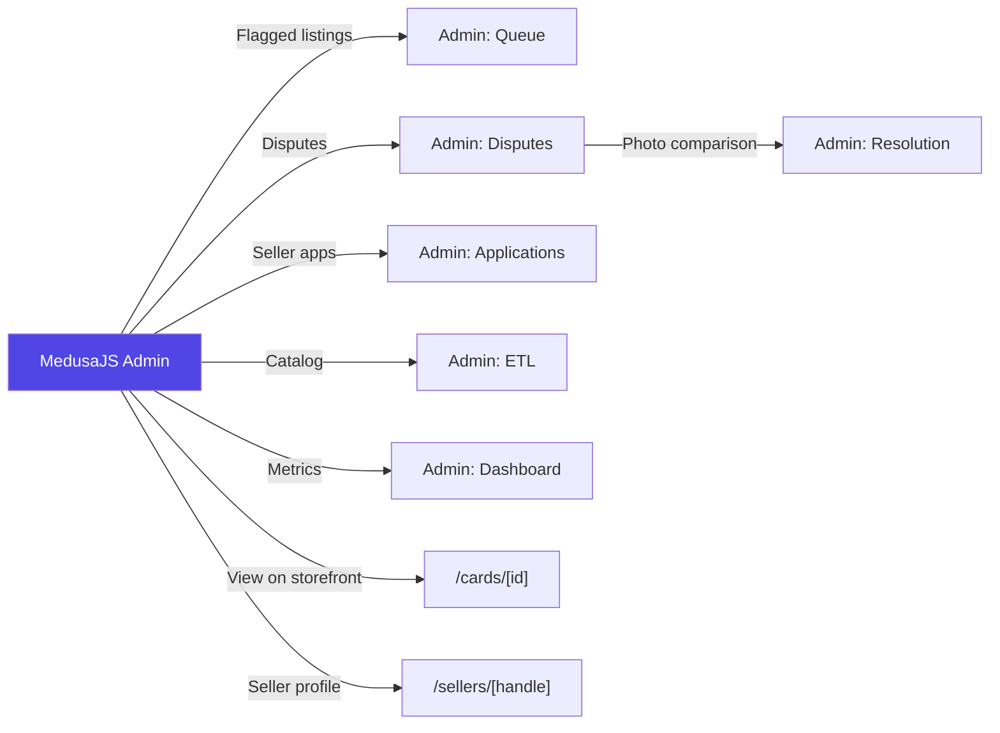

# SideDecked Storefront Sitemap v2

**Version:** 2.0
**Date:** 2026-03-02
**Supersedes:** `docs/storefront-sitemap.md` (v1, 2025-09-11)
**Sources:** PRD (72 FRs), Epics (9 epics, 52 stories), UX Design Spec, Storefront filesystem (46 page.tsx files), Existing sitemap v1

---

## 1. Master Route Inventory

Every route in the storefront, unified from PRD requirements, existing sitemap v1, and actual filesystem (`storefront/src/app/[locale]/(main)/`).

**Legend:**
- **Status:** `live` = deployed, `stub` = page exists but redirects/placeholder, `planned` = in PRD but no page.tsx yet
- **Epic:** Owning epic number or `--` for infrastructure/standard pages
- **Wireframe:** Base wireframe file or `--` if none exists
- **Figma:** Frame reference or `--` if not captured

### 1.1 Public Routes (Unauthenticated Access)

| # | Route | Page Title | Epic | Status | Wireframe | Stories | Primary Personas |
|---|-------|-----------|------|--------|-----------|---------|-----------------|
| 1 | `/` | Homepage | 9 | live | `storefront-homepage.html` | 9-1, 9-2 | Alex, Sam, Jordan |
| 2 | `/cards` | Browse Cards | 2 | live | `storefront-cards.html` | 2-2, 2-3, 2-4 | Sam, Alex |
| 3 | `/cards/[id]` | Card Detail | 2 | live | `storefront-card-detail.html` | 2-5, 2-6 | Sam, Alex, Maya |
| 4 | `/search` | Search Results | 2 | live | `storefront-search.html` | 2-3 | Sam, Alex |
| 5 | `/decks` | Deck Browser | 3 | live | `storefront-deck-browser.html` | 3-6 | Jordan, Alex |
| 6 | `/decks/[deckId]` | Deck Viewer | 3 | live | `storefront-deck-viewer.html` | 3-5 | Jordan, Alex |
| 7 | `/marketplace` | Marketplace | 5 | stub | -- | 5-1 | Sam |
| 8 | `/community` | Community Hub | 10* | stub | -- | -- | Jordan |
| 9 | `/products/[handle]` | Product Detail | 5 | live | -- | -- | Sam |
| 10 | `/categories` | Categories | 5 | live | -- | -- | Sam |
| 11 | `/categories/[category]` | Category Detail | 5 | live | -- | -- | Sam |
| 12 | `/collections/[handle]` | Collections | 5 | live | -- | -- | Sam |
| 13 | `/sellers/[handle]` | Seller Profile | 4 | live | -- | 7-4 | Sam |
| 14 | `/sellers/[handle]/reviews` | Seller Reviews | 4 | live | -- | 7-4 | Sam |

### 1.2 Authentication Routes

| # | Route | Page Title | Epic | Status | Wireframe | Stories | Primary Personas |
|---|-------|-----------|------|--------|-----------|---------|-----------------|
| 15 | `/user` | Login / Dashboard | 1 | live | `storefront-auth.html` | 1-1 | All |
| 16 | `/user/register` | Registration | 1 | live | `storefront-auth.html` | 1-1 | All |
| 17 | `/user/verify-email` | Email Verification | 1 | live | -- | 1-1 | All |
| 18 | `/auth/callback` | OAuth Callback | 1 | live | -- | 1-1 | All |
| 19 | `/auth/error` | Auth Error | 1 | live | -- | 1-1 | All |
| 20 | `/reset-password` | Reset Password | 1 | live | -- | 1-2 | All |

### 1.3 Authenticated User Routes

| # | Route | Page Title | Epic | Status | Wireframe | Stories | Primary Personas |
|---|-------|-----------|------|--------|-----------|---------|-----------------|
| 21 | `/user/settings` | Account Settings | 1 | live | `storefront-profile.html` | 1-2 | All |
| 22 | `/user/settings/profile` | Profile Settings | 1 | live | `storefront-profile.html` | 1-2 | All |
| 23 | `/user/addresses` | Address Book | 1 | live | -- | 1-2 | Alex, Sam, Maya |
| 24 | `/user/orders` | Order History | 5 | live | -- | 5-5 | Alex, Sam |
| 25 | `/user/orders/[id]` | Order Detail | 5 | live | -- | 5-5 | Alex, Sam |
| 26 | `/user/orders/[id]/return` | Return Request | 7 | live | -- | 7-2 | Alex, Sam |
| 27 | `/user/orders/[id]/request-success` | Return Confirmed | 7 | live | -- | 7-2 | Alex, Sam |
| 28 | `/user/returns` | Returns List | 7 | live | -- | 7-2 | Alex, Sam |
| 29 | `/user/messages` | Messages | -- | live | -- | -- | Alex, Sam, Maya |
| 30 | `/user/wishlist` | Wishlist | 2 | live | -- | 2-8 | Sam, Alex |
| 31 | `/user/price-alerts` | Price Alerts | 2 | live | -- | 2-8 | Sam, Alex |
| 32 | `/user/reviews` | Reviews Received | 7 | live | -- | 7-4 | Maya |
| 33 | `/user/reviews/written` | Reviews Written | 7 | live | -- | 7-4 | Sam, Alex |

### 1.4 Deck Builder Routes (Authenticated)

| # | Route | Page Title | Epic | Status | Wireframe | Stories | Primary Personas |
|---|-------|-----------|------|--------|-----------|---------|-----------------|
| 34 | `/decks/builder/new` | Create Deck | 3 | live | `storefront-deck-builder.html` | 3-1, 3-2 | Alex, Jordan |
| 35 | `/decks/[deckId]/edit` | Edit Deck | 3 | live | `storefront-deck-builder.html` | 3-2, 3-3, 3-4 | Alex |

### 1.5 Seller Routes (Authenticated + Seller Role)

| # | Route | Page Title | Epic | Status | Wireframe | Stories | Primary Personas |
|---|-------|-----------|------|--------|-----------|---------|-----------------|
| 36 | `/sell` | Seller Dashboard | 4 | live | -- | 4-1, 4-7 | Maya |
| 37 | `/sell/list-card` | List a Card | 4 | live | -- | 4-2, 4-3, 4-4 | Maya |
| 38 | `/sell/upgrade` | Become a Seller | 4 | live | -- | 4-1 | Maya |
| 39 | `/sell/payouts` | Payout History | 6 | live | -- | 6-2 | Maya |
| 40 | `/sell/payouts/settings` | Payout Settings | 6 | live | -- | 6-1 | Maya |
| 41 | `/sell/reputation` | Seller Reputation | 7 | live | -- | 7-4 | Maya |

### 1.6 Commerce Routes

| # | Route | Page Title | Epic | Status | Wireframe | Stories | Primary Personas |
|---|-------|-----------|------|--------|-----------|---------|-----------------|
| 42 | `/cart` | Shopping Cart | 5 | live | -- | 5-1, 5-2 | Alex, Sam |
| 43 | `/checkout` | Checkout | 5 | live | -- | 5-3 | Alex, Sam |
| 44 | `/order/[id]/confirmed` | Order Confirmation | 5 | live | -- | 5-3 | Alex, Sam |

### 1.7 Legal & Standard Pages

| # | Route | Page Title | Epic | Status | Wireframe | Stories | Primary Personas |
|---|-------|-----------|------|--------|-----------|---------|-----------------|
| 45 | `/terms/seller` | Seller Terms | -- | live | -- | -- | Maya, Marcus |
| 46 | `/terms` | Terms of Service | -- | planned | -- | -- | All |
| 47 | `/privacy` | Privacy Policy | -- | planned | -- | -- | All |
| 48 | `/faq` | FAQ | -- | planned | -- | -- | All |
| 49 | `/about` | About Us | -- | planned | -- | -- | All |
| 50 | `/contact` | Contact Us | -- | planned | -- | -- | All |

### 1.8 Development/Debug Routes (Not Production)

| # | Route | Page Title | Status |
|---|-------|-----------|--------|
| 51 | `/test-navigation` | Nav Test | dev-only |
| 52 | `/test/integration` | Integration Test | dev-only |
| 53 | `/debug` | Debug Dashboard | dev-only |
| 54 | `/auth/test` | Auth Test | dev-only |

**Total:** 50 production routes (44 live/stub + 6 planned) + 4 dev-only

---

## 2. Persona-Route Matrix

Routes each persona interacts with, rated as **P** (primary — core journey), **S** (secondary — occasional use), or blank (not applicable).

| Route | Alex (Player) | Sam (Searcher) | Maya (C2C Seller) | Marcus (B2C Vendor) | Jordan (Community) | Priya (Admin) |
|-------|:---:|:---:|:---:|:---:|:---:|:---:|
| `/` Homepage | P | P | S | | P | |
| `/cards` Browse | P | P | S | | S | |
| `/cards/[id]` Detail | P | P | P | | S | |
| `/search` Results | P | P | S | | S | |
| `/decks` Browser | P | S | | | P | |
| `/decks/[deckId]` View | P | | | | P | |
| `/decks/builder/new` Create | P | | | | S | |
| `/decks/[deckId]/edit` Edit | P | | | | | |
| `/marketplace` | S | P | | | | |
| `/products/[handle]` | S | P | | | | |
| `/categories` | | S | | | | |
| `/collections/[handle]` | | S | | | | |
| `/community` | S | | | | P | |
| `/cart` | P | P | | | S | |
| `/checkout` | P | P | | | S | |
| `/order/[id]/confirmed` | P | P | | | | |
| `/user` Login | P | P | P | | P | |
| `/user/register` | P | P | P | | P | |
| `/user/settings` | S | S | S | | S | |
| `/user/orders` | P | P | | | S | |
| `/user/orders/[id]` | P | P | | | | |
| `/user/orders/[id]/return` | S | S | | | | |
| `/user/returns` | S | S | | | | |
| `/user/messages` | S | S | P | | | |
| `/user/wishlist` | S | P | | | | |
| `/user/price-alerts` | S | P | | | | |
| `/user/addresses` | S | S | S | | | |
| `/user/reviews` | | | P | | | |
| `/user/reviews/written` | S | S | | | | |
| `/sell` Dashboard | | | P | | | |
| `/sell/list-card` | | | P | | | |
| `/sell/upgrade` | | | P | | | |
| `/sell/payouts` | | | P | | | |
| `/sell/reputation` | | | P | | | |
| `/sellers/[handle]` | S | P | S | | S | |
| `/sellers/[handle]/reviews` | S | S | S | | | |
| `/terms/seller` | | | P | P | | |
| `/terms` | S | S | S | S | S | |
| `/privacy` | S | S | S | S | S | |
| `/faq` | S | S | S | | S | |
| `/about` | S | S | | | S | |

**Note:** Marcus (B2C Vendor) primarily uses the **Vendor Panel** (`:5173`), not the storefront. Priya (Admin) uses the **MedusaJS Admin** panel. Their storefront interaction is minimal.

---

## 3. User Journey Flow Diagrams

### 3.1 Alex: Deck-to-Cart (The Killer Feature)

**Dead ends identified:**
- `/order/[id]/confirmed` → No "Back to deck builder" link (should return to the deck being built)
- `/decks/[deckId]` (public view) → No "Edit" or "Import" CTA for unauthenticated users (Auth gate needed → Story 1-4)

**Friction points:**
- Card detail → deck builder requires knowing deck exists first (no "Add to new deck" shortcut from card detail)
- Cart optimizer not yet built (Epic 5 backlog)

### 3.2 Sam: Search-to-Purchase

**Dead ends identified:**
- `/sellers/[handle]` → No link back to the card that led there
- `/user/wishlist` → Missing "Add all to cart" action (Growth feature)

**Friction points:**
- `/search` and `/cards` serve overlapping purposes — UX distinction unclear (see Gap Analysis)
- Price alerts have no notification system yet (Epic 8 backlog)

### 3.3 Maya: List-and-Sell (C2C)

**Dead ends identified:**
- `/sell/list-card` → After listing success, no deep link to the listing on the card detail page
- `/sell/reputation` → No link to improve trust score (needs actionable guidance)
- No fulfillment flow on storefront (only vendorpanel has it)

**Friction points:**
- Maya must use `/sell/upgrade` before listing, but no wireframe exists for this flow
- No seller-facing order fulfillment on storefront (must use vendorpanel — confusing for C2C sellers)

### 3.4 Marcus: Bulk Import (B2C)

**Dead ends identified:**
- Vendor panel → storefront link is one-way (no storefront → vendorpanel navigation)
- Business seller application has no status page on storefront

**Friction points:**
- Two separate apps (storefront + vendorpanel) for seller operations
- No `/sell/applications/status` route for pending business seller applications

### 3.5 Jordan: Discover-and-Share (Community)

**Dead ends identified:**
- `/community` is a stub ("Coming Soon") — Jordan's primary destination doesn't exist
- `/decks` → No "Follow creator" or social features yet
- Shared deck URL → No "Follow this deck builder" CTA

**Friction points:**
- Community features are entirely missing (no epic owns them — see Gap Analysis)
- No notification system for deck updates, follows, or community activity
- `/community` promises features that don't exist, creating trust damage

### 3.6 Priya: Platform Health (Admin)

**Dead ends identified:**
- Admin panel → storefront links are one-way
- No admin impersonation mode to see buyer/seller experience

**Friction points:**
- All admin tools are in MedusaJS default admin — no custom storefront admin dashboard
- No automated alert routing (Priya must poll the admin queue)

---

## 4. Gap Analysis

### 4.1 Critical Gaps (Must Fix for MVP)

| # | Gap | Severity | Current State | Proposed Action |
|---|-----|----------|--------------|-----------------|
| G1 | **`/community` has no owning epic** | **High** | Stub page ("Coming Soon"), no stories, no FRs | Propose **Epic 10: Community & Social** |
| G2 | **Cart/Checkout have no wireframes** | **High** | Pages exist and work (MedusaJS default) but no SideDecked UX | Create wireframes when Epic 5 stories begin |
| G3 | **Seller routes have no wireframes** | **High** | `/sell/*` pages exist but no UX spec | Create wireframes when Epic 4 stories begin |
| G4 | **Standard pages missing** (FAQ, Privacy, Terms, About, Contact) | **High** | Footer links are dead; legal requirement | Propose stories under new **Epic 11: Platform Foundation** |
| G5 | **No notification system** | **High** | FR31 requires toast (done via sonner), but no persistent notification center, no email triggers | Propose stories — cross-cutting concern |
| G6 | **`/products/[handle]` vs `/cards/[id]` overlap** | **Medium** | Products = MedusaJS commerce listings; Cards = TCG catalog entries. Same card can appear at both URLs | Resolve: `/cards/[id]` is canonical for SEO; `/products/[handle]` for direct marketplace listings. Add cross-links. |
| G7 | **`/marketplace` vs `/cards` overlap** | **Medium** | Marketplace redirects to `/products`; Browse Cards at `/cards` serves similar purpose | Resolve: `/cards` = catalog (all cards, including those without listings); `/marketplace` = commerce (only listed cards with prices). Keep both, differentiate in nav labels. |
| G8 | **`/categories` and `/collections` unowned** | **Medium** | MedusaJS default pages, no epic or stories | Map to Epic 5, create stories for TCG-specific category hierarchy |

### 4.2 Medium Gaps

| # | Gap | Severity | Current State | Proposed Action |
|---|-----|----------|--------------|-----------------|
| G9 | **No seller fulfillment on storefront** | Medium | C2C sellers (Maya) must use vendorpanel for fulfillment | Add simplified fulfillment UI to `/sell` dashboard (Epic 4) |
| G10 | **No business seller application status** | Medium | Marcus applies but has no way to check status | Add `/sell/application-status` route (Epic 4) |
| G11 | **No "Add to new deck" from card detail** | Medium | Can only add to existing decks | Add "Create deck with this card" CTA to card detail (Epic 3) |
| G12 | **Order confirmation has no return path to context** | Medium | `/order/[id]/confirmed` has no "back to deck" or "continue shopping" | Add contextual CTAs based on entry point (Epic 5) |
| G13 | **Wishlist page has no wireframe** | Medium | Route exists, no UX spec | Create wireframe when Story 2-8 begins |
| G14 | **No email notification templates** | Medium | FR60 requires transactional emails | Story 8-5 covers this but needs email template wireframes |

### 4.3 Low-Priority Gaps (Post-MVP)

| # | Gap | Severity | Current State | Proposed Action |
|---|-----|----------|--------------|-----------------|
| G15 | **No event system** | Low | UX spec mentions events/tournaments | Defer to post-MVP; potential Epic 10 scope |
| G16 | **No blog/content pages** | Low | Footer links to blog but no blog exists | Defer to post-MVP; consider headless CMS |
| G17 | **No admin impersonation** | Low | Priya can't see buyer/seller experience | Defer to Growth phase |
| G18 | **No saved search / search alerts** | Low | Users can't save searches for notifications | Defer to Growth phase |

---

## 5. Wireframe Coverage

### 5.1 Existing Wireframes (9 files)

| Wireframe File | Routes Covered | Epic | Stories Covered |
|----------------|---------------|------|----------------|
| `storefront-homepage.html` | `/` | 9 | 9-1, 9-2 |
| `storefront-auth.html` | `/user`, `/user/register` | 1 | 1-1 |
| `storefront-profile.html` | `/user/settings`, `/user/settings/profile` | 1 | 1-2 |
| `storefront-cards.html` | `/cards` | 2 | 2-2, 2-3, 2-4 |
| `storefront-search.html` | `/search` | 2 | 2-3 |
| `storefront-card-detail.html` | `/cards/[id]` | 2 | 2-5 |
| `storefront-deck-builder.html` | `/decks/builder/new`, `/decks/[deckId]/edit` | 3 | 3-1, 3-2, 3-3, 3-4 |
| `storefront-deck-browser.html` | `/decks` | 3 | 3-6 |
| `storefront-deck-viewer.html` | `/decks/[deckId]` | 3 | 3-5 |

### 5.2 Routes Without Wireframes (Need Creation)

**High priority (routes exist and are live):**

| Route | Epic | Blocking Story | Wireframe Needed |
|-------|------|---------------|-----------------|
| `/cart` | 5 | 5-1 | Cart page with optimizer preview |
| `/checkout` | 5 | 5-3 | Multi-vendor checkout flow |
| `/sell` | 4 | 4-1 | Seller dashboard |
| `/sell/list-card` | 4 | 4-2, 4-3, 4-4 | 3-step listing wizard |
| `/sell/upgrade` | 4 | 4-1 | Seller onboarding flow |
| `/user/orders` | 5 | 5-5 | Order tracking with escrow visualization |
| `/user/wishlist` | 2 | 2-8 | Wishlist management |
| `/marketplace` | 5 | -- | Marketplace landing (currently stub) |
| `/sellers/[handle]` | 4 | 7-4 | Seller public profile |

**Medium priority (planned routes):**

| Route | Epic | Purpose |
|-------|------|---------|
| `/terms` | 11* | Terms of service |
| `/privacy` | 11* | Privacy policy |
| `/faq` | 11* | Help / FAQ |
| `/about` | 11* | About SideDecked |
| `/contact` | 11* | Contact support |
| `/community` | 10* | Community hub |

*Proposed new epics (see Section 6)

---

## 6. Proposed New Epics & Stories

### Epic 10: Community & Social (Proposed)

**Rationale:** `/community` exists as a stub page. Jordan (Community Member) has no primary destination. FR5 allows anonymous browsing, and the UX spec identifies community as a key differentiator. The PRD mentions community features across multiple FRs but no epic owns them.

**FRs to own:** New FRs (COM-FR1 through COM-FR6)

| Story ID | Name | Description | Route | Priority |
|----------|------|-------------|-------|----------|
| 10-1 | Community Hub Landing | Community homepage with activity feed, featured decks, popular discussions. Replaces current "Coming Soon" stub. | `/community` | P1 (MVP) |
| 10-2 | User Follow System | Users can follow other users. Following feed shows followed users' deck activity, new listings. | `/community`, `/user/settings` | P1 (MVP) |
| 10-3 | Deck Comments & Ratings | Users can comment on and rate public decks. Threaded comments with reply support. | `/decks/[deckId]` | P2 (Growth) |
| 10-4 | Community Deck Curation | Curated deck collections by game/format. Community-voted "Deck of the Week". | `/community`, `/decks` | P2 (Growth) |
| 10-5 | User Public Profile | Public-facing user profile showing decks, collection stats, activity. | `/users/[handle]` (new route) | P2 (Growth) |
| 10-6 | Community Events & Tournaments | Event listings, tournament brackets, LGS finder. | `/community/events` (new route) | P3 (Vision) |

**Dependencies:** Epic 1 (auth), Epic 3 (decks)

### Epic 11: Platform Foundation Pages (Proposed)

**Rationale:** Standard pages (Terms, Privacy, FAQ, About, Contact) are a legal requirement for any marketplace. Footer links currently point to dead ends. These are high-severity gaps.

| Story ID | Name | Description | Route | Priority |
|----------|------|-------------|-------|----------|
| 11-1 | Terms of Service & Privacy Policy | Legal pages with MDX content. Terms of service, privacy policy, cookie policy. Must be indexable by search engines. | `/terms`, `/privacy` | P0 (Legal requirement) |
| 11-2 | FAQ & Help Center | Searchable FAQ with categories (Buying, Selling, Deck Building, Account). Supports card condition guide, shipping info. | `/faq` | P1 (MVP) |
| 11-3 | About & Contact Pages | About SideDecked story, team, mission. Contact form with category routing. | `/about`, `/contact` | P1 (MVP) |
| 11-4 | Footer Link Audit & Fix | Update footer component to link to real pages. Remove placeholder links. Add social media links. | All pages (footer) | P0 (Legal requirement) |

**Dependencies:** None (foundational)

### Cross-Cutting: Notification System (Proposed Stories for Epic 8)

**Rationale:** FR31 (toast notifications) is partially addressed by sonner. But persistent notifications (price alerts, order updates, community activity) have no system. Story 8-5 covers transactional email but not in-app notifications.

| Story ID | Name | Description | Route | Priority |
|----------|------|-------------|-------|----------|
| 8-7 | In-App Notification Center | Persistent notification bell in header. Shows unread count. Dropdown lists recent notifications (order updates, price alerts, follows). Links to relevant pages. | All pages (header), `/user/notifications` (new route) | P1 (MVP) |
| 8-8 | Notification Preferences | Users can configure which notifications they receive (in-app, email, push). Per-category toggles. | `/user/settings` | P2 (Growth) |

---

## 7. Navigation Architecture

### 7.1 Primary Navigation (Header)

Current nav links and proposed changes:

| Current Label | Route | Proposed Label | Rationale |
|--------------|-------|---------------|-----------|
| Browse Cards | `/cards` | **Cards** | Shorter, clearer |
| Deck Builder | `/decks` | **Decks** | Route goes to browser, not builder |
| Marketplace | `/marketplace` | **Shop** | "Marketplace" is jargon; "Shop" is clearer |
| Sell | `/sell` | **Sell** | Keep as-is |
| Community | `/community` | **Community** | Keep as-is; implement Epic 10 first |

### 7.2 Footer Navigation

**Proposed footer structure** (replacing placeholder links):

| Column | Links |
|--------|-------|
| **Shop** | Browse Cards, Marketplace, Deck Browser, Sellers |
| **Sell** | Start Selling, List a Card, Seller Resources, Seller Terms |
| **Community** | Community Hub, Popular Decks, Card Guides |
| **Support** | FAQ, Contact Us, Shipping Info, Returns |
| **Legal** | Terms of Service, Privacy Policy, Cookie Policy |
| **Connect** | Discord, Twitter/X, Instagram |

### 7.3 User Menu (Profile Dropdown)

**Authenticated:**

| Link | Route | Section |
|------|-------|---------|
| My Orders | `/user/orders` | Account |
| My Decks | `/decks?view=mine` | Account |
| Wishlist | `/user/wishlist` | Account |
| Price Alerts | `/user/price-alerts` | Account |
| Messages | `/user/messages` | Account |
| Notifications | `/user/notifications` | Account |
| --- | --- | --- |
| Seller Dashboard | `/sell` | Seller (if seller) |
| --- | --- | --- |
| Settings | `/user/settings` | Settings |
| Sign Out | -- | Settings |

**Unauthenticated:**

| Link | Route |
|------|-------|
| Sign In | `/user` |
| Create Account | `/user/register` |

---

## 8. Route Resolution Decisions

### 8.1 `/products/[handle]` vs `/cards/[id]`

**Decision:** Both routes serve different purposes and should coexist.

- `/cards/[id]` — **Canonical card page.** Shows catalog data (oracle text, printings, legality), market pricing aggregated across all sellers, and all active listings. This is the SEO-indexed page. Owned by customer-backend (sidedecked-db).
- `/products/[handle]` — **Individual listing page.** Shows a specific seller's listing with their photos, condition description, and price. This is the MedusaJS product page. Owned by backend (mercur-db).

**Cross-linking:** Card detail page links to individual listings. Product page links back to the card catalog entry.

### 8.2 `/marketplace` vs `/cards`

**Decision:** Differentiate by intent.

- `/cards` — **Discovery.** All cards in the catalog, including those with zero listings. For browsing, research, deck building. Powered by Algolia search against customer-backend data.
- `/marketplace` — **Shopping.** Only cards with active listings and prices. For buying. Powered by MedusaJS product catalog. Shows seller info, conditions, shipping.

**Implementation:** Marketplace page should be un-stubbed and rebuilt with commerce-first UX when Epic 5 begins.

### 8.3 `/search` vs `/cards`

**Decision:** `/search` is the universal entry point; `/cards` is the dedicated browsing experience.

- `/search` — Handles the search bar query from any page. Shows results across cards, decks, sellers, and products. Cross-category.
- `/cards` — Game-filtered card catalog with faceted filtering. Single-category (cards only).

**Navigation:** Search bar → `/search`. "Browse Cards" nav → `/cards`. Search results can link to `/cards` with pre-applied filters.

---

## 9. Implementation Priority

Based on gap severity and epic dependencies:

| Priority | Action | Epic | Stories |
|----------|--------|------|---------|
| P0 | Fix dead footer links (placeholder → real pages or remove) | 11 | 11-4 |
| P0 | Create Terms of Service and Privacy Policy | 11 | 11-1 |
| P1 | Build Community Hub (replace stub) | 10 | 10-1, 10-2 |
| P1 | Build FAQ page | 11 | 11-2 |
| P1 | Build About & Contact pages | 11 | 11-3 |
| P1 | In-app notification center | 8 | 8-7 |
| P2 | Un-stub `/marketplace` | 5 | (part of 5-1) |
| P2 | Create wireframes for Cart/Checkout | 5 | 5-1, 5-3 |
| P2 | Create wireframes for Seller flows | 4 | 4-1 through 4-4 |
| P3 | Community features (comments, curation) | 10 | 10-3, 10-4 |
| P3 | Public user profiles | 10 | 10-5 |
| P3 | Events & tournaments | 10 | 10-6 |

---

*This sitemap supersedes `docs/storefront-sitemap.md` (v1). All future route additions should be documented here first.*
