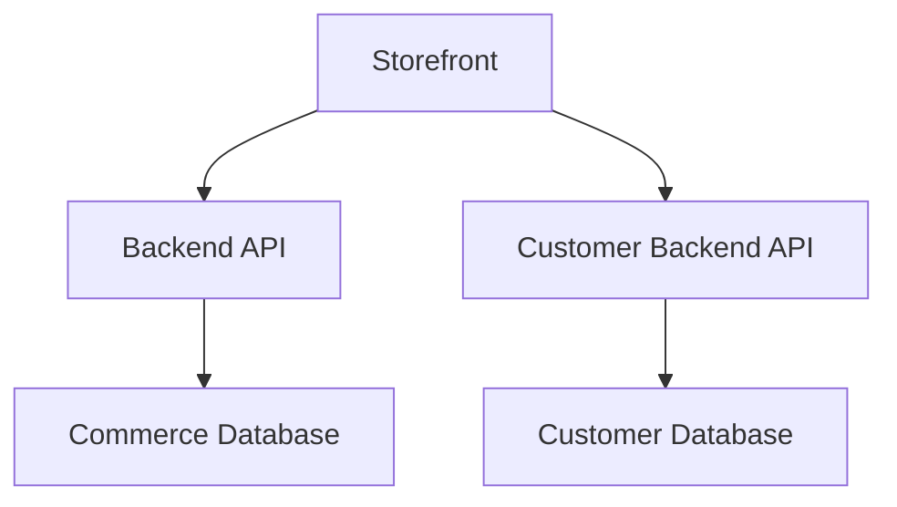

# Documentation Standards

**MANDATORY: These documentation standards are NON-NEGOTIABLE and must be followed for ALL documentation, without exception.**

## Core Documentation Philosophy

### Documentation as Code
**REQUIREMENT: All documentation must be treated with the same rigor as production code**

- Documentation changes require review and approval
- Documentation must be versioned alongside code changes
- Documentation must be tested for accuracy and completeness
- Broken links and outdated information are considered bugs
- Documentation must be updated BEFORE code changes are merged

### Documentation Completeness Requirements

**MANDATORY: Documentation must be updated for ALL of these scenarios:**

| Scenario | Required Documentation Updates |
|----------|--------------------------------|
| **New API Endpoint** | API reference, integration guide, examples |
| **Database Schema Change** | Data architecture docs, migration guide |
| **New Feature** | User guide, technical overview, integration docs |
| **Architecture Change** | System overview, ADR creation, integration updates |
| **Breaking Change** | Migration guide, changelog, deprecation notice |
| **Security Update** | Security docs, compliance updates |
| **Performance Change** | Performance guide, benchmarks |
| **New Dependency** | Architecture decision record, security review |

## Documentation Structure Standards

### File Naming Conventions
```
# ✅ CORRECT: Kebab-case with descriptive names
api-reference.md
authentication-architecture.md
deck-builder-integration-guide.md
04-vendor-management-system.md
ADR-001-database-selection.md

# ❌ INCORRECT: Inconsistent naming
API_Reference.md
authenticationArchitecture.md
deckbuilder.md
phase4.md
adr001.md
```

### Document Structure Template
```markdown
# Document Title

**Version**: X.X  
**Last Updated**: YYYY-MM-DD  
**Author**: Team/Individual Name  
**Reviewers**: [Name1, Name2]  
**Status**: Draft | Review | Approved | Deprecated

## Overview
[Brief 1-2 paragraph summary of what this document covers]

## Table of Contents
- [Section 1](#section-1)
- [Section 2](#section-2)
- [References](#references)

## Prerequisites
[What the reader needs to know/have before reading this document]

## Main Content
[Detailed content with clear headings and examples]

## Examples
[Working examples with expected output]

## Troubleshooting
[Common issues and solutions]

## References
- [Code Standards](./code-standards.md)
- [Testing Standards](./testing-standards.md)
- [External Resource](https://example.com)

## Changelog
| Version | Date | Changes |
|---------|------|---------|
| 1.1 | 2025-01-15 | Updated API examples |
| 1.0 | 2025-01-01 | Initial version |
```

## Architecture Documentation Standards

### System Overview Documents
```markdown
# System Overview Template

## Architecture Principles
- [List core architectural principles]
- [Each principle should have rationale]

## System Context
[High-level system diagram and description]

## Core Components
| Component | Purpose | Technology | Repository |
|-----------|---------|------------|------------|
| Backend | Commerce operations | MercurJS v2 | backend |
| Customer Backend | TCG features | Node.js + TypeORM | customer-backend |

## Data Flow Diagrams
[Include mermaid diagrams where possible]



## Integration Points
[Document all service-to-service communication]
```

### Domain Model Documentation
```markdown
# Domain Models Template

## Bounded Context: [Context Name]

### Core Entities
#### Entity Name
**Purpose**: [What this entity represents]
**Aggregate Root**: Yes/No
**Repository**: [Repository class name]

**Attributes**:
| Field | Type | Required | Description |
|-------|------|----------|-------------|
| id | UUID | Yes | Primary identifier |
| name | String | Yes | Entity name |

**Relationships**:
- One-to-Many with [Related Entity]
- Many-to-One with [Parent Entity]

**Business Rules**:
1. [Rule description]
2. [Validation requirements]

**Example**:
```json
{
  "id": "123e4567-e89b-12d3-a456-426614174000",
  "name": "Lightning Deck",
  "format": "Standard",
  "game": "MTG"
}
```
```

### Architectural Decision Records (ADRs)
```markdown
# ADR Template

# ADR-XXX: [Decision Title]

**Status**: Proposed | Accepted | Deprecated | Superseded  
**Date**: YYYY-MM-DD  
**Deciders**: [Name1, Name2]  
**Consulted**: [Name3, Name4]  
**Informed**: [Name5, Name6]  

## Context and Problem Statement
[Describe the architectural problem or decision point]

## Decision Drivers
- [Driver 1: e.g., performance requirement]
- [Driver 2: e.g., team expertise]
- [Driver 3: e.g., cost constraints]

## Considered Options
1. **Option 1**: [Brief description]
2. **Option 2**: [Brief description]
3. **Option 3**: [Brief description]

## Decision Outcome
**Chosen Option**: "[Option X]"

**Rationale**: [Explain why this option was chosen]

### Positive Consequences
- [Consequence 1]
- [Consequence 2]

### Negative Consequences
- [Risk 1 and mitigation plan]
- [Risk 2 and mitigation plan]

## Implementation Notes
[Technical details for implementation]

## Follow-up Actions
- [ ] [Action 1 with owner and deadline]
- [ ] [Action 2 with owner and deadline]

## References
- [Link to related ADRs]
- [Link to external resources]
```

## API Documentation Standards

### OpenAPI/Swagger Integration
**REQUIREMENT: All APIs must have OpenAPI 3.0+ documentation**

```typescript
// ✅ CORRECT: Comprehensive API Documentation
/**
 * @openapi
 * /api/decks/{id}:
 *   get:
 *     summary: Retrieve a deck by ID
 *     description: |
 *       Returns detailed information about a specific deck including
 *       cards, validation status, and metadata. Requires authentication
 *       for private decks.
 *     tags: [Decks]
 *     parameters:
 *       - name: id
 *         in: path
 *         required: true
 *         description: Unique identifier for the deck
 *         schema:
 *           type: string
 *           format: uuid
 *         example: "123e4567-e89b-12d3-a456-426614174000"
 *     responses:
 *       200:
 *         description: Deck retrieved successfully
 *         content:
 *           application/json:
 *             schema:
 *               $ref: '#/components/schemas/DeckResponse'
 *             example:
 *               id: "123e4567-e89b-12d3-a456-426614174000"
 *               name: "Lightning Deck"
 *               format: "Standard"
 *               game: "MTG"
 *               is_public: true
 *               card_count: 60
 *               cards: []
 *       404:
 *         description: Deck not found
 *         content:
 *           application/json:
 *             schema:
 *               $ref: '#/components/schemas/ErrorResponse'
 *             example:
 *               error: "Deck not found"
 *               code: "DECK_NOT_FOUND"
 *       401:
 *         description: Authentication required for private deck
 *         content:
 *           application/json:
 *             schema:
 *               $ref: '#/components/schemas/ErrorResponse'
 *     security:
 *       - bearerAuth: []
 */
export async function GET(req: Request, res: Response) {
  // Implementation
}
```

### API Reference Format
```markdown
# API Reference Template

## GET /api/decks/{id}

Retrieve a deck by its unique identifier.

### Parameters
| Parameter | Type | Location | Required | Description |
|-----------|------|----------|----------|-------------|
| id | string (UUID) | Path | Yes | Deck identifier |
| include_cards | boolean | Query | No | Include card details (default: false) |

### Request Examples
```bash
# Basic request
curl -X GET "https://api.sidedecked.com/api/decks/123" \
  -H "Authorization: Bearer YOUR_TOKEN"

# With card details
curl -X GET "https://api.sidedecked.com/api/decks/123?include_cards=true" \
  -H "Authorization: Bearer YOUR_TOKEN"
```

### Response Format
```json
{
  "id": "123e4567-e89b-12d3-a456-426614174000",
  "name": "Lightning Deck",
  "format": "Standard",
  "game": "MTG",
  "is_public": true,
  "card_count": 60,
  "created_at": "2025-01-01T00:00:00Z",
  "updated_at": "2025-01-01T00:00:00Z"
}
```

### Error Responses
| Status | Code | Description |
|--------|------|-------------|
| 400 | INVALID_DECK_ID | Invalid UUID format |
| 401 | UNAUTHORIZED | Authentication required |
| 403 | FORBIDDEN | Access denied to private deck |
| 404 | DECK_NOT_FOUND | Deck does not exist |
| 500 | INTERNAL_ERROR | Server error |

### Rate Limiting
- **Limit**: 100 requests per minute per user
- **Headers**: `X-RateLimit-Remaining`, `X-RateLimit-Reset`
```

## User Guide Standards

### Step-by-Step Procedures
```markdown
# User Guide Template

## How to Create a Deck

### Prerequisites
Before you start, ensure you have:
- [ ] A SideDecked account
- [ ] Basic understanding of your chosen TCG format
- [ ] Access to the deck builder interface

### Step 1: Navigate to Deck Builder
1. Log into your SideDecked account
2. Click **"Decks"** in the main navigation
3. Click **"Create New Deck"** button

**Expected Result**: You should see the deck builder interface with empty deck zones.

### Step 2: Configure Deck Settings
1. Enter your deck name in the **"Deck Name"** field
2. Select your game from the **"Game"** dropdown:
   - Magic: The Gathering
   - Pokémon
   - Yu-Gi-Oh!
   - One Piece TCG
3. Choose your format from the **"Format"** dropdown
4. Set deck privacy using the **"Public/Private"** toggle

**Expected Result**: Deck configuration panel shows your selections.

### Step 3: Add Cards to Your Deck
1. Use the search bar to find cards by name
2. Click **"Add to Deck"** for each card you want
3. Specify quantity using the **"+/-"** controls
4. Drag cards between zones (main deck, sideboard, etc.)

**Expected Result**: Cards appear in the appropriate deck zones with correct quantities.

### Troubleshooting
**Problem**: "Card not found" error  
**Solution**: Check spelling and make sure the card exists in the selected game

**Problem**: "Invalid format" validation error  
**Solution**: Verify the card is legal in your chosen format

**Problem**: Deck builder won't save  
**Solution**: Check your internet connection and ensure you're logged in
```

### Integration Guides
```markdown
# Integration Guide Template

## Integrating with SideDecked Deck Builder API

### Overview
This guide explains how to integrate your application with the SideDecked Deck Builder API to create, modify, and validate decks programmatically.

### Authentication Setup
1. **Obtain API Credentials**
   ```bash
   curl -X POST "https://api.sidedecked.com/auth/api-keys" \
     -H "Authorization: Bearer YOUR_USER_TOKEN" \
     -d '{"name": "My Integration", "permissions": ["decks:read", "decks:write"]}'
   ```

2. **Configure Authentication**
   ```javascript
   const client = new SideDeckedAPI({
     apiKey: 'sk_live_...',
     baseUrl: 'https://api.sidedecked.com'
   })
   ```

### Basic Operations

#### Creating a Deck
```javascript
const deck = await client.decks.create({
  name: "My Deck",
  game: "MTG",
  format: "Standard",
  is_public: false
})

console.log('Deck created:', deck.id)
```

#### Adding Cards
```javascript
await client.decks.addCard(deck.id, {
  card_id: "card-uuid",
  quantity: 4,
  zone: "main"
})
```

#### Validating a Deck
```javascript
const validation = await client.decks.validate(deck.id)
if (!validation.is_valid) {
  console.log('Validation errors:', validation.errors)
}
```

### Error Handling
```javascript
try {
  const deck = await client.decks.get(deckId)
} catch (error) {
  if (error.code === 'DECK_NOT_FOUND') {
    console.log('Deck not found')
  } else if (error.code === 'RATE_LIMITED') {
    console.log('Rate limit exceeded, retry after:', error.retry_after)
  } else {
    console.log('Unexpected error:', error.message)
  }
}
```
```

## Code Documentation Standards

### Inline Code Documentation
```typescript
// ✅ CORRECT: Comprehensive Code Documentation
/**
 * Validates a deck against format-specific rules and returns detailed validation results.
 * 
 * This service supports validation for multiple TCG formats including MTG, Pokémon,
 * Yu-Gi-Oh!, and One Piece TCG. Each format has specific rules for deck composition,
 * banned cards, and card quantities.
 * 
 * @param deck - The deck to validate containing cards and metadata
 * @param options - Validation options and configuration
 * @param options.strictMode - Enable strict validation including tournament rules
 * @param options.checkBanned - Verify cards against ban lists (default: true)
 * @param options.skipQuantityCheck - Skip card quantity validation (default: false)
 * 
 * @returns Promise resolving to detailed validation results
 * 
 * @throws {ValidationError} When deck format is unsupported
 * @throws {ServiceError} When validation service is unavailable
 * 
 * @example
 * ```typescript
 * const validation = await deckValidationService.validateDeck(deck, {
 *   strictMode: true,
 *   checkBanned: true
 * })
 * 
 * if (!validation.isValid) {
 *   console.log('Validation failed:', validation.errors)
 *   validation.errors.forEach(error => {
 *     console.log(`- ${error.type}: ${error.message}`)
 *   })
 * }
 * ```
 * 
 * @see {@link DeckValidator} for format-specific validation logic
 * @see {@link BanListService} for banned card checking
 * 
 * @since 2.1.0
 * @version 2.3.0 - Added One Piece TCG support
 */
public async validateDeck(
  deck: DeckValidationRequest, 
  options: ValidationOptions = {}
): Promise<ValidationResult> {
  // Implementation with inline comments for complex logic
  
  // Initialize validation context with format-specific rules
  const validator = this.getValidatorForFormat(deck.format)
  
  // Perform basic structural validation first
  const structuralErrors = this.validateDeckStructure(deck)
  if (structuralErrors.length > 0) {
    return { isValid: false, errors: structuralErrors }
  }
  
  // Continue with format-specific validation...
}
```

### README Documentation Standards
```markdown
# Repository README Template

# [Repository Name]

Brief 1-2 sentence description of what this repository does.

[](https://github.com/org/repo/actions)
[](https://codecov.io/gh/org/repo)
[](https://npmjs.org/package/package)

## Quick Start

```bash
# Installation
npm install

# Development
npm run dev

# Testing
npm test

# Build
npm run build
```

## Features
- [Feature 1] - Brief description
- [Feature 2] - Brief description
- [Feature 3] - Brief description

## Project Structure
```
src/
├── api/          # API routes and controllers
├── services/     # Business logic services
├── entities/     # Database entities
├── types/        # TypeScript type definitions
└── utils/        # Utility functions
```

## Environment Variables
```env
DATABASE_URL=postgresql://localhost:5432/dbname
API_KEY=your_api_key_here
LOG_LEVEL=info
```

## API Documentation
- [Full API Reference](../API-REFERENCE.md)
- [Integration Guide](../architecture/07-authentication-architecture.md)
- [Data Architecture](../architecture/05-data-architecture.md)

## Development
See [Code Standards](./code-standards.md) for:
- Setting up development environment
- Running tests
- Contributing guidelines
- Code standards

## Deployment
See [Deployment Guide](../DEPLOYMENT-GUIDE.md) for production deployment instructions.

## License
MIT License - see main repository LICENSE file for details.
```

## Documentation Maintenance

### Regular Documentation Reviews
**SCHEDULE: Monthly documentation audits required**

#### Audit Checklist
- [ ] All links work correctly
- [ ] Code examples execute without errors
- [ ] API documentation matches current implementation
- [ ] Screenshots and diagrams are up-to-date
- [ ] Version numbers are accurate
- [ ] Contact information is current

#### Documentation Health Metrics
| Metric | Target | Current Status |
|--------|--------|---------------|
| Link Validity | 100% | ✅ 98% |
| Example Accuracy | 100% | ✅ 95% |
| Up-to-date Screenshots | 90% | ⚠️ 75% |
| API Coverage | 100% | ✅ 100% |

### Documentation Versioning
```markdown
# Versioning Strategy

## Version Format
- **Major.Minor.Patch** (e.g., 2.1.0)
- **Major**: Breaking changes to documented APIs
- **Minor**: New features or significant updates
- **Patch**: Bug fixes and minor corrections

## Changelog Requirements
Every documentation update must include:
- Clear description of changes
- Impact assessment (breaking/non-breaking)
- Migration instructions (if applicable)
- Related issue/PR references

## Archive Policy
- Keep last 3 major versions accessible
- Archive older versions with clear deprecation notices
- Provide migration paths for deprecated documentation
```

### Automated Documentation Validation
```yaml
# .github/workflows/docs-validation.yml
name: Documentation Validation
on:
  push:
    paths: ['docs/**', '*.md']
  pull_request:
    paths: ['docs/**', '*.md']

jobs:
  validate-docs:
    runs-on: ubuntu-latest
    steps:
      - uses: actions/checkout@v3
      
      - name: Check links
        uses: lycheeverse/lychee-action@v1
        with:
          args: --verbose --no-progress 'docs/**/*.md' '*.md'
          
      - name: Validate markdown
        uses: DavidAnson/markdownlint-cli2-action@v9
        with:
          globs: '**/*.md'
          
      - name: Check spelling
        uses: streetsidesoftware/cspell-action@v2
        with:
          files: '**/*.md'
          
      - name: Validate code examples
        run: |
          # Extract and test all code examples
          npm run test --if-present
```

## Documentation Anti-Patterns

### ❌ NEVER Do These
- **Outdated examples**: Code examples that don't work with current version
- **Broken links**: Links to non-existent pages or resources
- **Incomplete information**: Missing required parameters or steps
- **Inconsistent formatting**: Mixed styles and conventions
- **No maintenance**: Documentation that never gets updated
- **Wall of text**: Dense paragraphs without structure or examples
- **Assume knowledge**: Not explaining prerequisites or context
- **Generic examples**: Examples that don't relate to actual use cases

### ✅ ALWAYS Do These
- **Test all examples**: Every code example must be tested and working
- **Keep it current**: Update documentation with every related code change
- **Use clear structure**: Headers, lists, and formatting for readability
- **Provide context**: Explain why, not just how
- **Include troubleshooting**: Address common issues and solutions
- **Use real examples**: Base examples on actual use cases
- **Cross-reference**: Link to related documentation appropriately
- **Version appropriately**: Clear version information and changelogs

## Documentation Tools and Automation

### Recommended Tools
- **Markdown**: Standard format for all documentation
- **Mermaid**: For diagrams and flowcharts
- **OpenAPI**: For API documentation
- **Swagger UI**: For interactive API exploration
- **GitBook/Notion**: For comprehensive user guides
- **Lychee**: For link validation
- **Markdownlint**: For markdown formatting
- **CSpell**: For spell checking

### Automation Scripts
```bash
#!/bin/bash
# scripts/validate-docs.sh

echo "🔍 Validating documentation..."

# Check for broken links
echo "Checking links..."
lychee docs/**/*.md *.md

# Validate markdown format
echo "Validating markdown..."
markdownlint docs/**/*.md *.md

# Check spelling
echo "Checking spelling..."
cspell "docs/**/*.md" "*.md"

# Test code examples
echo "Testing code examples..."
npm run test --if-present

# Generate API docs
echo "Generating API documentation..."
npm run generate:oas --if-present

echo "✅ Documentation validation complete!"
```

**Remember: Documentation is not an afterthought—it's an integral part of the development process. Good documentation enables teams to move faster and build better software.**
